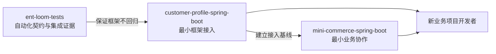
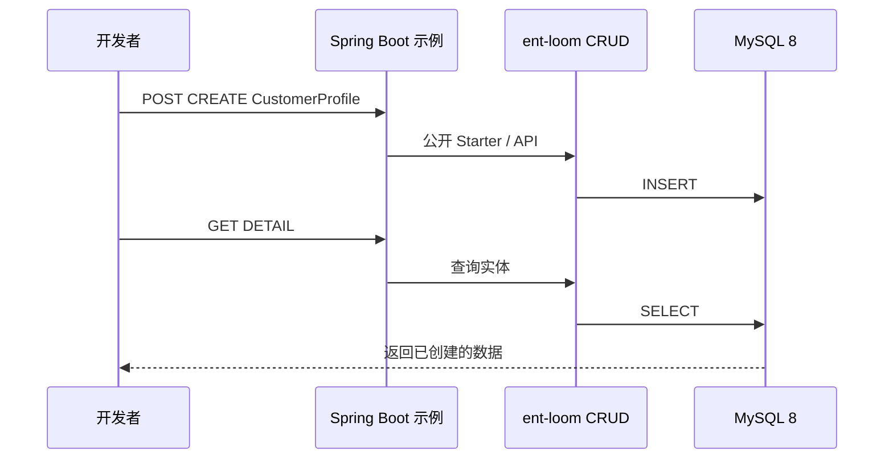
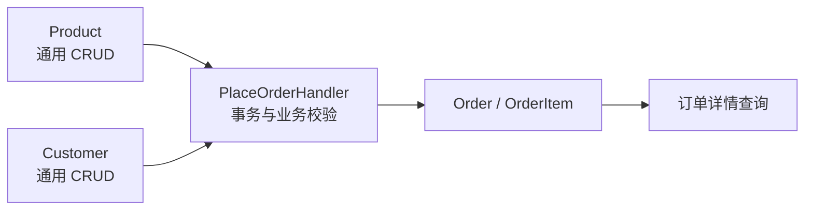

# 示例工程实施计划

> 状态：Planned
> 范围：面向新业务项目的可运行 `ent-loom` 消费者示例
> 关联：[开发者文档体验概要设计与实施计划](开发者文档体验实施计划.md)、[测试策略与验收分层](../../../architecture/core/测试策略与验收分层.md)

## 目标与边界

示例工程面向业务开发者，证明公开构件在一个普通 Spring Boot 项目中可复制、可启动、可观察地工作。它不是框架测试的替代品，也不模拟完整生产系统。



- `ent-loom-tests` 保留消费者、MySQL 集成和跨模块验收；其读者是框架维护者和 CI。
- `examples/` 保留可读的应用代码、启动说明和请求示例；其读者是业务开发者。
- 两者可以覆盖同一条最短业务路径，但不共享测试 fixture、内部实现或测试装配。

## 目录

```text
examples/
├── README.md
├── customer-profile-spring-boot/
│   ├── README.md
│   ├── pom.xml
│   ├── compose.yaml
│   ├── .env.example
│   ├── requests/customer-profile.http
│   └── src/
│       ├── main/java/com/example/customerprofile/
│       └── main/resources/
└── mini-commerce-spring-boot/
    ├── README.md
    ├── pom.xml
    ├── compose.yaml
    ├── .env.example
    ├── requests/commerce.http
    └── src/
        ├── main/java/com/example/minicommerce/
        └── main/resources/
```

每个示例是独立 Maven 消费者：使用 Spring Boot 的公开版本管理，只声明公开的 `ent-loom` 构件和必需基础依赖，不继承框架内部父 POM，不依赖 `ent-loom-tests` 或任何内部类。

首期的 README 与 POM 必须固定一个已发布的 `ent-loom` 版本及其公共 Maven 仓库；在此前不得把示例标记为正式快速开始，也不得将开发中的未发布构件作为默认前提。框架 CI 中，先以 Maven Wrapper 构建并安装当前工作区构件至隔离的本地仓库，再从各示例目录执行其验证脚本。`examples/pom.xml` 只作为可选聚合入口，不进入默认主 Reactor，也不承担构件发布或版本管理职责。

## 示例一：单表接入

目录：`examples/customer-profile-spring-boot`。

该示例只回答“如何把一个普通 Spring Boot 项目接入 ent-loom”。使用一个 `CustomerProfile` 实体，完成实体声明、注册/暴露、开发态主体与权限配置、MySQL 8 连接和真实 HTTP 请求。



- 依赖：Spring Boot、公开 `ent-loom` Starter/API/Annotations、MySQL Driver；测试依赖仅限 Spring Boot Test。
- 不引入 Lombok，保留实体所需的最小显式 Java 代码，避免增加注解处理和 IDE 配置这一入门变量。
- 本地 MySQL 8 由 `compose.yaml` 提供；账号和端口只通过 `.env.example` 说明，不提交真实凭据。
- 首期固定使用 `src/main/resources/schema.sql` 建表，并由 Spring Boot 在本地 MySQL 初始化时执行。DDL Starter 不进入此示例；生产迁移策略由业务项目另行选择和说明。
- 首期只验收 `CREATE -> DETAIL`；完整 CRUD、关系和扩展能力另行演示。

## 示例二：最小商城

目录：`examples/mini-commerce-spring-boot`。

该示例以熟悉的业务原型说明：通用实体维护由框架承担，有业务不变量的动作必须进入显式业务 Handler。它不是完整商城，也不承诺覆盖企业所有领域能力。



最短路径：创建商品 -> 创建客户 -> 提交订单 -> 查询订单和明细。

- `Product`、`Customer` 等基础主数据使用通用 CRUD；不重复编写通用分页、字段校验和基础治理代码。
- 下单通过明确的 Command/Handler 实现，以承载事务、价格快照、商品有效性等业务不变量；不得强行把它伪装成通用 `CREATE`。
- 下单入口固定为业务 `POST /orders` Controller，接收 `PlaceOrderCommand`，由 `PlaceOrderHandler` 在一个 Spring 事务中读取商品和客户、校验有效性、写入 `Order` 与 `OrderItem`，并返回订单 ID。订单详情固定为业务 `GET /orders/{id}` 查询，返回订单与明细；`Order`、`OrderItem` 不暴露给通用 CRUD。
- `PlaceOrderHandler` 通过公开 CRUD API 或项目自身的持久化端口读取主数据、写入订单；不得调用框架内部实现、复制 CRUD Controller，或绕过主体、权限和实体暴露治理。价格快照、商品失效和不存在的客户/商品必须各有可观察的失败响应。
- 可引入 Lombok，以减少多个实体、DTO 和配置对象的样板代码；实体限用 `@Getter`、`@Setter`、`@NoArgsConstructor` 等直观注解，避免 `@Data`、`@SneakyThrows`，也不以 Lombok 隐藏框架要求。
- 显式排除登录、支付、库存扣减、优惠券、搜索、消息队列、对象存储、多租户和前端管理台。新增能力应以新的独立示例承载，不持续膨胀本示例。

## 共同约束

1. 每个示例的 README 必须写明环境版本、构件获取方式、MySQL 启动、应用启动、验证请求、停止和清理方式。
2. 示例的开发态主体、权限、实体白名单和 Controller 开关必须显式配置；不得依赖默认放行或隐藏的测试 Bean。
3. 请求示例必须命中真实端口，并能与 MySQL 中的状态相互核对；H2 和 MockMvc 仅属于框架测试。
4. 示例源码优先可读、可复制；少量重复配置优于抽取 `examples-common` 后隐藏关键接入步骤。
5. 生产部署的认证、授权、迁移、审计和基础设施策略必须与本地开发配置区分说明，不将开发便利配置宣传为生产默认值。
6. 每个示例必须提供非交互验证脚本：使用独立 Compose 项目和数据卷启动 MySQL 健康检查，等待应用健康就绪，执行请求并断言响应；`CREATE` 返回的 ID 必须用于 `DETAIL`，且关键字段必须再由 SQL 查询核对。脚本无论成功或失败均停止应用和 Compose 服务；失败时保留应用与容器日志。

## 实施顺序与门禁

1. 完整交付 `customer-profile-spring-boot`，包括 MySQL 8、本地启动、真实 `CREATE` 与 `DETAIL` 请求、SQL 状态核对及文档入口。
2. 为单表示例建立可自动执行的构建、启动和 HTTP 冒烟验证，但不将其替代 `ent-loom-tests` 中的模块、消费者或 MySQL 专项测试。该验证通过后，单表示例即成为开发者文档的正式快速开始入口。
3. 以单表示例已经稳定的公开依赖和配置方式为基线，实现 `mini-commerce-spring-boot` 的下单业务 Handler，并为其单独建立同等的干净环境验收。
4. 商城示例是业务协作的后续入口，不阻塞单表示例的首期发布；两个示例均通过各自验收后，再在文档导航中并列展示。
