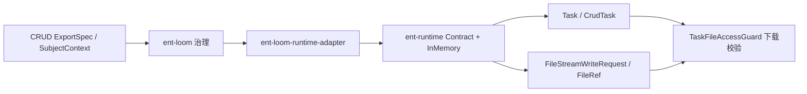
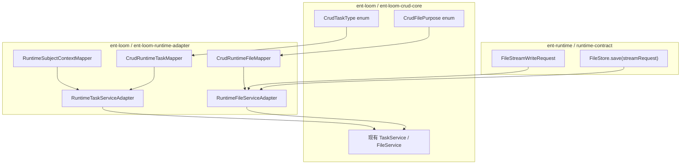
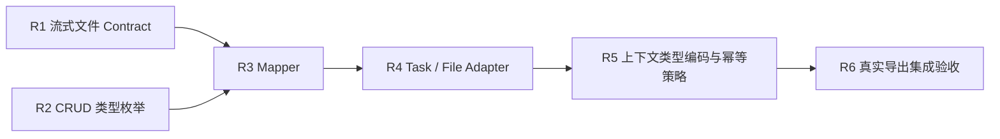

# 运行时适配最小闭环实施计划

> 状态：Partial（Task/File Adapter 合同已完成）
> 最近核验：2026-09-03
> 范围：`ent-runtime` 与 `ent-loom` 的首个可选集成闭环
> 关联决策：[应用运行时与实体框架分层决策](../../decisions/core/应用运行时与实体框架分层决策.md)

## 目标

以 CRUD Task/File Adapter 合同为首个场景，证明 `ent-loom` 可以通过可选 Adapter 使用 `ent-runtime` 的主体、任务和文件能力，同时保持两个核心仓库没有直接依赖。真实 `ExportGateway -> QueryEngine -> ExportEngine` 纵向导出仍是后续验收项。

本计划只建立最小集成边界，不一次迁移幂等、JDBC、Redis、MQ、对象存储或全部现有实现。

当前实现事实见[运行时适配最小闭环](../../../architecture/core/运行时适配最小闭环.md)。

## 当前实现



R1-R4 已完成：当前闭环可用 runtime 内存存储验证主体、任务、流式文件、错误文件引用和 CRUD 下载守卫；R5 的真实导出纵向测试尚未完成。这仍然是任务化合同验证，不是生产级 Worker。

## 最小闭环


闭环完成后应能验证：

1. CRUD 主体的 subjectId、tenantId、orgId 可以稳定转换为运行时主体；运行时专属字段按 Adapter 规则补充。
2. 导出任务通过 Adapter 创建并更新，不泄漏实体模型到 `ent-runtime`。
3. 导出结果通过流式文件契约保存，避免强制聚合为 `byte[]`。
4. runtime 的任务和文件结果可以映射回现有 CRUD 合同。
5. 下载前仍执行实体、scene、主体、用途和过期校验。

“异步导出”在本阶段表示任务化导出合同，不表示已经具备生产线程池、分布式 Worker 或消息调度。

## 代码落点



### ent-runtime

本轮只补齐一个已经被真实导出场景需要的契约：

| 类型 | 模块 | 处理 |
|---|---|---|
| `FileStreamWriteRequest` | `runtime-contract` | 新增框架无关的流式写入请求 |
| `FileStore.save(FileStreamWriteRequest)` | `runtime-contract` | 增加流式保存入口 |
| `InMemoryFileStore` | `runtime-inmemory` | 实现新增入口，继续用于验证 |

`FileStreamWriteRequest` 只表达文件名、Content-Type、输入流、可选大小、用途、归属主体和过期时间，不包含 CRUD operation、scene 或实体类型。

### ent-loom Core

本轮只把当前散落的任务类型和文件用途字符串收敛为实体侧枚举：

```text
CrudTaskType
  IMPORT
  EXPORT

CrudFilePurpose
  IMPORT_SOURCE
  IMPORT_ERROR
  EXPORT_RESULT
```

枚举属于 CRUD 语义，保留在 `ent-loom-crud-core`；`ent-runtime` 继续使用可扩展的通用值，由 Adapter 映射。

### ent-loom Adapter

模块已位于：

```text
ent-loom-integrations/ent-loom-runtime-adapter
```

首批类型及职责：

| 类型 | 职责 |
|---|---|
| `RuntimeSubjectContextMapper` | 转换两侧共同身份字段，并配置默认 subjectType；不执行认证和授权 |
| `CrudRuntimeTaskMapper` | 转换 `CrudTask` 与 runtime `Task`；将必要 CRUD 快照编码为 Adapter 命名空间属性 |
| `CrudRuntimeFileMapper` | 转换两侧文件引用、写入请求和用途 |
| `RuntimeTaskServiceAdapter` | 以 runtime 生命周期实现现有 CRUD `TaskService` |
| `RuntimeFileServiceAdapter` | 以 runtime `FileStore` 实现现有 CRUD `FileService` |

Adapter 可以同时依赖 `ent-loom` 与 `ent-runtime`；两边 Core 不能反向依赖 Adapter。

CRUD 上下文跨任务保存时，实体类型只记录稳定类名，operation、scene 和 scope 只由 Adapter 编解码。`ent-runtime` 可以保存这些不透明属性，但不得把它们提升为运行时公共字段或解释其实体语义。

## 明确保留在 ent-loom

以下类型理解实体、操作或治理语义，本轮及长期默认不迁入 `ent-runtime`：

- `CrudTaskContextSnapshot`、`CrudDataScope`；
- `CrudPermissionService`、`CrudGovernanceAuditRecorder`；
- `CrudWriteTransactionExecutor`、`IdempotencyPolicy`；
- `RouteKeyFactory`、`NamingUtils`；
- 所有 Spec、scene、operation 和组件 Runtime Model。

其中 `RouteKeyFactory` 等静态类是实体路由实现细节，不因“可复用”而进入通用工具仓库。

## 本轮不做

- 不迁移通用 `PayloadCanonicalizer` 和 `StablePayloadCanonicalizer`；CRUD 只增加实体侧专用指纹 Map。
- 不增加 `RuntimeIdempotencyStoreAdapter`。
- 不迁移或删除 CRUD 原有 Task/File 公共类型。
- 不直接搬迁 `LocalFileService`、`LocalTaskService` 或 `JdbcIdempotencyStore`。
- 不增加通用 `SubjectContextHolder`、Spring Security、线程池或消息上下文传播。
- 不增加 JDBC、Redis、Redisson、RabbitMQ、MinIO 或 S3 模块。
- 不发布统一 Starter，不建立第三个 `common-utils` 仓库。

## 实施顺序



| 阶段 | 产物 | 完成标志 |
|---|---|---|
| R1 | runtime 流式文件契约及内存实现 | 已完成：`ent-runtime` 构建和流式文件测试通过 |
| R2 | `CrudTaskType`、`CrudFilePurpose` | 已完成：原有 Import/Export 测试通过 |
| R3 | 三个纯 Mapper | 已完成：主体、文件、任务映射测试通过 |
| R4 | Task/File Adapter | 已完成：runtime 内存实现通过 CRUD Task/File 合同 |
| R5 | 上下文类型编码、幂等指纹和最小重放策略 | 已完成：类型往返、显式 `SUBMIT` 幂等重放/冲突和 JDK Bean 规避测试通过 |
| R6 | 真实导出纵向测试 | 未完成：当前测试仍未经过真实 Gateway、Query 和 Export Engine |

R1 与 R2 可以独立完成；R3-R6 必须串行收敛。每一阶段失败时只修正当前边界，不提前引入下一阶段基础设施。

## 验收门禁

- `runtime-contract`、`runtime-core` 不出现 `com.entloom.crud`、Spring、Redis、MQ 或对象存储依赖。
- `ent-loom` Core 不直接依赖 `ent-runtime`，依赖只出现在可选 Adapter。
- Adapter 不绕过 CRUD Gateway、治理流水线或 `TaskFileAccessGuard`。
- runtime 公共字段中不出现实体 `Class<?>`、`CrudOperationKey`、`CrudDataScope` 或 scene；Adapter 命名空间属性只保存可跨进程解析的标量快照。
- 流式保存测试不依赖一次性读取完整内容。
- Docusaurus 文档构建、两个仓库各自的 Maven 定向测试通过；本次验证命令见当前实现文档。

## 后续启动条件

R1-R5 已形成当前最小闭环。只有真实导出场景或其他实际调用者证明重复实现造成维护成本后，才启动 R6 及后续基础设施：

1. 通过真实 Gateway、Query 和 Export Engine 验证任务文件闭环。
2. 设计可持久化的幂等重放结果编码，之后再迁移 JDBC 实现。
3. 基于真实部署需求增加 Local、JDBC、Redis、对象存储或 MQ 适配。
4. 基于真实跨线程或跨消息场景增加主体上下文传播。

后续阶段需要单独立项，不自动成为本计划的完成条件。
