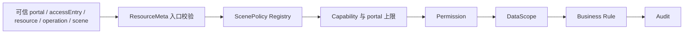

# 场景策略治理实施计划

> 状态：In Progress
> 当前事实：[治理架构](../../../architecture/core/governance/治理架构.md)

Scene Policy 用于声明资源场景的稳定能力点和静态入口上限。它补充 ResourceMeta，但不替代主体权限、数据范围和业务规则。

## 目标边界

```text
ResourceMeta       资源默认边界
ScenePolicy        例外和高风险场景能力点
Permission         当前主体是否拥有能力
DataScope          当前主体可操作的数据范围
Business Rule      当前数据状态是否允许操作
```

框架层不得出现教师、家长、学校、德育等具体业务语义。

## 稳定查找键

```text
accessEntry + resource + operationKey + scene
```

`capability` 是查找结果中的业务权限码，不属于 key。精确 `accessEntry` 优先于通用策略；通用策略只能在资源入口已通过校验后兜底，不能扩大入口。

## 默认行为

| 场景 | 默认规则 |
|---|---|
| 普通 CRUD | 由 ResourceMeta、Permission 和 DataScope 治理 |
| ACTION | 必须显式命中 Scene Policy |
| IMPORT | 不继承 CREATE，必须显式命中 |
| EXPORT | 不继承 QUERY，必须显式命中 |
| STATS | 低风险白名单可继承 QUERY，其余显式命中 |
| ENTRY_GOVERNED CRUD | 只能显式打开，仍受资源入口和数据范围限制 |

`submit`、`revoke`、`approve` 等动作不能通过基础 UPDATE 权限隐式放行。

## 治理顺序



Scene Policy 位于 Permission 之前。请求参数中的 schoolId、classId、studentId 只能收窄授权范围，不能成为授权依据。

## 最小模型

第一阶段只需要声明：

- `accessEntry`
- `resource`
- `operationKey`
- `scene`
- `capability`
- `portals`

不引入表达式 DSL、角色枚举或业务状态机。Registry 在启动期构建并冻结，重复 key 或非法 operation 直接失败。

## 审计字段

至少记录：

```text
resource / operation / scene / accessEntry / capability / portal
scenePolicyMatched / decision / reason / scope
```

白名单必须有负责人和复核说明，不能以散落常量长期存在。

## 实施顺序

1. 定义最小 Annotation/Model 和唯一 key。
2. 启动期扫描、冲突校验并生成只读 Registry。
3. 在 Permission 前接入匹配，先强制 ACTION/IMPORT/EXPORT。
4. 定义可信 portal 来源并对 portal 上限 fail-closed。
5. 补齐审计字段。
6. 建立 STATS、旧 scene 映射和 ENTRY_GOVERNED 临时白名单。
7. 选择一个真实高风险 ACTION 完成业务闭环。
8. 闭环稳定后再评估组合注解。

## 验收

- 未注册的 ACTION/IMPORT/EXPORT 默认拒绝。
- 高风险 STATS 不通过 QUERY 隐式授权。
- portal 拒绝发生在业务执行前并可审计。
- Handler 只能在治理 scope 上继续收窄。
- 独立 Controller 必须调用统一治理入口。
- 业务动态权限不进入框架通用 Annotation。

长期优先级由 [CRUD 路线图](index.md) 管理；本文只在该能力实际实施期间保留。
