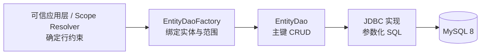

# 实体 DAO 实施清单

> 状态：In Progress（D0.1 信任边界已明确，待实现与测试）
> 当前大项：D0 合同校正
> 当前小项：D0.1 范围不可变与外部越权合同测试
> 阻塞项：无
> 最近核验：2026-09-16

本文是[实体 DAO](../../../architecture/components/crud/实体DAO.md)的待执行清单。实施遵循“先较小闭环，再较佳实践”：先完成单实体、按主键、单表、单数据源的安全读写闭环，再根据真实调用需求增加列表、分页、批量和分片能力。

## 使用规则

1. 所有事项初始保持 `[ ]`；代码、测试、文档和验收证据齐全后才能勾选。
2. D0 未完成前，不新增 `EntityDao` 公共合同或 JDBC 实现。
3. 每次只推进一个当前小项；完成阶段门禁后，才进入下一阶段。
4. 新增公共能力必须有真实调用者，不因未来设想提前扩张稳定 API。
5. 验收使用 JDK 21 和 Maven Wrapper；Core 合同同时守住 Java 8 目标兼容边界。

## 总体闭环



首期只承诺：可信应用层获得一个绑定且不可被调用参数放宽访问范围的 DAO，并以同一条写入 SQL 原子落实主键、行约束、逻辑删除和可选期望版本。DAO 不承诺防止可信业务代码主动选择错误范围。

## 首期范围

### 纳入

- 单实体、单表、单数据源。
- 按主键查询、新增、Patch 更新和删除。
- 可信应用层确定的行约束不可变绑定与执行。
- 逻辑删除、数据库生成主键和可选乐观锁。
- 参数化值、标识符白名单和稳定异常转换。
- H2 行为测试、MySQL 8 方言验收和现有 Gateway / Engine 等价回归。

### 不纳入

- `list`、精确分页、`findByIds` 和便利 Map 转换。
- 实体非 `null` 选择性更新和全量覆盖。
- 精细区分“不存在、越权、版本冲突、值未变化”。
- 批量、upsert、条件写和键集分页。
- 水平分片、路由提示、读写分离和跨数据源事务。
- JOIN、聚合、报表、跨实体规则和 ORM Session 语义。

## 阶段总览

| 阶段 | 目标 | 完成结果 |
|---|---|---|
| D0 | 校正安全与并发合同 | 外部输入无范围绕过入口，可信业务代码责任明确 |
| D1 | 建立最小 Core 合同 | 主键 CRUD 合同可独立编译，Core 不依赖 Spring/JDBC |
| D2 | 完成 JDBC 主键闭环 | 单表主键读写正确落实范围、逻辑删除和版本谓词 |
| D3 | 接入现有执行主链 | Gateway / Engine 复用 DAO 且治理、审计语义不退化 |
| D4 | 建立数据库验收证据 | H2 与 MySQL 8 的行为差异得到验证和记录 |
| D5 | 按真实需求扩展 | 每项扩展独立过门禁，不膨胀首期合同 |

## D0：合同校正

### D0.1 可信应用层与外部输入边界

- [x] 明确 Gateway、Scene Handler 和业务 Service 属于可信应用层；DAO 不防止可信业务代码主动构造错误范围或选择全量范围。
- [x] 明确 DAO 的安全责任从接收最终 `EntityAccessScope` 开始：绑定范围必须进入 SQL，且不能被查询条件或写入参数放宽。
- [x] 明确 HTTP 参数、请求 DTO 和其他外部输入不能直接提交、反序列化或替换 `EntityAccessScope` / `RowConstraint`。
- [x] 明确 `RowConstraint.unrestricted()` 是可信应用层的显式能力；常规业务避免滥用依靠应用架构、代码审查和运维治理。
- [ ] 范围对象创建后不可变；DAO 单次调用不能移除、替换或放宽范围。
- [ ] 增加外部越权合同测试：外部租户、组织和普通查询条件只能收窄授权范围，不能替换或扩大最终范围。
- [ ] 增加可信调用合同测试：Service 显式构造范围与 Resolver 产出的范围遵循相同白名单、参数化和绑定规则。

验收：外部输入不能控制最终可执行范围；可信应用层可以显式确定范围，并对其正确性负责；DAO 稳定执行绑定范围但不冒充第二套权限系统。

### D0.2 写入未命中语义

- [ ] 删除“影响 0 行后稳定精细分类”的首期承诺，不依赖后置多次查询推断唯一原因。
- [ ] 未提供 `expectedVersion` 时，影响 0 行统一映射为“目标不存在或不可写”，不区分不存在与范围拒绝。
- [ ] 提供 `expectedVersion` 时，影响 0 行统一映射为乐观锁冲突，不额外泄露目标是否存在。
- [ ] 明确写入正常返回值只允许 `1`；`0` 统一转换为稳定异常，不向调用方泄漏驱动影响行数差异。
- [ ] `JdbcWriteMissClassifier` 若继续保留，只能作为诊断或旧引擎兼容部件，不进入 DAO 的稳定业务合同。
- [ ] 增加并发测试，证明 DAO 正确性不依赖“写入后再查询”的竞态分类。

验收：无需 DAO 自建事务或假设多条语句使用同一连接，也能给出稳定且不泄露数据存在性的写入结果。

### D0.3 insert 与行约束

- [ ] 明确首期可用于 insert 校验的约束仅包含字段等值、字段 `IN` 及其 `AND` 组合。
- [ ] insert 遇到 `OR`、`NOT`、范围比较、数据库函数或无法从最终持久化值确定的约束时直接拒绝。
- [ ] 明确范围字段由框架强制填充还是由调用方提供并校验；同一实体只保留一种确定语义。
- [ ] 数据库默认值、生成列、字符集和排序规则不得由 Java 内存判断伪装成数据库等价语义。
- [ ] 范围字段缺失、值冲突、空集合约束和 SQL `NULL` 分别具有测试。

验收：所有允许进入 insert 的行约束都能在写 SQL 前确定判定，不支持的表达式 fail-closed。

### D0.4 首期 API 定稿

- [ ] 首期 `EntityDao<T, ID>` 只保留 `findById`、`insert`、Patch `updateById` 和 `deleteById`。
- [ ] 默认重载只在确实降低调用噪音且不产生语义分叉时保留。
- [ ] 明确版本实体未传 `expectedVersion` 时是允许盲写，还是强制提供期望版本。
- [ ] 明确无版本实体传入 `expectedVersion` 必须拒绝，不能静默忽略。
- [ ] 明确 Patch 的主键、实体类型、字段三态、不可写字段和空 Patch 行为。
- [ ] 首期不定义 `PersistenceRouteHint`；首个真实分片项目出现后再设计路由合同。

验收：最小接口不存在仅为便利性或未来设想增加的方法，所有返回值和异常都有唯一语义。

### D0 阶段门禁

- [ ] 架构文档已按 D0.1-D0.4 更新。
- [ ] 安全边界、未命中语义、insert 约束和版本规则不存在互相矛盾的表述。
- [ ] 公共 API 草案通过 Java 类型擦除、`null` 重载歧义和 Java 8 编译检查。
- [ ] 记录 D0 决策依据，并将 D1 设为当前阶段。

## D1：最小 Core 合同

### D1.1 范围与写入模型

- [ ] 定义不可变 `RowConstraint` 最小 AST，并限制可用字段、操作符和组合方式。
- [ ] 定义不可变访问上下文，并确保外部传输模型不能直接反序列化为可执行范围。
- [ ] 定义 `WriteOptions`，首期只承载可选 `expectedVersion`。
- [ ] 定义“目标不存在或不可写”“乐观锁冲突”“非法范围”“非法写入字段”等稳定异常。
- [ ] 所有状态和类型优先使用带中文名称说明的枚举。

### D1.2 DAO 与 Factory

- [ ] 定义最小 `EntityDao<T, ID>` 合同。
- [ ] 定义 `EntityDaoFactory`，绑定实体类型、主键元数据和可信访问范围。
- [ ] Factory 校验实体是否已注册、主键类型是否匹配、范围字段是否属于实体元数据。
- [ ] DAO 实例不可变且可安全复用，不持有可变请求状态或裸 JDBC `Connection`。
- [ ] 通过 Web 绑定和装配边界阻止外部输入直接形成可执行 scope，不限制可信 Service 显式构造范围。

### D1.3 Patch 与元数据适配

- [ ] 复用现有 `UpdatePatch<T>` 前，确认其 `Object id`、字符串字段名和 delegate Map 不会污染 DAO 稳定合同。
- [ ] 如需适配层，由适配层把现有 Patch 规范化为 DAO 内部字段变更模型，不复制第二套公开 Patch。
- [ ] 元数据明确主键、表名、列名、逻辑删除、版本、生成策略、可写字段和范围字段。
- [ ] 主键、逻辑删除、版本及范围字段不能通过普通 Patch 修改。

### D1 阶段门禁

- [ ] Core 合同测试覆盖空值、非法实体、非法字段、非法操作符、空 Patch 和版本元数据不匹配。
- [ ] Core 不依赖 Spring、Spring JDBC、Servlet、Starter 或 JDBC 实现包。
- [ ] Core 源码满足 Java 8 目标语法和 API 边界；完整 Reactor 仍使用 JDK 21 构建。
- [ ] 公共实体及字段具有充足中文注释，枚举字段使用 `link` 指向对应枚举。

## D2：JDBC 主键读写闭环

### D2.1 谓词编译

- [ ] 从现有查询与写入编译器提取可复用的字段解析、参数绑定和逻辑删除谓词部件。
- [ ] `findById` 的有效条件固定为主键、绑定范围和逻辑未删除谓词。
- [ ] update/delete 的有效条件固定为主键、绑定范围、逻辑未删除谓词和可选期望版本。
- [ ] 表名、列名只能来自冻结实体元数据；所有值都使用参数化绑定。
- [ ] 空范围、恒假范围、非法字段和超出数据库参数限制具有确定行为。

### D2.2 新增

- [ ] insert 前完成 D0.3 允许子集的范围校验或范围字段强制填充。
- [ ] 逻辑删除初始值和版本初始值由持久化映射策略统一处理。
- [ ] 调用方不能覆盖框架受控初始字段。
- [ ] 数据库生成主键稳定回收并转换为声明的 ID 类型。
- [ ] 显式主键符合实体主键策略，唯一键冲突转换为稳定数据约束异常。

### D2.3 更新与删除

- [ ] Patch 只编译明确出现且允许写入的字段，显式 `null` 进入 SQL。
- [ ] 更新字段为空时在访问数据库前拒绝。
- [ ] 版本匹配与版本递增在同一条 update SQL 中完成。
- [ ] 删除的逻辑删除或物理删除与版本匹配在同一条 SQL 中完成。
- [ ] 写入影响 0 行按 D0.2 统一映射，不执行用于业务分类的后置存在性查询。
- [ ] MySQL “matched rows / changed rows”连接选项不改变对外合同。

### D2 阶段门禁

- [ ] JDBC 单元测试覆盖 SQL 结构、参数顺序、字段白名单和异常转换。
- [ ] H2 行为测试覆盖主键查询、新增、Patch 更新、逻辑删除和乐观锁。
- [ ] 并发测试覆盖两个相同期望版本写入只有一个成功。
- [ ] DAO 本身不创建跨调用事务，事务编排仍由 Service / Gateway 负责。

## D3：接入现有 Gateway / Engine

- [ ] 盘点现有 `QuerySpec`、`CommandSpec`、治理 scope 与 DAO `RowConstraint` 的唯一映射位置。
- [ ] Gateway 将治理完成后的范围转换为 DAO scope；HTTP 或业务载荷中的普通条件只能收窄，不能替换或扩大治理范围。
- [ ] 默认 Engine 的主键读写逐项迁移到 DAO，共用 SQL 编译部件而非长期维护两套实现。
- [ ] `UpdatePatch<T>` 通过现有规范化路径进入 DAO，不新增任意实体反射写入旁路。
- [ ] Permission、DataScope、Scene Policy、审计和幂等仍由 Gateway 负责，DAO 不反向依赖治理模型。
- [ ] 复杂查询和跨表写入继续使用专用 Handler / Repository，不强行进入 DAO。
- [ ] 迁移期间建立新旧路径等价测试，完成迁移后删除失去调用者的重复实现。

### D3 阶段门禁

- [ ] 空 scene 默认 CRUD 的查询、创建、更新、删除回归通过。
- [ ] 非空 scene、范围拒绝、逻辑删除和乐观锁行为不退化。
- [ ] 审计、幂等和事务边界与迁移前一致。
- [ ] DAO Core 不依赖 Gateway，Gateway 只依赖 DAO 合同而非 JDBC 实现细节。

## D4：数据库与发布验收

### D4.1 H2 与 MySQL 8

- [ ] H2 用于快速行为回归，但不作为 MySQL 方言最终证据。
- [ ] MySQL 8 验证生成主键、逻辑删除、版本递增、显式 `null`、唯一键异常和影响行数。
- [ ] 验证连接参数变化不会改变 DAO 对外返回和异常语义。
- [ ] 验证字段名、保留字、字符集、时区和常用 Java/MySQL 类型映射。
- [ ] 验证测试结束后临时 schema 无残留。

### D4.2 模块与装配

- [ ] 第一阶段沿用 `crud-core`、`crud-engine-jdbc` 和现有 Starter，不创建占位 Maven 模块。
- [ ] Starter 仅在实体元数据和 JDBC 依赖齐备时装配 Factory，并允许用户显式覆盖。
- [ ] 普通业务 Bean 无法直接注入全量或未绑定范围的 DAO。
- [ ] 增加模块边界测试，阻止 Core 引入 Spring/JDBC 依赖或 Starter 细节。

### D4.3 最终验收

- [ ] 选择一个真实无复杂关系实体完成 Service -> Resolver -> Factory -> DAO -> MySQL 8 全链路。
- [ ] 验证合法范围可读写、其他范围不可观察、不可修改。
- [ ] 验证并发更新、逻辑删除后读取、重复删除和非法 Patch。
- [ ] 记录 Maven 命令、测试数量、数据库版本和关键测试类。
- [ ] 更新实体 DAO Architecture 的状态、最近核验日期和当前事实。
- [ ] 更新本清单状态，并在 CRUD 路线图记录完成结果。

## D5：后续扩展门禁

以下事项不是 D0-D4 的完成条件，满足真实调用需求后分别立项。

### 查询扩展

- [ ] 出现真实列表调用后，再增加有硬上限的 `list(EntityQuery)`。
- [ ] 出现真实分页调用后，再增加确定性排序和精确计数合同。
- [ ] 出现两个真实多主键调用后，再增加 `findByIds`；Map 视图优先由调用方转换。
- [ ] 精确分页成本不可接受且有真实大表场景后，再设计键集分页。

### 写入扩展

- [ ] 出现实体现有值选择性更新需求后，再评估 `updateById(ID, T)`。
- [ ] 出现真正全量覆盖语义后，再评估 `replaceById`，并先解决缺省值与 `null` 合同。
- [ ] 批量能力分别定义事务、分块、部分成功和逐项结果，不只依靠 `NonAtomic` 命名表达风险。
- [ ] 主键 upsert 通过 MySQL 8 并发与非主键唯一冲突验收后，才进入公共合同。
- [ ] 条件写必须拒绝空条件和恒真条件，并始终叠加绑定范围与逻辑删除谓词。

### 分片扩展

- [ ] 首个真实分片项目出现前，不定义 `PersistenceRouteHint`、`ShardId` 或分片 Maven 模块。
- [ ] 先完成单路由键、单分片、同事务不切换数据源的最小验证。
- [ ] 只有真实需要 SQL 改写时才评估 ShardingSphere-JDBC。
- [ ] 跨分片分页、排序、聚合和事务不进入通用 DAO。

## 验收证据模板

每完成一个阶段，在对应阶段下追加：

```text
验收日期：YYYY-MM-DD
测试命令：JAVA_HOME=<JDK21> ./mvnw -pl <modules> -am test
测试结果：<模块与测试数量，0 失败、0 错误>
关键测试：<测试类及覆盖合同>
边界确认：<未实现能力、依赖边界、兼容性结论>
遗留事项：<下一阶段或明确暂缓事项>
```
