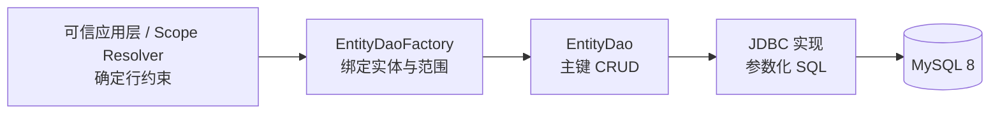

# 实体 DAO 实施清单

> 状态：In Progress（D0-D4.3 主键 CRUD 闭环及 D4.1 数据库类型矩阵已完成；D5.1 数据库生成主键 DAO 已完成）
> 当前大项：D5 需求门禁
> 当前小项：D5.1 数据库生成主键 DAO 已完成，等待 MySQL 8 验收
> 阻塞项：无
> 最近核验：2026-09-18

本文是[实体 DAO](../../../architecture/components/crud/实体DAO.md)的待执行清单。实施遵循“先完成最小安全闭环，再按真实需求演进”：先围绕一个代表性样板实体、一个真实执行链测试入口完成按主键、单表、单数据源的安全读写技术闭环，再根据真实业务调用需求增加列表、分页、批量和分片能力。

## 收缩后的首期边界

为避免首期同时改造元数据、并发控制和全部 Engine，D1-D4 首期只验证以下合同：

- 样板实体使用显式主键；数据库生成主键留到后续阶段。
- 样板实体暂不启用乐观锁；`expectedVersion` 不进入首期公共 DAO 合同。
- 保留逻辑删除；首期元数据必须显式声明未删除值和已删除值，不沿用 JDBC 中隐含的 `0/1` 假设。
- 等值或单元素 `IN` 范围字段由 DAO 在 insert 时强制填充；多元素 `IN` 由调用方提供值并由 DAO 校验，不依赖数据库默认值、生成列或触发器推导范围。
- 只迁移一个真实执行链测试入口的主键 CRUD；其他 Engine 操作、批量和 save-or-update 不在本次切换范围。该入口证明技术闭环，不冒充真实业务需求验证。
- 无版本更新采用 matched-rows 语义：目标行存在且范围匹配时，即使新旧值相同也视为成功 `1` 行；JDBC 方言和相关连接配置必须固定、启动校验并验证该行为。

在首个闭环完成前，先完成元数据能力预检；若样板实体无法由现有元数据完整表达上述语义，先补元数据模型和适配器，不提前定稿 DAO 扩展合同。

首期关键数据库语义前置探针：在 D0/D2 以最小 MySQL 8 实验确认 matched-rows 配置、无变化更新影响行数及范围字段类型转换；探针失败时先修正连接配置或收缩合同，不等到 D4 才发现基础语义不成立。

## 使用规则

1. 所有事项初始保持 `[ ]`；代码、测试、文档和验收证据齐全后才能勾选。
2. D0 未完成前，只允许形成 API 草案、决策记录和测试用例设计，不新增 `EntityDao` 公共合同或 JDBC 实现。
3. 每次只推进一个当前小项；完成阶段门禁后，才进入下一阶段。
4. 首期公共合同只服务本清单选定的执行链测试入口；D5 新增能力必须有真实业务调用者，不因未来设想提前扩张稳定 API。
5. 当前框架尚未上线，不承担历史 API、配置或运行行为兼容责任；变更默认采用干净重构，在同一闭环切换调用者并删除旧类型、旧配置、旧测试和重复实现，不增加适配层、兼容开关或双路径。
6. 测试以目标合同为准，不建立新旧行为等价门禁；需要保留的业务语义直接写入目标合同并由新实现验证。
7. 验收使用 JDK 21 和 Maven Wrapper；Core 源码仍须满足 Java 8 目标语法和 API 边界。

## 总体闭环



首期只承诺：可信应用层获得一个绑定且不可被调用参数放宽访问范围的 DAO，并以同一条写入 SQL 原子落实主键、行约束和逻辑删除。首期不包含版本谓词。DAO 不承诺防止可信业务代码主动选择错误范围。

## 首期范围

### 纳入

- 单实体、单表、单数据源。
- 按主键查询、新增、Patch 更新和删除。
- 可信应用层确定的行约束不可变绑定与执行。
- 逻辑删除；数据库生成主键和乐观锁留待后续扩展。
- 参数化值、标识符白名单和稳定异常转换。
- H2 行为测试、MySQL 8 方言验收和 Gateway / Engine 目标合同回归。

### 不纳入

- `list`、精确分页、`findByIds` 和便利 Map 转换。
- 实体非 `null` 选择性更新和全量覆盖。
- 精细区分“不存在、越权、版本冲突、值未变化”。
- 批量、upsert、条件写和键集分页。
- 水平分片、路由提示、读写分离和跨数据源事务。
- JOIN、聚合、报表、跨实体规则和 ORM Session 语义。

## 阶段总览

| 阶段 | 目标 | 完成结果 |
|---|---|---|
| D0 | 校正安全与并发合同 | 外部输入无范围绕过入口，可信业务代码责任明确 |
| D1 | 建立最小 Core 合同 | 主键 CRUD 合同可独立编译，Core 不依赖 Spring/JDBC |
| D2 | 完成 JDBC 主键闭环 | 单表主键读写正确落实范围和逻辑删除；首期无版本谓词 |
| D3 | 重构现有执行主链 | Gateway / Engine 主键路径由 DAO 唯一实现，治理与审计符合目标合同 |
| D4 | 建立数据库验收证据 | H2 与 MySQL 8 的行为差异得到验证和记录 |
| D5 | 按真实需求扩展 | 每项扩展独立过门禁，不膨胀首期合同 |

## D0：合同校正

### D0.1 可信应用层与外部输入边界

- [x] 明确 Gateway、Scene Handler 和业务 Service 属于可信应用层；DAO 不防止可信业务代码主动构造错误范围或选择全量范围。
- [x] 明确 DAO 的安全责任从接收最终 `EntityAccessScope` 开始：绑定范围必须进入 SQL，且不能被查询条件或写入参数放宽。
- [x] 明确 HTTP 参数、请求 DTO 和其他外部输入不能直接提交、反序列化或替换 `EntityAccessScope` / `RowConstraint`。
- [x] 明确 `RowConstraint.unrestricted()` 是可信应用层的显式能力；常规业务避免滥用依靠应用架构、代码审查和运维治理。
- [x] 约定范围对象创建后不可变；DAO 单次调用不能移除、替换或放宽范围。
- [x] 形成外部越权测试用例设计：外部租户、组织和普通查询条件只能收窄授权范围，不能替换或扩大最终范围；测试实现在 D1、D3 完成。
- [x] 形成可信调用测试用例设计：Service 显式构造范围与 Resolver 产出的范围遵循相同白名单、参数化和绑定规则；测试实现在 D1、D3 完成。

验收：外部输入不能控制最终可执行范围；可信应用层可以显式确定范围，并对其正确性负责；DAO 稳定执行绑定范围但不冒充第二套权限系统。

- 验收日期：2026-09-17
- 核验方式：架构合同一致性审查；D1 / D3 测试用例设计核验
- 验收结果：范围采用深不可变快照；调用条件只能通过 `AND` 收窄；外部租户、组织、普通条件与伪造 scope，以及 Resolver / Service 两类可信路径均已有分阶段验收用例
- Web 装配证据：`SubjectContextPropagationTest` 验证 HTTP 顶层 `scope`、服务端上下文选项和 `crudExplicitAll` 不能被反序列化为可执行范围；命令组装只接收 Gateway 后续生成的治理上下文。
- 边界确认：本阶段不新增公共 API 或 JDBC 实现；测试代码分别在 D1、D3 落地
- 遗留事项：进入 D0.2，校正写入未命中语义

### D0.2 写入未命中语义

> 本节保留了未来启用乐观锁后的未命中决策。由于首期已收缩为无版本样板实体，D1-D4 不实现 `expectedVersion`、版本冲突或版本并发合同。

- [x] 删除“影响 0 行后稳定精细分类”的首期承诺，不依赖后置多次查询推断唯一原因。
- [x] 未提供 `expectedVersion` 时，影响 0 行统一映射为“目标不存在或不可写”，不区分不存在与范围拒绝。
- [x] 提供 `expectedVersion` 时，影响 0 行统一映射为版本条件写入冲突，不额外泄露目标是否存在，也不承诺该异常可通过自动重试恢复。
- [x] 明确写入正常返回值只允许 `1`；`0` 统一转换为稳定异常，不向调用方泄漏驱动影响行数差异。
- [x] 明确 `JdbcWriteMissClassifier` 不进入目标架构；`OrderTestEntity` Gateway 主键入口切换到 DAO 时同步删除该入口的分类器调用点和精细分类测试。
- [x] 形成并发测试设计，证明 DAO 正确性不依赖“写入后再查询”的竞态分类；测试实现在 D2 完成。

验收：无需 DAO 自建事务或假设多条语句使用同一连接，也能给出稳定且不泄露数据存在性的写入结果。

- 验收日期：2026-09-17
- 核验方式：DAO 目标合同与默认 Engine 当前实现差异审查；D2 未命中及并发测试用例设计核验
- 验收结果：0 行异常只由 `expectedVersion` 是否存在决定，1 行为唯一正常结果，大于 1 行视为持久化不变量破坏；DAO 不执行写后分类查询
- 边界确认：D0 只校正合同，不提前修改 JDBC；D3 切换 `OrderTestEntity` Gateway 主键入口时删除该入口的 `JdbcWriteMissClassifier` 调用，不保留双路径或开关
- 遗留事项：D2 实现并发与无写后查询测试；D3 完成旧分类路径删除；进入 D0.3 校正 insert 与行约束

### D0.3 insert 与行约束

- [x] 明确首期可用于 insert 校验的约束仅包含字段等值、非空字段 `IN` 及其 `AND` 组合。
- [x] insert 遇到 `OR`、`NOT`、范围比较、数据库函数或无法从最终持久化值确定的约束时直接拒绝。
- [x] 范围约束值与调用方范围字段值统一按元数据类型规范化为实际 JDBC 绑定值，再执行填充与校验；SQL 使用同一份规范化结果。
- [x] 等值和单元素 `IN` 先规范化为唯一值并由 DAO 强制填充；调用方提供冲突值时拒绝。
- [x] 多元素 `IN` 不存在唯一可填值，调用方必须提供范围字段，DAO 校验其属于集合；字段缺失时拒绝。
- [x] 首期范围字段最终值只能由绑定参数确定；MySQL 已有表的启动期复验失败只记录告警，显式 Factory 在 scoped DAO 创建时仍严格拒绝生成列、`AUTO_INCREMENT`、`ON UPDATE` 和触发器。
- [x] 已验证 MySQL 只有表级 DML 权限时可能隐藏触发器元数据；校验要求目标表 `TRIGGER`/`ALL PRIVILEGES` 可见性，角色权限必须在当前连接激活或设为默认角色，权限不足时 fail-closed。
- [x] 数据库默认值、字符集和排序规则对范围字段最终值及类型转换已完成 MySQL 8 矩阵验证；字符串范围列要求 `_bin` 二进制排序规则，默认值不得替代 DAO 显式绑定。
- [x] 范围字段缺失、值冲突、空集合约束和 SQL `NULL` 分别具有测试。

验收：所有允许进入 insert 的行约束都能在写 SQL 前确定判定，不支持的表达式 fail-closed。

验收日期：2026-09-17<br />
关键实现：`RowConstraint`、`RowConstraintNormalizer`、`InsertConstraintValueBinder`。<br />
关键测试：`InsertConstraintValueBinderTest` 4 项、`JdbcInsertScopeDatabaseValidatorTest` 8 项通过。<br />
边界确认：`JdbcInsertScopeDatabaseValidator` 针对 MySQL 8 已存在表检查范围列的生成列、AUTO_INCREMENT、ON UPDATE、触发器及字符串排序规则；同时确认当前账号具备触发器元数据可见性。字符串范围列只接受 `_bin` 二进制排序规则。表不存在交由 DDL/迁移阶段处理，Starter 在容器刷新最低优先级再次复验，非 MySQL 继续由行为测试验证。

数据库语义矩阵补充验收（2026-09-18）：`JdbcInsertScopeDatabaseValidatorTest` 10 项通过；`DaoMysqlIntegrationTest` 在 MySQL 8.0.45 验证 `utf8mb4_0900_ai_ci` 会把 `tenant-a` 与 `TENANT-A` 判为相等并由校验器拒绝，切换到 `utf8mb4_bin` 后通过。范围列配置数据库默认值时，DAO insert 仍显式写入 `tenant-a` 与规范化后的 `BIGINT 7`（输入为字符串 `007`），数据库最终值未采用默认值；随机 schema 清理完成。

### D0.4 首期 API 定稿

- [x] 首期 `EntityDao<T, ID>` 只保留 `findById`、`insert`、Patch `updateById` 和 `deleteById`。
- [x] 默认重载只在确实降低调用噪音且不产生语义分叉时保留。
- [x] 首期不提供 `expectedVersion` 和乐观锁；版本合同作为后续独立扩展立项。
- [x] 首期无版本更新明确允许后写覆盖；不将该合同用于余额、库存等依赖“读后计算”的并发敏感写入，相关场景须等待乐观锁或条件写扩展。
- [x] 明确 Patch 的主键、实体类型、字段三态、不可写字段和空 Patch 行为。
- [x] 首期不定义 `PersistenceRouteHint`；首个真实分片项目出现后再设计路由合同。
- [x] 选定 `OrderTestEntity` 作为代表性测试样板，使用 `t_order` 根表的显式主键、`schoolId` / `tenantId` 范围字段和 `isDeleted` 逻辑删除字段；其 `items` 一对多关系不进入 DAO 元数据、SQL 或本阶段验收。当前入口为 `DefaultEngineSingleTableCrudTest` 使用的 `CommandGateway` 真实执行链测试路径，不作为真实业务调用者证据。

验收：最小接口不存在仅为便利性或未来设想增加的方法，所有返回值和异常都有唯一语义。

### D0.5 元数据能力预检

- [x] 样板实体的显式主键、表名、列名、可写字段、范围字段和逻辑删除字段均可由现有 `EntityMeta` / `EntityFieldMeta` 表达。
- [x] 为逻辑删除补充最小元数据，显式表达未删除值和已删除值；注册时校验字段类型与两个值兼容。
- [x] 预检确认首期不依赖版本字段、数据库生成主键、默认值、生成列或触发器推导范围。
- [x] 预检确认 `UpdatePatch` 可在唯一规范化边界转换为内部字段变更模型，不让 DAO 依赖 `getValuesForDelegate()`。
- [x] 预检通过后才进入 D1；不通过时先补元数据或收缩样板实体，不先创建 DAO 公共合同。

预检记录（2026-09-17）：

- `EntityMeta` / `EntityFieldMeta` 现可表达显式主键、逻辑删除字段、未删除值、已删除值、列映射、可写字段和 `scopeField` 标记；注册时校验逻辑删除字段类型、状态值类型及两个状态值不相同。
- 当前元数据没有版本字段、版本类型或递增策略，乐观锁不能进入首期。
- `OrderTestEntity` 作为根表样板时具备 `schoolId`、`tenantId` 和逻辑删除字段；其 `items` 一对多关系被明确排除，不进入 DAO 元数据、SQL 或本阶段验收，因此满足首期单表条件。
- `StudentTestEntity` 是单表显式主键实体，但没有范围字段和逻辑删除字段。
- `JdbcCrudCommandHandlerTest` 中的 `TestEntity` 通过手工 `EntityMeta` 设置了 `schoolId(scopeField=true, writable=false)`，只能作为元数据行为夹具，不能替代真实业务样板。
- `DefaultEngineSingleTableCrudTest` 通过现有 `CommandGateway` 覆盖 `OrderTestEntity` 根表的 create、update、delete 和逻辑删除路径；新增测试确认 `schoolId` / `tenantId` 不可通过 Gateway 更新，`items` 不进入根表元数据。
- 验收命令：`JAVA_HOME=C:\\Users\\40428\\.jdks\\ms-21.0.12.1 .\\mvnw.cmd -pl ent-loom-modules/ent-loom-crud/ent-loom-crud-engine-jdbc -am -Dtest=DefaultEngineSingleTableCrudTest -Dsurefire.failIfNoSpecifiedTests=false test`
- 验收结果：18 项测试通过，0 失败，0 错误；范围字段元数据和 Gateway 入口验证完成。
- 结论：`OrderTestEntity` 根表样板和现有 Gateway 测试入口已确定；本轮已补齐逻辑删除状态值解析及 `UpdatePatch` 内部规范化模型，进入 D1/D2 实现。

### D0 阶段门禁

- [x] 架构文档已按 D0.1-D0.5 更新。
- [x] 安全边界、未命中语义、insert 约束和版本规则不存在互相矛盾的表述。
- [x] 公共 API 草案通过 Java 类型擦除、`null` 重载歧义和 Java 8 编译检查。
- [x] 记录 D0 决策依据，并将 D1 设为当前阶段。

## D1：最小 Core 合同

### D1.1 范围与写入模型

- [x] 定义不可变 `RowConstraint` 最小 AST，并限制可用字段、操作符和组合方式。
- [x] 定义不可变访问上下文，并确保外部传输模型不能直接反序列化为可执行范围。
- [x] 首期不定义 `WriteOptions`；版本条件写入冲突留待乐观锁扩展。
- [x] 定义“目标不存在或不可写”“非法范围”“非法写入字段”等稳定异常。
- [x] 所有状态和类型优先使用带中文名称说明的枚举。
- [x] 使用已选样板实体校验范围 AST 和访问上下文能够表达目标调用，不为样板实体增加专用分支。

### D1.2 DAO 与 Factory

- [x] 定义最小 `EntityDao<T, ID>` 合同。
- [x] 定义同时携带实体类型与主键类型的 `EntityType<T, ID>`（或等价描述符），`EntityDaoFactory` 通过该描述符绑定实体、主键元数据和可信访问范围。
- [x] Factory 校验实体是否已注册、描述符主键类型是否与元数据匹配、范围字段是否属于实体元数据；不依赖被类型擦除的返回值泛型推断。
- [x] DAO 实例不可变且可安全复用；复用边界限于同一绑定范围，不跨请求错误共享租户/范围状态；不持有可变请求状态或裸 JDBC `Connection`。
- [x] 通过 Web 绑定和装配边界阻止外部输入直接形成可执行 scope，不限制可信 Service 显式构造范围。
- [x] 合同测试证明范围对象不可变，DAO 调用参数不能替换或放宽已绑定范围。
- [x] 首期 Factory 只接受满足元数据预检能力边界的单表显式主键、无版本实体；样板实体仅用于验收，不为数据库生成主键或版本实体预留分支，也不增加样板类型专用分支。

### D1.3 Patch 与元数据适配

- [x] 复用现有 `UpdatePatch<T>` 前，确认其 `Object id`、字符串字段名和 delegate Map 不会污染 DAO 稳定合同。
- [x] 在唯一规范化边界把 `UpdatePatch<T>` 转换为 DAO 内部字段变更模型，不设置旧 Patch 适配入口，也不复制第二套公开 Patch。
- [x] 首期元数据明确显式主键、表名、列名、逻辑删除、可写字段和范围字段；版本和生成策略留待后续扩展。
- [x] 主键、逻辑删除及范围字段不能通过普通 Patch 修改。

### D1 阶段门禁

- [x] Core 合同测试覆盖空值、非法实体、非法字段、非法操作符和空 Patch。
- [x] Core 不依赖 Spring、Spring JDBC、Servlet、Starter 或 JDBC 实现包。
- [x] Core 源码满足 Java 8 目标语法和 API 边界；完整 Reactor 仍使用 JDK 21 构建。
- [x] 公共实体及字段具有充足中文注释，枚举字段使用 `link` 指向对应枚举。

## D2：JDBC 主键读写闭环

### D2.1 谓词编译

- [x] 从现有查询与写入 SQL 部件提取可复用的参数化等值/IN 绑定，并由 `JdbcEntityPredicateCompiler` 统一编译主键、范围和逻辑删除谓词。
- [x] `findById` 的有效条件固定为主键、绑定范围和逻辑未删除谓词。
- [x] update/delete 的有效条件固定为主键、绑定范围和逻辑未删除谓词。
- [x] 表名、列名只能来自冻结实体元数据；所有值都使用参数化绑定。
- [x] 空范围、恒假范围、非法字段和超出 DAO SQL 参数上限具有确定行为。

### D2.2 新增

- [x] insert 前按 D0.3 完成范围处理：唯一值约束由 DAO 填充，多元素 `IN` 由调用方提供且由 DAO 校验。
- [x] 逻辑删除初始值由显式元数据映射统一处理。
- [x] 调用方不能覆盖框架受控初始字段。
- [x] 显式主键符合实体主键策略，唯一键冲突转换为稳定数据约束异常。
- [x] 数据库生成主键不属于首期合同，调用方不得依赖生成键回收。

### D2.3 更新与删除

- [x] Patch 只编译明确出现且允许写入的字段，显式 `null` 进入 SQL。
- [x] 更新字段为空时在访问数据库前拒绝。
- [x] 首期不执行版本匹配和版本递增；乐观锁作为后续扩展。
- [x] 删除的逻辑删除或物理删除在同一条 SQL 中完成。
- [x] 写入影响 0 行按 D0.2 统一映射，不执行用于业务分类的后置存在性查询。
- [x] JDBC Starter 启动时通过真实 `DataSource` 连接校验 MySQL 驱动和 `useAffectedRows`；配置为 `true` fail-fast，未配置按 Connector/J 默认 matched-rows 语义处理；H2 无变化更新返回 `1`。
- [x] 实际 MySQL 8 连接验证正确配置下无变化更新返回 `1`，错误配置启动失败；证据已在 D4.1 留档。

### D2 阶段门禁

- [x] JDBC 单元测试覆盖 SQL 结构、参数顺序、字段白名单、参数上限和异常转换。
- [x] H2 行为测试覆盖主键查询、新增、Patch 更新和逻辑删除。
- [x] 首期并发测试覆盖范围谓词下的单条写入原子性；乐观锁并发测试留待版本扩展。
- [x] DAO 本身不创建跨调用事务，事务编排仍由 Service / Gateway 负责。
- [x] 已选样板实体完成 Factory -> DAO -> H2 的主键读写闭环，且使用与选定执行链测试入口相同的元数据与范围模型。

验收日期：2026-09-17<br />
测试命令：`JAVA_HOME=/Users/zubin/Library/Java/JavaVirtualMachines/temurin-21.0.12.1/Contents/Home ./mvnw -pl ent-loom-modules/ent-loom-crud/ent-loom-crud-engine-jdbc -am test`<br />
测试结果：Core 244 项、JDBC 79 项通过，0 失败、0 错误。<br />
关键测试：`InsertConstraintValueBinderTest`、`JdbcEntityPredicateCompilerTest`、`JdbcMatchedRowsStartupValidatorTest`、`JdbcEntityDaoTest`、`DefaultEngineSingleTableCrudTest`、`DefaultEngineDaoScopeGatewayTest`。<br />
边界确认：DAO 谓词编译、参数上限、H2 行为、范围并发和启动配置校验已完成；实际 MySQL 8 证据已由 D4.1/D4.3 补齐。显式主键实体的 CommandGateway 单条、批量和 save-or-update 已统一切换到 DAO；EntityDao 直接支持数据库生成主键，但默认 Command Handler 仍使用专用回退处理器。<br />
遗留事项：D4.1 的 MySQL 8 实例验收和 D4.2 的 Starter 装配验收已补齐；DAO 原生批量公共合同仍按 D5 真实需求门禁管理。

## D3：以 DAO 重构一个真实执行链测试入口

- [x] 盘点现有 `QuerySpec`、`CommandSpec`、治理 scope 与 DAO `RowConstraint` 的唯一映射位置；映射集中在 `JdbcEntityDaoCommandHandler`。
- [x] Gateway 执行治理后由 DAO Handler 将 `CrudDataScope` 转换为 DAO scope；载荷不能替换或扩大治理范围。
- [x] 外部越权集成测试覆盖租户、组织和普通目标条件，证明选定执行链测试入口只能收窄最终范围；可信 Service 显式范围与 Resolver 范围使用同一校验和绑定路径。
- [x] 选定的 `OrderTestEntity` `CommandGateway` 真实执行链测试入口的单条 CREATE/UPDATE/DELETE 主键写入切换到 DAO，不保留该操作的原主键 SQL 备用路径。
- [x] `UpdatePatch<T>` 通过 `DefaultCommandPayloadBinder` 和 `NormalizedUpdatePatch` 规范化后进入 DAO，不新增任意实体反射写入旁路。
- [x] Permission、DataScope、Scene Policy、审计和幂等仍由 Gateway 负责，DAO 不反向依赖治理模型；已补 Gateway 幂等回归。
- [x] 复杂查询、批量和 save-or-update 继续使用专用 Handler，不强行进入 DAO。
- [x] 显式主键实体的单条、批量和 save-or-update 已删除重复主键 SQL 调用；`JdbcWriteMissClassifier` 类型及全部调用点已删除，不保留 deprecated 入口、适配层、兼容开关或双写双读。

### D3 阶段门禁

- [x] 空 scene 默认 CRUD 的查询、创建、更新、删除回归通过。
- [x] 非空 scene、租户/组织范围拒绝和逻辑删除符合目标合同。
- [x] 该入口涉及的审计、幂等和事务边界由目标架构测试覆盖；其他入口不作为本阶段完成条件。
- [x] DAO Core 不依赖 Gateway；Gateway 执行链通过 JDBC Handler 依赖 DAO 合同，不在 Core 引入 JDBC 实现细节。

阶段验收（2026-09-18 更新）：`DefaultEngineSingleTableCrudTest` 22 项、`DefaultEngineDaoScopeGatewayTest` 1 项通过；空/非空 Scene 的样板实体单条 CRUD、批量、save-or-update、逻辑删除、Patch、Gateway 幂等、完整审计事件、外层事务回滚以及租户/组织/普通目标条件越权拒绝均已验证。Starter 默认处理器已切换为 DAO 优先路由，数据库生成主键实体在默认 Command 路由中继续进入回退处理器，但可由业务直接注入 EntityDao 使用。

## D4：数据库与发布验收

### D4.1 H2 与 MySQL 8

- [x] H2 用于快速行为回归，但不作为 MySQL 方言最终证据。
- [x] MySQL 8 验证显式主键、逻辑删除、唯一键异常、无变化更新和影响行数；显式 `null` 仍由 H2 DAO 合同测试覆盖。
- [x] 验证 matched-rows 必需连接配置正确时 DAO 语义稳定，错误配置在真实 MySQL 连接启动期 fail-fast；不承诺兼容会改变影响行数语义的配置。
- [x] 验证实体表名、字段名和保留字：JDBC 方言统一引用元数据标识符，H2 真实用例覆盖 `order` 表及 `select`/`group` 列的 DAO 写入、读取、更新和查询编译。
- [x] 验证字符集、时区和更多常用 Java/MySQL 类型映射。
- [x] 验证测试结束后临时 schema 无残留。

D4.1 验收证据（2026-09-17）：`DaoMysqlIntegrationTest` 1 项通过，实际连接 MySQL 8.0.45；覆盖 `useAffectedRows=true` 启动拒绝、`false` 启动通过、无变化更新返回 1、范围字段 SQL 填充、逻辑删除、唯一键异常、字符集/字段类型和随机 schema 清理复核，并执行 `JdbcInsertScopeDatabaseValidator` 验证范围列数据库结构。新增 `JdbcReservedIdentifierIntegrationTest` 2 项通过，H2 真实验证保留表名/列名的 DAO CRUD 与查询编译。

D4.1 类型矩阵验收（2026-09-18）：`JdbcCommonTypesEntityDaoTest` 在 H2 验证 UTF-8 文本、Boolean、Integer、Long、`DECIMAL(19,4)`、`DATE`、`TIMESTAMP`、可空字段的插入、读取、Patch、精度和显式 `null`；`DaoMysqlTypeMatrixIntegrationTest` 在实际 MySQL 8.0.45 上通过 `mysql-integration` profile 验证 `utf8mb4`、`TINYINT(1)`、`DECIMAL(19,4)`、`DATE`、`DATETIME(6)` 及 session 时区切换。此次与 `DaoMysqlIntegrationTest` 共 2 项真实 MySQL 测试通过，随机 schema 清理完成。

### D4.2 模块与装配

- [x] 第一阶段沿用 `crud-core`、`crud-engine-jdbc` 和现有 Starter，不创建占位 Maven 模块。
- [x] Starter 仅在实体元数据和 JDBC 依赖齐备时装配 `JdbcEntityDaoFactory`，并允许用户通过 `EntityDaoFactory` 显式覆盖。
- [x] 默认 Factory 注入 `JdbcInsertScopeDatabaseValidator`；标准 `JdbcGuardedSqlExecutor` 自动复用底层 `DataSource`，自定义执行器必须显式传入校验器，缺失时 scoped DAO 拒绝创建。
- [x] Starter 不注册未绑定范围的裸 `EntityDao`；业务通过 `@EntDao` 接口注入，每次调用由显式配置的 `EntityDaoScopeResolver` 解析可信范围，再委托 Factory。支持默认应用包扫描和 `@EntDaoScan`，缺少解析器或声明不合法时启动失败。
- [x] Starter 将 `JdbcEntityDaoCommandHandler` 设为全局默认处理器；处理器对显式主键实体执行 DAO 合同，数据库生成主键实体在默认 Command 路由中明确回退到 `JdbcCrudCommandHandler`，但可由业务直接注入 EntityDao 使用。
- [x] 现有 Core 模块边界测试阻止 Core 引入 Spring/JDBC 依赖或 Starter 细节。

D4.2 验收证据（2026-09-18）：`CrudStarterConfigurationContractTest` 已验证 JDBC/元数据齐备时 Factory 条件装配、Factory 类型暴露、范围数据库校验监听器及无裸 DAO Bean；`JdbcInsertScopeDatabaseStartupValidatorTest` 验证监听器以最低优先级执行、触发复验且失败时不阻塞容器刷新；`CrudCoreModuleBoundaryTest` 维持 Core 构件边界，Starter 不创建新的 Maven 模块。

### D4.3 最终验收

- [x] 已选样板实体 `OrderTestEntity` 完成 Service / Gateway -> Resolver -> Factory -> DAO -> MySQL 8 全链路，不在本阶段临时更换验收对象。
- [x] 验证合法范围可读写，其他范围不可观察、不可修改。
- [x] 验证并发更新、逻辑删除后读取、重复删除和非法 Patch。
- [x] 记录 Maven 命令、测试数量、数据库版本和关键测试类。
- [x] 更新实体 DAO Architecture 的状态、最近核验日期和当前事实。
- [x] 更新本清单状态，并在 CRUD 路线图记录完成结果。

D4.3 验收证据（2026-09-17）：`DaoMysqlIntegrationTest` 通过 1 项，实际连接 MySQL 8.0.45；其中 `OrderTestEntity` 的 `t_order` 通过真实治理范围解析、`JdbcEntityDaoFactory`、DAO 命令处理器和 `CommandGateway` 完成创建、更新、读取、越权拒绝、并发更新、逻辑删除、重复删除和非法 Patch 验收。测试结束后随机 schema 无残留。

全仓 Reactor 回归证据（2026-09-18）：使用 JDK 21 执行 `./mvnw test`，37 个模块全部成功，634 项测试执行，0 失败、0 错误、4 项跳过。跳过项为未配置连接信息的 MySQL 集成测试；本次回归未替代 D4.1/D4.3 已记录的真实 MySQL 8.0.45 验收。

## D5：后续扩展门禁

以下事项不是 D0-D4 的完成条件，满足真实调用需求后分别立项。

### 查询扩展

- [ ] 出现真实列表调用后，再增加有硬上限的 `list(EntityQuery)`。
- [ ] 出现真实分页调用后，再增加确定性排序和精确计数合同。
- [ ] 出现两个真实多主键调用后，再增加 `findByIds`；Map 视图优先由调用方转换。
- [ ] 精确分页成本不可接受且有真实大表场景后，再设计键集分页。

### 写入扩展

- [x] 商城订单真实调用驱动 EntityDao 支持数据库生成主键：执行器执行前声明能力、校验影响一行和唯一非空键，并将主键回填实体。
- [ ] 出现实体现有值选择性更新需求后，再评估 `updateById(ID, T)`。
- [ ] 出现真正全量覆盖语义后，再评估 `replaceById`，并先解决缺省值与 `null` 合同。
- [ ] 批量能力分别定义事务、分块、部分成功和逐项结果，不只依靠 `NonAtomic` 命名表达风险。
- [ ] 主键 upsert 通过 MySQL 8 并发与非主键唯一冲突验收后，才进入公共合同。
- [ ] 条件写必须拒绝空条件和恒真条件，并始终叠加绑定范围与逻辑删除谓词。

D5.1 验收证据（2026-09-18）：`GeneratedKeyExecutionTest`、`JdbcEntityDaoTest` 与商城 `OrderDaoIntegrationTest` 覆盖不支持能力时执行前拒绝、影响行数、唯一非空键、主键类型与实体回填，并以真实 `@EntDao` 扫描代理、H2 MySQL 模式和 Spring 服务事务验证下单、详情查询及第二条明细失败时整体回滚。JDBC Engine 105 项、商城示例 13 项通过；MySQL 8 生成键仍待实例验收。

### 乐观锁扩展

- [ ] 出现首个真实版本实体后再立项；首版仅支持 `Integer` / `Long` 数值版本和固定 `+1`。
- [ ] 版本实体写入必须提供 `expectedVersion`，无版本实体传入时直接拒绝。
- [ ] 更新、删除的版本判断必须进入同一条写入 SQL；影响 `0` 行统一表示版本条件冲突，不做后置分类查询。
- [ ] 并发验收证明同一预期版本的两个写入恰好一个成功。
- [ ] 时间戳、字符串、自定义递增器和数据库函数版本不进入首版。

### 分片扩展

- [ ] 首个真实分片项目出现前，不定义 `PersistenceRouteHint`、`ShardId` 或分片 Maven 模块。
- [ ] 先完成单路由键、单分片、同事务不切换数据源的最小验证。
- [ ] 只有真实需要 SQL 改写时才评估 ShardingSphere-JDBC。
- [ ] 跨分片分页、排序、聚合和事务不进入通用 DAO。

## 验收证据模板

每完成一个阶段，在对应阶段下追加：

```text
验收日期：YYYY-MM-DD
测试命令：JAVA_HOME=<JDK21> ./mvnw -pl <modules> -am test
测试结果：<模块与测试数量，0 失败、0 错误>
关键测试：<测试类及覆盖合同>
边界确认：<未实现能力、依赖边界、被替代实现删除结论>
遗留事项：<下一阶段或明确暂缓事项>
```
