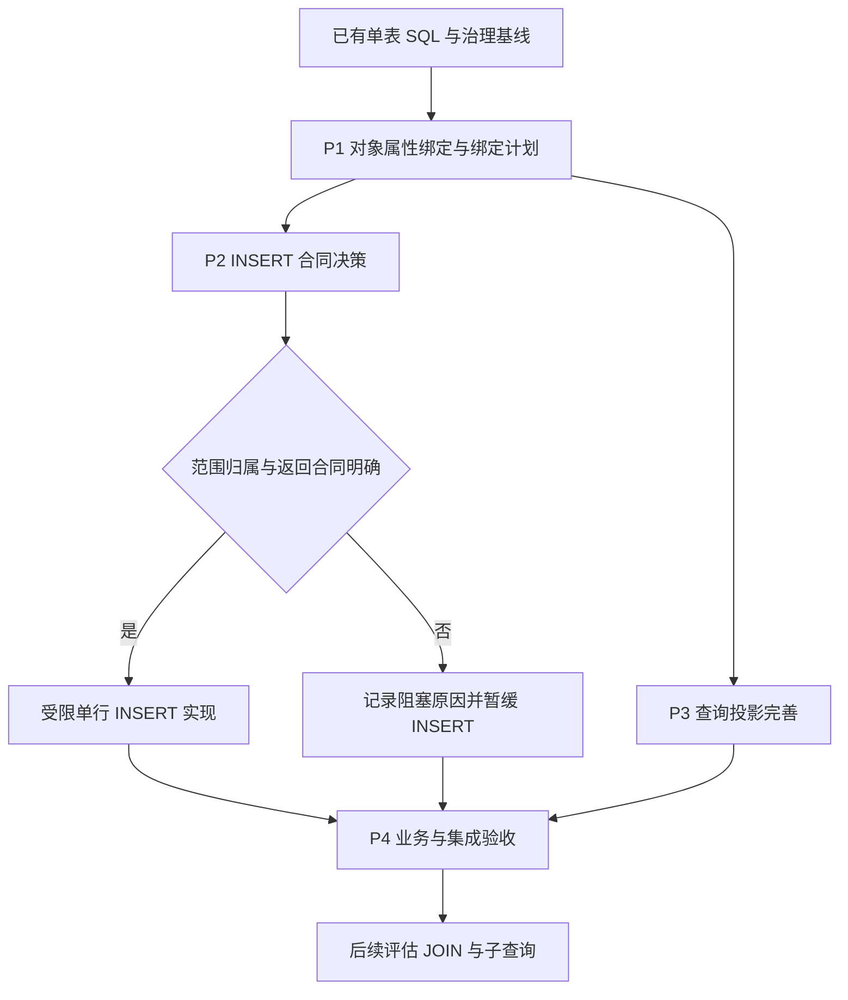

# 实体 DAO 自定义 SQL 一期实施清单

> 状态：P1 JavaBean 对象路径已实现；Map/record、INSERT 与构造器投影 Remaining<br />
> 核验日期：2026-09-21<br />
> 当前合同：[实体 DAO 自定义方法](../../../architecture/components/crud/实体DAO自定义方法.md)<br />
> 关联：[实体 DAO 实施清单](实体DAO实施清单.md)、[统一读写与分页设计](../../../architecture/components/crud/实体DAO统一读写与分页设计.md)

## 目标与使用规则

在现有受治理的单表自定义 SQL 基础上，逐步补齐面向对象的参数输入和明确的结果映射。本文是新增能力的实施入口，示例标为“目标”的均不能视为当前可用 API。

按“先较小闭环，再较佳实践”推进：先完成对象参数绑定及必要的内部模型拆分，再确定 INSERT 的范围归属和主键合同，最后完善投影与业务验收。JOIN 等复杂查询只做边界评估，不作为一期上线条件。

每项只有在实现、针对性测试、当前合同文档及验收记录同步完成后才可打钩。评估项打钩只代表决策完成，不代表功能已经支持。本文已有能力表来自源码和现存测试核对，本次文档整理未重新运行 Java 测试。

## 当前基线

| 能力 | 当前状态 | 证据入口 |
|---|---|---|
| 单表 SELECT、UPDATE、DELETE | 已实现 | `JdbcEntityDaoCustomMethodExecutor` |
| 方法参数名绑定、IN 集合、枚举和时间规范化 | 已实现；依赖 `-parameters` | `validateParameters`、`bind`、`JdbcEntityValueBinder` |
| 实体、明确 DTO、List、Optional | 已实现；不等同于任意构造器或 record 映射 | `JdbcEntityDaoCustomMethodExecutorTest` |
| 单表 PageQuery / PageResult、可选 count | 已实现 | `EntDaoPaginationIntegrationTest`、分页设计文档 |
| 范围和逻辑删除治理、OR 条件保护、非法 SQL 拒绝 | 已实现 | `JdbcEntityDaoCustomMethodExecutorTest` |
| Starter 扫描、声明校验、代理执行 | 已实现 | `EntDaoTest` |
| JavaBean 对象属性路径 | 已实现；显式路径，不自动展开 | `JdbcEntityDaoCustomMethodExecutor`、`JdbcEntityDaoCustomMethodExecutorTest` |
| Map、record 参数路径 | 未实现 | 当前阶段只支持 JavaBean 可读属性 |
| 自定义 INSERT | 未实现 | 当前命令只接受 UPDATE / DELETE |
| JOIN、子查询、CTE、UNION、任意动态 SQL | 当前禁止 | 受限 SQL 解析合同 |

源码与测试位置：

- JDBC 执行及测试：`ent-loom-modules/ent-loom-crud/ent-loom-crud-engine-jdbc/src/{main,test}/java/com/entloom/crud/engine/jdbc/dao/`。
- Starter 代理及测试：`ent-loom-modules/ent-loom-crud/ent-loom-crud-spring-boot-starter/src/{main,test}/java/com/entloom/crud/starter/dao/`。

## 能力边界与顺序




绑定计划只保存结构、实体字段元数据和 JavaBean 访问方式，不能保存实参、参数值或请求级范围。INSERT 的新增归属检查独立于查询 WHERE 治理，不能机械复用追加条件的方式。

## P1：对象属性参数绑定

业务目标：直接传入实体或请求 DTO，避免 Service 为每个自定义方法逐个拆参数。

当前已支持的 API：

```java
@EntCommand("update customer set name = :customer.name where id = :customer.id")
int updateName(Customer customer);

@EntQuery("select * from customer where name = :filter.name")
List<Customer> findByFilter(CustomerFilter filter);
```

当前合同：使用显式 `:参数名.属性名`，支持 JavaBean 嵌套路径，保留 `:id`；单对象不自动展开成无前缀的 `:id`、`:name`。根对象或中间节点为 `null` 时执行前失败，叶子 `null` 按现有字段绑定规则传递。不支持 Map、record、方法调用表达式、SpEL、数组下标及任意反射表达式。

| 编号 | 待办 | 实现位置 | 验收标准 |
|---|---|---|---|
| P1.1 | 定义路径语法、根参数名和错误合同 | JDBC DAO 参数解析；当前合同文档 | 非法路径、未知根参数、保留前缀在启动期拒绝；保留普通参数和 PageQuery 特殊参数规则 |
| P1.2 | 提取最小不可变绑定计划和属性读取职责 | `JdbcEntityDaoCustomMethodExecutor` 所在包 | 同一参数多次引用正确；不同调用与并发调用不串值；不为每种类型新增独立公共 SPI |
| P1.3 | JavaBean 属性与嵌套路径 | 参数访问器、SQL 词法与表达式解析 | `customer.id`、`request.customer.id` 正确绑定；未知或不可读属性启动失败；对象属性与普通参数可混用 |
| P1.4 | 明确 null 语义 | 参数访问器及异常信息 | 根对象或中间节点为 null 时执行前报完整路径；叶子 null 按现有字段绑定规则传递，不自动改写为 IS NULL |
| P1.5 | Map 与 record 输入支持 | 参数访问器、兼容性测试 | Map 缺失键与显式 null 可区分，缺失键执行前失败；Map 动态键不声称能启动期验证；record 在 Java 17/21 测试夹具验证 |
| P1.6 | 统一字段类型与集合规范化 | `JdbcEntityValueBinder`、参数绑定计划 | 以 SQL 对应实体字段规范化值；覆盖枚举、日期、重复引用和 IN 集合；非 IN 集合、集合 null 元素按现有规则拒绝 |
| P1.7 | 评估显式参数别名注解 | annotations、Starter、JDBC 参数元数据 | 决定是否引入 `@EntParam`；若引入，明确与 `-parameters` 的优先级并验证重复名、空名；若暂缓，记录原因 |

- [x] P1.1 路径与错误合同完成。
- [x] P1.2 最小绑定计划提取完成。
- [x] P1.3 JavaBean 与嵌套路径完成。
- [x] P1.4 null 语义与异常验证完成。
- [ ] P1.5 Map 与 record 输入完成（暂缓：尚无一期真实需求，避免扩大 Java 兼容面）。
- [x] P1.6 类型规范化与集合回归完成。
- [ ] P1.7 参数别名决策完成（暂缓：当前继续要求 `-parameters`，有真实无参数名构建需求再单独决策）。

兼容要求：完整 Reactor 使用 JDK 21；Java 8 目标模块不得直接引用高版本 record API 或使用 record 语法。record 支持方案需按[运行时兼容边界](../../decisions/core/Java运行时与Spring兼容性.md)选定实现位置和访问方式。

## P2：INSERT 合同与受限实现

业务目标：确有自定义插入需求时，允许通过相同 DAO 声明单行写入，保持与基础新增一致的范围和事务边界。

目标 API（待合同决策及实现；假设实体采用显式主键）：

```java
@EntCommand("insert into customer (id, name) values (:customer.id, :customer.name)")
int insertCustomer(Customer customer);
```

此示例省略范围字段，不表示当前已支持自动注入。必须先证明如何从可信范围确定新增归属；不能从任意 OR、IN 或区间谓词猜测租户或组织值。

| 编号 | 待办 | 实现位置 | 验收标准 |
|---|---|---|---|
| P2.1 | 明确新增归属与范围字段规则 | DAO 范围合同、现有 insert 校验链、设计决策 | 区分可信等值、冲突、多值及不可推导范围；定义注入还是校验策略；不可证明归属时拒绝执行 |
| P2.2 | 明确主键、默认值与返回合同 | `EntCommand` 合同、DAO 主键策略 | 优先使用影响行数；明确生成主键是否暂缓；不得让 long 同时表示主键和影响行数 |
| P2.3 | 实现单表、显式列、单行 VALUES | JDBC 受限解析器与执行器 | 列值数量、重复列、未知列、受保护字段检查通过；拒绝 INSERT SELECT、批量 VALUES、upsert |
| P2.4 | 复用对象参数、归属校验和事务执行 | JDBC 绑定与守卫执行器 | 正常写入、越权拒绝、逻辑删除初值、默认列值、外层回滚在测试中验证 |

- [ ] P2.1 范围归属决策完成。
- [ ] P2.2 主键和返回合同决策完成。
- [ ] P2.3 受限单行 INSERT 完成。
- [ ] P2.4 治理、参数和事务验收完成。

P2.1/P2.2 未确定前不实现 INSERT。P2.3/P2.4 还必须保证“最终写入值”与范围校验值一致：先按受限 `VALUES` 列表形成待写入字段快照，再执行范围字段注入或冲突校验，最终绑定只能来自该快照；数据库默认值不能被当作已验证的范围归属。若暂缓，记录原因和重新进入条件；其他已完成阶段可以独立交付，不得宣称 INSERT 已完成。

## P3：查询投影完善

业务目标：已有 DTO 查询继续可用，新增映射能力具备明确列名、类型和 null 合同，不把当前 DTO 支持误写为待从零实现。

目标使用形态：`Optional<CustomerSummary> findSummary(Long id)`；其中 `CustomerSummary` 的构造器或 record 映射规则须先确定。

| 编号 | 待办 | 实现位置 | 验收标准 |
|---|---|---|---|
| P3.1 | 盘点现有映射并确定列别名合同 | 当前查询结果映射器、JDBC DAO | 覆盖实体、已有 DTO、List、Optional、PageResult；列缺失、重复别名、未知列行为有明确定义 |
| P3.2 | 构造器及 record 投影 | 结果映射器、对应版本测试夹具 | 构造器选择确定；列与参数匹配可解释；基本类型接收 SQL NULL 时明确失败；满足 Java 兼容边界 |
| P3.3 | 评估 Map 投影需求 | 查询返回类型合同 | 有真实需求才确定键命名与重复列行为并实施；否则明确暂缓，不扩大泛型返回合同 |

- [ ] P3.1 现有映射回归与别名合同完成。
- [ ] P3.2 构造器与 record 投影完成。
- [ ] P3.3 Map 投影决策完成，并按决策实施或暂缓。

## P4：业务与集成验收

- [ ] 在示例工程接入对象参数更新或过滤查询；至少一个真实调用方使用新合同（当前以 JDBC 测试夹具作为阶段调用方，示例工程接入留待 P4）。
- [x] JDBC 单元/H2 测试覆盖对象读取、缺失路径、null、枚举、时间、集合及同参数重复引用。
- [ ] Starter 测试覆盖启动失败、代理调用、PageQuery 与对象参数混用、事务回滚。
- [ ] 回归 OR 条件治理、范围隔离、逻辑删除、单对象基数、稳定分页和可选 count。
- [ ] 按仓库 MySQL 8 integration profile 验证本期新增 SQL 行为；记录数据库版本和测试结果。
- [ ] 用 JDK 21 执行相关模块构建及仓库要求的兼容检查；未执行或失败项如实记录。
- [ ] 更新当前能力文档、Mermaid 图、示例及本文验收记录；所有暂缓项均有明确原因。

## 后续评估：不纳入一期实现承诺

- [ ] 收集 JOIN 查询的真实用例，明确主表与关联表各自的数据范围、逻辑删除、结果基数和分页语义，再决定 SQL Parser 方案。
- [ ] 评估只读子查询；CTE、UNION、复杂聚合、窗口函数继续禁止，直到有独立设计与验收。
- [ ] 评估游标分页及更复杂 count；沿用现有单表分页，不重复实现。

JOIN 涉及多表，不能称为“单表 JOIN”。复杂跨聚合写、数据库特有语法继续交给专用 Repository。方法名推导、XML Mapper、任意动态 SQL、ORM Session 和懒加载不进入本期。

## 验收记录模板

每个阶段完成时追加记录，不预填通过结果。

| 阶段/编号 | 实现或提交 | 测试命令与环境 | 结果 | 当前合同更新 | 暂缓项与原因 |
|---|---|---|---|---|---|
| P1.1-P1.6 | `JdbcEntityDaoCustomMethodExecutor` 对象路径绑定与测试 | `JAVA_HOME=/Users/zubin/Library/Java/JavaVirtualMachines/temurin-21.0.12.1/Contents/Home ./mvnw -pl ent-loom-modules/ent-loom-crud/ent-loom-crud-engine-jdbc -am -Dtest=JdbcEntityDaoCustomMethodExecutorTest -Dsurefire.failIfNoSpecifiedTests=false test`；JDK 21、H2 | 通过，8 tests，0 failures，0 errors | 已更新 JavaBean 路径合同；Map/record 暂缓 | 无；INSERT、构造器/record 投影和真实示例工程接入留待后续阶段 |
