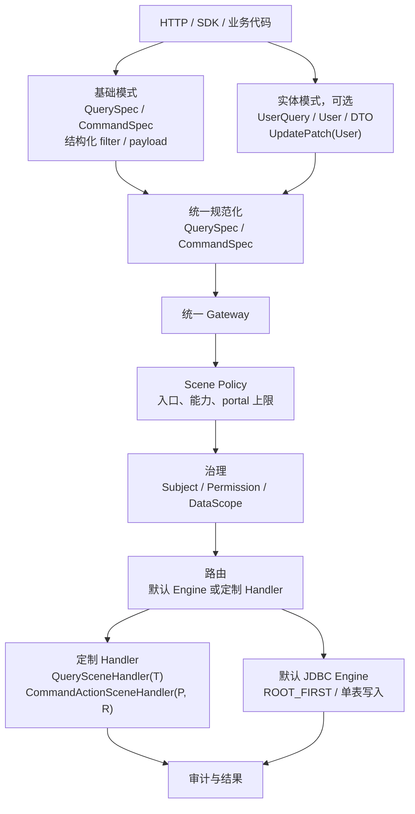
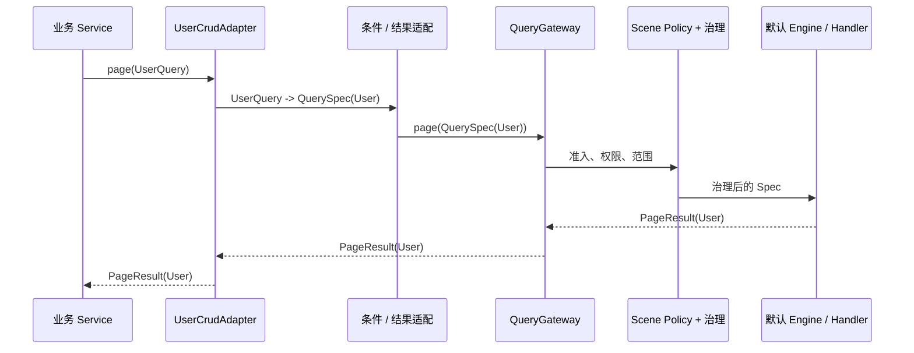
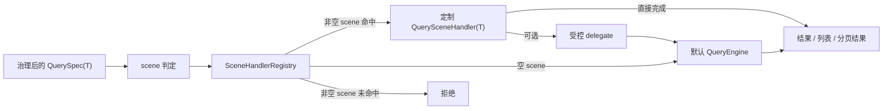
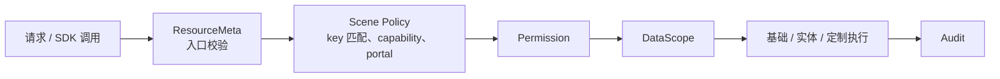

# 统一 CRUD 执行模式实施计划

> 状态：In Progress（U0-U3 较小闭环已落地，等价性与真实复杂查询验收待继续）
> 关联主线：Scene Policy 治理闭环；现有 `QuerySpec` / `CommandSpec` / Gateway 合同稳定
> 当前事实：[CRUD 运行时架构](../../../architecture/components/crud/运行时架构.md)

## 目标

CRUD 保持现有基础模式作为默认入口，并在不改变治理、路由和审计主链的前提下，提供可选的面向实体模式和定制模式。

实体模式不是强制迁移目标。动态字段、低代码页面、通用后台和 HTTP 调用可以继续直接使用基础 `Spec`；业务代码可按需选择强类型对象；复杂查询和领域动作继续交由定制 Handler。



## 基本原则

1. 一个治理入口：所有框架提供的模式都必须经过 Gateway，不允许实体模式或定制 Handler 绕开主体、权限、数据范围和审计。
2. 一个执行态协议：基础模式与实体模式最终归一为不可变 `QuerySpec`、`CommandSpec` 或其治理后的执行态副本。
3. 基础模式优先：基础 CRUD 是稳定默认能力；实体模式只提供类型安全和业务代码可读性，不取代动态 `Spec`。
4. 查询条件与结果分离：`User`、`List<User>` 适合结果或写入载荷；查询条件应为 `UserQuery`、`UserFilter` 或结构化 `QueryFilter`，不得把实体的默认值和 `null` 混入查询语义。
5. 定制优先于过度通用化：复杂关联、报表、跨库、跨服务和领域动作优先由 Scene Handler 承接；没有两个真实调用者时不新增公共 DSL 或 SPI。
6. Scene Policy 不等于执行策略：它只决定场景是否可进入、可使用的能力和 portal 上限；`ROOT_FIRST`、`EXISTS`、`JOIN_LIST` 属于查询计划，实体映射属于结果适配，三者不得混为同一枚举。
7. 非空 scene 必须 fail-closed：只有空 scene 可以进入默认 Engine；非空 scene 未命中 Handler 时必须拒绝，`ACTION` 永远没有默认执行路径。

## 三种模式

| 模式 | 稳定入口 | 主要参数 / 返回 | 适用范围 | 是否已有基础 |
|---|---|---|---|---|
| 基础模式 | `QueryGateway`、`CommandGateway` | `QuerySpec<R>`、`CommandSpec<P>`、结构化 filter / payload | 通用后台、HTTP、动态字段、低代码 | 是 |
| 实体模式 | 实体专用 Adapter；满足提炼门槛后可形成公共 Facade | `UserQuery`、`User`、`List<User>`、DTO、`UpdatePatch<User>` | 强类型业务服务、可复用领域逻辑 | 否 |
| 定制模式 | Scene Handler | `QuerySceneHandler<R>`、`CommandActionSceneHandler<P, R>` | 复杂关联、聚合、领域动作、外部系统组合 | 是 |

### 基础模式

基础模式继续以 `QuerySpec` 和 `CommandSpec` 为唯一通用契约。字段过滤、排序、分页、选择字段与关系展开均使用受控结构化对象；默认 JDBC 查询维持根实体为权限和数据范围锚点。

基础模式不要求调用方持有实体 Java 类的实例。`resultType` 可为 `CrudRecord`、`Map` 兼容视图、DTO 或实体类型，但返回类型不改变治理和 SQL 安全语义。

### 实体模式

实体模式先通过实体专用 Adapter 提供类型绑定；出现两个真实调用者且结构稳定后，才提炼公共 Facade。它不新增第二套 Engine、第二套权限模型或第二套 SQL 编译器。



首期只提供以下能力：

- 查询：`UserQuery` 或 DTO 显式表达条件，适配为 `QuerySpec<User>`。
- 新增：实体或请求 DTO 先提取受控可写字段，再规范化为 `WriteCommand<Map<String, Object>>` 和 `CommandSpec`。
- 更新：全量更新使用专用 DTO 或实体，所有约定可写字段均参与更新，包括值为 `null` 的字段；局部更新继续使用 `UpdatePatch<User>`，保留 absent、explicit null、value 三态。
- 结果：默认 Engine 使用既有 `resultType` 映射为实体或 DTO；复杂投影由定制 Handler 返回专用结果类型。

首期不支持以实体实例隐式推断过滤条件，也不承诺实体模式能自动处理任意关联图、懒加载或 ORM Session 语义。

实体写入不得要求默认 JDBC Engine 反射任意对象。Adapter / Assembler 必须在 Gateway 前完成一次规范化，并统一处理主键提取、可写字段、只读字段、未知字段和 `null` 语义；默认 Engine 继续只消费受控动态载荷。DTO 结果首期只承诺无参构造、可写字段以及 Java 字段名或蛇形列名匹配。

### 定制模式

定制模式用于基础模式不能安全、清晰表达的需求。Handler 必须声明 routeKey，并通过 Gateway 进入 Scene Policy 与治理；它可以直接返回结果，也可以修改受控 Spec 后调用 delegate 复用默认 Engine。



`ACTION` 没有默认执行路径，必须使用 `CommandActionSceneHandler<P, R>`；它与查询定制模式共用 Scene Policy 准入，但不得通过普通 `UPDATE` 权限隐式放行。

## Scene Policy 与执行模式的边界

Scene Policy 位于资源入口校验之后、Permission 之前。它为高风险场景提供 fail-closed 的静态能力点，不能替代 SQL 规划、对象绑定或业务状态机。



稳定查找键仍为：

```text
accessEntry + resource + operationKey + scene
```

其中 `capability` 是匹配结果，执行模式不是查找键。一个场景可以只允许定制 Handler，也可以允许实体 Adapter / Facade 最终进入默认 Engine；是否允许由 Scene Policy 的能力配置和路由合同共同决定。

## 查询与关联边界

默认查询继续使用 `ROOT_FIRST`：先在根实体上完成过滤、分页和数据范围约束，再批量加载已声明的关联。它已经适合作为基础与实体模式共同复用的默认实现。

| 查询需求 | 推荐实现 | 当前边界 |
|---|---|---|
| 单表过滤、排序、分页 | 基础模式或实体 Adapter / Facade -> 默认 Engine | 当前支持 |
| 已声明关联的展示展开 | 默认 `ROOT_FIRST` | 当前支持受控展开 |
| 按关联字段筛选根实体 | 后续 `EXISTS` 查询计划 | 不提前扩展 HTTP 合同 |
| 一跳维表投影、关联排序 | 后续 `JOIN_LIST` 查询计划 | 仅考虑 `N:1` / `1:1` |
| 多跳、`1:N` 分页、复杂报表、跨服务 | 定制 Query Scene Handler | 不进入默认 Engine |

`EXISTS` 和 `JOIN_LIST` 的详细启动条件与 SQL 安全约束继续以[关系查询后续路线](关系查询后续路线.md)为准。本计划不重复创建另一套关联查询模型。

## 实施顺序

### U0：合同校正

- 固化空 scene 进入默认 Engine、非空 scene 未命中 Handler 时 fail-closed 的路由合同测试。
- 明确实体 / DTO 写入必须先规范化为受控字段 Map 或 `WriteCommand`，默认 JDBC Engine 不新增任意对象反射入口。
- 明确全量更新、局部更新、主键、只读字段、未知字段和 `null` 的最小语义。

验收：文档、Router 合同和默认 Engine 输入约束一致；后续实现不依赖未定义的隐式对象映射。

### U1：Scene Policy 准入闭环

- 定义最小 Policy 注解 / 模型、唯一 key、冻结 Registry 和结构化匹配结果。
- 在 Permission 之前接入 ACTION、IMPORT、EXPORT 的 fail-closed 校验。
- 审计记录 `accessEntry`、capability、portal、policyMatched 与拒绝原因。
- 选择一个真实 ACTION，完成 Policy、Permission、DataScope、Handler 和 Audit 端到端验证。
- 不改变基础 Query / Command 的现有请求和结果合同。

验收：真实 ACTION 只有命中 Policy 和 Handler 后才能执行；未注册的高风险场景在执行前拒绝；基础空 scene 的默认 CRUD 不回归；定制 Handler 不能绕过 Policy。

### U2：基础模式统一收口

- 固化基础模式的 `Spec -> Gateway -> Policy -> Governance -> Route -> Audit` 主链测试。
- 将 `ROOT_FIRST` 的受控关联展开、字段白名单和数据范围作为默认查询能力边界。
- 明确 `resultType` 的实体、DTO 与动态结果映射合同，不新增通用 Map 到实体的旁路 API。

验收：同一 `QuerySpec<R>` 无论来自 HTTP 还是 SDK，获得相同的治理、路由和审计语义。

### U3：单实体强类型闭环

- 先在业务或示例模块为一个无复杂关系的实体实现专用 Adapter，不新增 Core 公共 Facade。
- 实现 `UserQuery -> QuerySpec<User>`、实体 / DTO 新增规范化和 `UpdatePatch<User>` 更新示例。
- Adapter 只能调用 Gateway；查询条件、写入载荷和返回类型分别建模。

验收：实体 Adapter 与等价基础 Spec 的权限、范围、SQL 结果和审计字段一致；基础模式仍可独立编译和使用；默认 Engine 未新增实体反射写入旁路。

### U4：定制模式与真实场景

- 选择一个真实复杂查询场景实现 Query Handler，并明确是否 delegate 默认 Engine。
- 只有两个真实一跳关联列表场景后，才启动 `EXISTS` 或 `JOIN_LIST` 公共查询计划。
- 只有出现第二个真实强类型实体调用方，且结构确有重复后，才评估提炼 `EntityQueryFacade`、`EntityCommandFacade` 或等价公共 API。

验收：定制 Handler 在治理后执行；非空 scene 未命中时拒绝；复杂查询不向默认 Engine 注入原始 SQL；公共 Facade 的提炼满足两个真实调用者门槛。

## 待勾选实施清单

### U0：合同校正

- [x] 路由合同明确区分空 scene、非空 scene 命中和非空 scene 未命中。
- [x] 实体 / DTO 写入规范化合同覆盖主键、可写字段、只读字段、未知字段和 `null`。
- [x] 默认 Engine 任意对象写入旁路不存在，并有合同测试证明。
- [x] 文档、Router 行为和默认 Engine 输入约束一致。

### U1：Scene Policy 准入闭环

- [x] Policy 模型、唯一 key、冻结 Registry 和冲突校验完成。
- [x] ACTION、IMPORT、EXPORT 在 Permission 前执行 fail-closed 校验。
- [x] 可信 portal、capability、匹配结果和拒绝原因进入审计。
- [x] 一个真实 ACTION 完成 Policy、治理、Handler、审计端到端验证。
- [x] 基础空 scene CRUD 回归通过，Handler 无治理旁路。

### U2：基础模式统一收口

- [x] HTTP 与 SDK 的等价 Spec 获得相同治理、路由和审计结果。
- [x] `ROOT_FIRST`、字段白名单和数据范围边界具有合同测试。
- [x] 实体、DTO、`CrudRecord` 和 Map 结果映射边界明确并验证。
- [x] 基础 Query / Command 现有请求和结果合同无回归。

### U3：单实体强类型闭环

- [x] 一个真实实体的专用 Adapter 在业务或示例模块落地。
- [x] 查询、新增和局部更新均经规范化后调用 Gateway。
- [ ] Adapter 与等价基础 Spec 的权限、范围、SQL 结果和审计一致。
- [x] 默认 Engine 未新增实体反射写入入口，Core 未提前新增公共 Facade。

### U4：定制模式与抽象门禁

- [ ] 一个真实复杂查询通过 Query Handler 完成治理后执行。
- [ ] Handler 直接返回和受控 delegate 边界明确，未注入原始 SQL。
- [ ] 非空 scene 未命中 Handler 的拒绝测试通过。
- [ ] `EXISTS`、`JOIN_LIST` 和公共实体 Facade 均满足两个真实调用者门槛后再启动。

### 完成证据

当前关键证据：

- `DefaultScenePolicyServiceTest`：唯一 key、冻结 Registry、高风险 fail-closed、portal/capability 匹配。
- `AnnotatedHandlerAutoRegistrationTest`：真实 ACTION 经 Policy、Gateway、治理和 Handler 执行。
- `CustomerProfileCrudAdapterTest`：强类型查询、新增与显式 null 局部更新规范化后进入 Gateway。
- 阶段验证命令：`JAVA_HOME=<JDK21> ./mvnw -pl ent-loom-modules/ent-loom-crud/ent-loom-crud-spring-boot-starter,ent-loom-tests/ent-loom-e5-static-test -am test`。

- [x] 各阶段关键测试类和 Maven 验证命令已记录。
- [x] 完整 Maven Reactor 在 JDK 21 下验证通过。
- [ ] Current Architecture 已更新，实施计划中的已完成正文已清理或归档。
- [ ] 未完成事项已转入对应后续路线，未长期保留新旧双入口。

## 非目标

- 不引入 ORM Session、实体脏检查、懒加载或 Repository 语义。
- 不将任意 Java 实体实例自动转为查询条件。
- 不让实体模式绕过 Scene Policy、Gateway、Permission、DataScope 或审计。
- 不支持原始 SQL、任意 JOIN、任意多跳关系或自动推断跨服务权限锚点。
- 不因为实体模式新增与 `QuerySpec` / `CommandSpec` 并行的公共执行协议。

## 完成定义

此计划完成时，基础模式、实体模式和定制模式具有清晰且不重叠的职责：基础模式仍是默认能力；实体模式是可选适配层；定制模式是复杂业务的受控扩展点。三者统一经过 Scene Policy、治理、路由和审计，并由测试证明不会产生权限或数据范围旁路。
