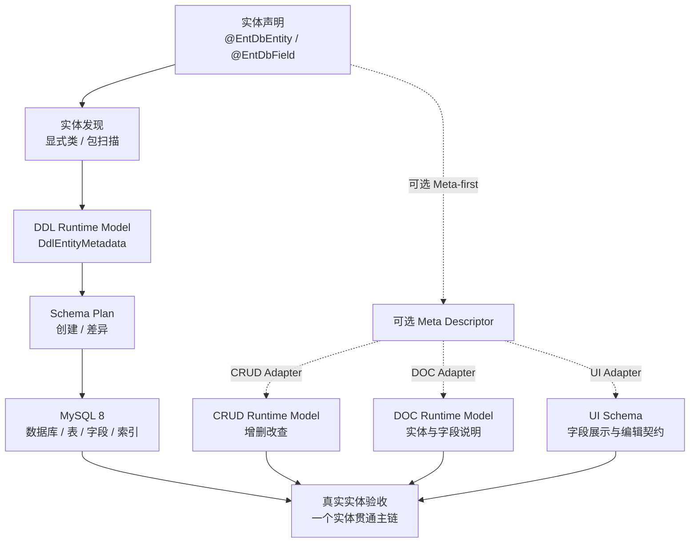
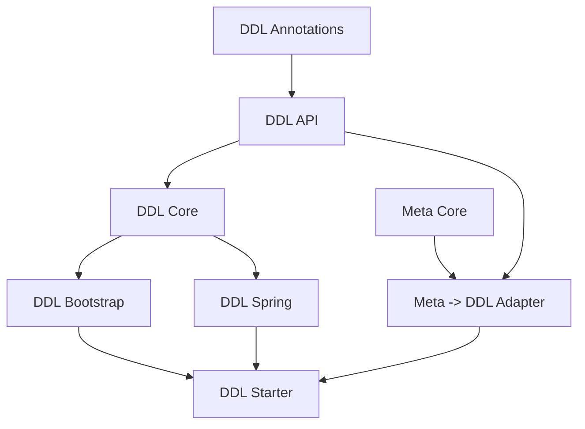

# DDL 实施清单

> 状态：E5 进行中
> 当前大项：E5
> 当前小项：E5，实体全链路验收（待启动）
> 阻塞项：无
> 最近核验：2026-08-25，E4 Meta -> DDL Adapter 合同测试通过

本文是 DDL 的唯一执行看板。它把模块 README 中的能力设想收敛为可验收的阶段，后续每次只推进一个小项。

## 总目标

围绕实体编程框架形成以下纵向闭环：

完成定义不是“能生成一段 SQL”，而是：一个实体能够被发现、归一为 DDL Runtime Model、生成确定的 MySQL SQL，并在 Spring Boot 入口实际执行；随后可以与 CRUD、DOC、UI 的实体模型形成可验证的组合。

## 当前事实

| 项目 | 当前状态 | 说明 |
|---|---|---|
| DDL API / Annotations | 已具备基础类型 | 已有实体、字段、索引和执行请求契约 |
| DDL Core | E1 已完成 | 已建立稳定元数据合同、确定性 CREATE 编排和执行结果分类 |
| MySQL 建表 SQL | E1 已完成 | 已覆盖类型映射、主键、唯一约束、普通索引和表达式索引 |
| 实体解析 | E2.2 已完成 | Bootstrap 和 Spring 均已统一显式类、包扫描、去重和稳定排序；Starter 可绑定显式实体类名 |
| 实际数据库执行 | E2.5 已完成 | `ent-loom-ddl-spring` 已提供 Spring JDBC `QueryStrategy` / `SqlExecutor`，并有真实 MySQL 8 建库建表证据 |
| 消费者接入 | E2.4 已完成 | 独立消费者测试模块仅通过公开 Annotations、API 和 Bootstrap 构件完成最小实体接入 |
| 字段 / 索引差异 | E3 已完成 | 已有表结构快照、稳定差异计划和受控 ADD / MODIFY SQL |
| Meta -> DDL | 已完成 | `MetaDdlAdapter` 已提供 Meta-only、DDL-only 和 Meta + DDL override 投影 |
| DDL 测试基线 | 已建立 | Core 25 项、Spring 14 项和 Meta Adapter 5 项测试覆盖 SQL、差异、H2 读取 / 执行、投影和模块边界 |

当前事实来源：`ent-loom-modules/ent-loom-ddl/README.md`、`ent-loom-integrations/README.md` 及现有实现；E4 完成后进入 E5 实体全链路验收。

## 范围与边界

### 当前纳入

- MySQL 8 数据库和表的创建。
- Java 类型到 MySQL 类型的确定性映射。
- 主键、字段、唯一约束、普通索引和表达式索引的建模。
- 显式实体类和 Spring 包扫描两种发现方式。
- SQL 生成、执行策略和执行结果的稳定合同。
- 新增字段、新增索引和有限字段修改的差异计划。
- Meta Descriptor 到 DDL Runtime Model 的适配。

### 当前不纳入

- 任意 SQL 执行平台。
- 复杂数据库迁移编排和跨版本回滚平台。
- 默认删除字段、删除索引和危险重命名。
- UI 菜单、权限、路由、组件渲染等业务语义。
- Java 8、Boot 2、Boot 4 兼容构件。

## 阶段总览

| 阶段 | 目标 | 主要模块 | 完成后结果 |
|---|---|---|---|
| E1 | 建立 DDL Core 的稳定建表合同 | `api`、`annotations`、`core` | 给定元数据可生成确定的 MySQL CREATE SQL |
| E2 | 接通实体发现和数据库执行 | `bootstrap`、`spring`、`starter` | Spring Boot 可按配置发现实体并执行建表 |
| E3 | 实现可控结构差异更新 | `api`、`core`、`spring` | 新增字段、索引和有限修改可生成 ALTER SQL |
| E4 | 接入通用 Meta 语义 | `ent-loom-meta-adapter-ddl` | Meta-first 实体可以投影到 DDL 模型 |
| E5 | 用真实实体验证整体能力 | 示例 / 集成测试 / 文档 | 一个实体贯通 DDL、CRUD、DOC、UI 验收路径 |

## E1（已完成）：Core 建表闭环

E1 只解决“给定 DDL Runtime Model，能稳定生成建表 SQL”的核心问题，不提前引入 Meta、UI 或复杂迁移策略。

### E1.1 稳定建表模型与 SQL 生成合同

- [x] 明确 `DdlEntityMetadata`、`DdlFieldMetadata`、`DdlIndexMetadata` 的必填字段和非法输入行为。
- [x] 明确单主键、复合主键、唯一字段、普通索引和表达式索引的 SQL 语义。
- [x] 明确 `DdlExecutionMode` 在 E1 中只开放 `NONE`、`CREATE_TABLE`、`CREATE_TABLE_AND_METAS` 的边界。
- [x] 保证同一元数据输入生成稳定、可比较的 SQL 顺序。
- [x] 为类型映射、默认值、注释、转义和标识符引用建立 Core 单测。

验收证据：`ent-loom-ddl-core` 测试通过，SQL snapshot 或等价字符串合同稳定。

### E1.2 建立 Core 执行编排

- [x] `DefaultDdlEngine` 对数据库、表、字段和索引生成结果进行明确分类。
- [x] `DdlExecutionResult` 能区分 generated、executed 和 errors。
- [x] `QueryStrategy`、`SqlExecutor` 保持 SPI 边界，Core 不引入 Spring JDBC。
- [x] `NoopQueryStrategy`、`NoopSqlExecutor` 仅作为显式测试 / dry-run 实现，不伪装成生产执行器。
- [x] 补充执行异常和空输入测试。

验收证据：Core 可在无 Spring 场景下完成生成模式和注入 fake executor 的执行模式测试。

### E1.3 E1 阶段门禁

- [x] `./mvnw -pl ent-loom-modules/ent-loom-ddl/ent-loom-ddl-core -am test` 通过。
- [x] DDL Core 无 Spring、Servlet、Starter 依赖。
- [x] 代码、测试和 README 对 E1 当前边界一致。
- [x] 更新本清单当前事实，并把 E2 设为当前阶段。

验收证据（2026-08-25）：

- 测试命令：`JAVA_HOME=/Users/zubin/Library/Java/JavaVirtualMachines/azul-21.0.10/Contents/Home ./mvnw -pl ent-loom-modules/ent-loom-ddl/ent-loom-ddl-core -am test`。
- 测试结果：Core Reactor 构建成功，`ent-loom-ddl-core` 共 17 项测试通过，0 失败、0 错误；扩展 DDL Reactor 共 22 项测试通过，0 失败、0 错误。
- 测试覆盖：Core 的 `MysqlCreateTableSqlBuilderTest`、`DdlMetadataContractTest`、`DefaultDdlEngineTest`、`DdlCoreBoundaryTest`，以及 Bootstrap/Spring/Starter 的主键推导和默认 SPI 测试。
- 边界验证：Core 运行时仅依赖 `ent-loom-ddl-api`，ArchUnit 验证不依赖 Spring、Servlet、Starter 或 Meta 包；测试依赖不进入运行时构件。
- 未完成工作（记录时）：E2 剩余的 Spring JDBC 执行器与真实数据库执行；E3 字段 / 索引差异；E4 Meta -> DDL Adapter；E5 实体全链路验收。

## 后续阶段清单

### E2：实体发现与实际执行

- [x] **E2.1 发现合同**：`DdlBootstrap` 统一显式类列表和包扫描入口；覆盖空输入、重复类、不可加载类、稳定排序和重复调用。

E2.1 验收证据（2026-08-25）：

- 测试命令：`JAVA_HOME=/Users/zubin/Library/Java/JavaVirtualMachines/azul-21.0.10/Contents/Home ./mvnw -pl ent-loom-modules/ent-loom-ddl/ent-loom-ddl-bootstrap -am test`。
- 测试结果：`ent-loom-ddl-bootstrap` 共 5 项测试通过，0 失败、0 错误；其上游 `ent-loom-ddl-core` 共 17 项测试通过，0 失败、0 错误；JDK 21 Enforcer 通过。
- 合同覆盖：显式类与包扫描合并、重复类去重、空输入、不可加载类跳过、按类名稳定排序，以及重复调用重新生成相同结果。
- 边界验证：Bootstrap 仅通过 `core`、`annotations` 和公开 DDL API 工作；Core 不依赖 Spring、Servlet、Starter 或 Meta Core；测试 fake 只实现公开 `DdlEngine` 接口。
- 未完成工作（记录时）：E2.2 Spring 配置与 Starter 装配；E2.3 Spring JDBC 执行器；E2.4 消费者测试；E2.5 MySQL 8 / Testcontainers；E3 字段 / 索引差异；E4 Meta -> DDL Adapter；E5 实体全链路验收。
- [x] **E2.2 Spring 装配合同**：为 `SpringAnnotationMetadataLoader`、实体 / 字段 / 索引解析和 `SpringPackageEntityClassResolver` 补齐测试；验证配置开关和缺少真实 SPI 时的诊断。

E2.2 验收证据（2026-08-25）：

- 测试命令：`JAVA_HOME=/Users/zubin/Library/Java/JavaVirtualMachines/azul-21.0.10/Contents/Home ./mvnw -pl ent-loom-modules/ent-loom-ddl/ent-loom-ddl-spring-boot-starter -am test`。
- 测试结果：`ent-loom-ddl-core` 共 17 项、`ent-loom-ddl-spring` 共 8 项、`ent-loom-ddl-spring-boot-starter` 共 4 项测试通过，0 失败、0 错误；JDK 21 Enforcer 通过。
- 合同覆盖：Spring 实体、字段、索引解析；空输入、重复包、不可扫描包、显式类与包扫描去重、稳定排序；`enabled=false` 不加载实体且不调用引擎；重复刷新只执行一次；缺少 QueryStrategy / SqlExecutor 时快速失败并保留中文诊断。
- 装配证据：Starter 标记 `@AutoConfiguration`，提供 Boot 3 `AutoConfiguration.imports`，保留 `spring.factories` 兼容入口；配置属性可绑定并装配 DDL 运行选项。
- 未完成工作（记录时）：E2.3 Spring JDBC 执行器；E2.4 消费者测试；E2.5 MySQL 8 / Testcontainers；E3 字段 / 索引差异；E4 Meta -> DDL Adapter；E5 实体全链路验收。本次未实现 JDBC、MySQL 或 Testcontainers。
- [x] **E2.3 执行器合同**：增加基于 Spring JDBC 的 `QueryStrategy` 和 `SqlExecutor` 实现，放在 `ent-loom-ddl-spring`；覆盖空输入、按输入顺序执行、执行异常、资源释放和结果保留。

E2.3 验收证据（2026-08-25）：

- 测试命令：`JAVA_HOME=/Users/zubin/Library/Java/JavaVirtualMachines/azul-21.0.10/Contents/Home ./mvnw -pl ent-loom-modules/ent-loom-ddl/ent-loom-ddl-bootstrap,ent-loom-modules/ent-loom-ddl/ent-loom-ddl-spring-boot-starter -am test`。
- 测试结果：`ent-loom-ddl-core` 共 17 项、`ent-loom-ddl-bootstrap` 共 5 项、`ent-loom-ddl-spring` 共 12 项、`ent-loom-ddl-spring-boot-starter` 共 5 项测试通过，0 失败、0 错误；JDK 21 Enforcer 通过。
- 合同覆盖：H2 验证表存在查询和逐条 DDL 执行；有依赖关系的两条 SQL 验证输入顺序；空输入不获取连接；Spring JDBC 数据访问异常向上保留；`JdbcTemplate` 管理连接释放；Core `DdlExecutionResult` 保留 generated / errors 并不伪造 executed 结果。
- 装配证据：存在 `DataSource` 且用户未提供 SPI 时，Starter 自动装配 `SpringJdbcQueryStrategy` 和 `SpringJdbcSqlExecutor`；用户自定义 SPI 仍由 `@ConditionalOnMissingBean` 保留；无 `DataSource` 时不装配默认 JDBC SPI。
- 边界验证：Spring JDBC 与 H2 仅进入 `ent-loom-ddl-spring` / Starter；Core 仍不依赖 Spring、Servlet、Starter 或 Meta Core；本次未引入 MySQL 驱动、Testcontainers、消费者测试或 E3/E4/E5 能力。
- 未完成工作（记录时）：E2.4 消费者测试；E2.5 MySQL 8 / Testcontainers；E3 字段 / 索引差异；E4 Meta -> DDL Adapter；E5 实体全链路验收。
- [x] **E2.4 消费者冒烟**：使用公开注解和 API 完成最小实体接入测试，不引用 Core 包内实现。

E2.4 验收证据（2026-08-25）：

- 测试命令：`JAVA_HOME=/Users/zubin/Library/Java/JavaVirtualMachines/azul-21.0.10/Contents/Home ./mvnw -pl ent-loom-tests/ent-loom-ddl-consumer-test -am test`。
- 测试结果：`ent-loom-ddl-core` 共 17 项、`ent-loom-ddl-bootstrap` 共 5 项、`ent-loom-ddl-consumer-test` 共 1 项测试通过，0 失败、0 错误；JDK 21 Enforcer 通过。
- 合同覆盖：独立消费者实体只使用 `@EntDbEntity` / `@EntDbField`；通过公开 `DdlBootstrap` 和 `DdlBootstrapRequest` 完成显式实体接入；公开 `QueryStrategy` / `SqlExecutor` fake 观察 generated / executed SQL 和最小建表字段。
- 边界验证：消费者测试没有导入 `com.entloom.ddl.core`、Spring、Servlet、Starter 或 Meta Core 包；测试构件仅声明 Annotations、API、Bootstrap 和 JUnit 依赖；本次未引入 MySQL 驱动或 Testcontainers。
- 未完成工作（记录时）：E2.5 MySQL 8 / Testcontainers；E3 字段 / 索引差异；E4 Meta -> DDL Adapter；E5 实体全链路验收。
- [x] **E2.5 MySQL 8 证据**：使用专用 profile 完成一次真实建库 / 建表验证，检查关键字段、主键和索引。

E2.5 验收证据（2026-08-25）：

- 测试命令：`JAVA_HOME=/Users/zubin/Library/Java/JavaVirtualMachines/azul-21.0.10/Contents/Home ./mvnw -Pmysql-integration -pl ent-loom-tests/ent-loom-ddl-mysql-integration-test -am test`。
- 测试环境：本机隔离 MySQL `8.0.45` 临时数据目录，专用 `mysql-integration` Maven profile，MySQL Connector/J 仅作为集成测试依赖；测试结束后临时 schema 已确认无残留。
- 测试结果：`ent-loom-ddl-core` 共 17 项、`ent-loom-ddl-spring` 共 12 项、`ent-loom-ddl-spring-boot-starter` 共 5 项、`ent-loom-ddl-mysql-integration-test` 共 1 项测试通过，0 失败、0 错误；JDK 21 Enforcer 通过。
- 合同覆盖：通过 Starter 自动配置按实体包扫描发现测试实体，并由 Spring JDBC 实际创建 schema 与表；验证 `id BIGINT`、`display_name VARCHAR(80)`、主键 `PRIMARY` 和 `idx_mysql_account_display_name` 普通索引。
- 边界验证：本次只验证 E2 建库建表执行，不实现 ALTER 差异、Meta Adapter 或 CRUD/DOC/UI 全链路；未引入 Testcontainers，E3、E4、E5 保持未开始。
- 未完成工作：E3 字段 / 索引差异；E4 Meta -> DDL Adapter；E5 实体全链路验收。

阶段门禁：Spring Boot 配置一个实体包即可在 MySQL 8 中完成建表；关闭 `enabled` 时不执行任何 DDL。E3 差异计划、E4 Meta Adapter 和 E5 跨 DDL / CRUD / DOC / UI 全链路不纳入 E2。

### E3：字段与索引差异

- [x] 抽象当前数据库表结构读取模型：公开 `DdlColumnMetadata`、`DdlTableSnapshot` 和 `QueryStrategy.readTable`。
- [x] 实现表注释、字段、主键、唯一约束和索引的差异计算，并统一数据库标识符大小写比较。
- [x] 实现新增字段和新增索引的确定性 `ALTER TABLE` SQL。
- [x] 实现有限字段修改和受控 `renameFrom`，明确删除、主键变化、索引重建和不兼容变化的拒绝原因。
- [x] 让 `CREATE_*` 与 `MODIFY_*` 执行模式有可测试的合法矩阵；删除模式仍拒绝。
- [x] 建立执行前 SQL 预览和失败结果合同；发现危险差异时不执行部分计划。

E3 验收证据（2026-08-25）：

- Core 测试命令：`JAVA_HOME=/Users/zubin/Library/Java/JavaVirtualMachines/azul-21.0.10/Contents/Home ./mvnw -pl ent-loom-modules/ent-loom-ddl/ent-loom-ddl-core -am test`。
- Spring 测试命令：`JAVA_HOME=/Users/zubin/Library/Java/JavaVirtualMachines/azul-21.0.10/Contents/Home ./mvnw -pl ent-loom-modules/ent-loom-ddl/ent-loom-ddl-spring -am test`。
- 测试结果：Core 25 项、Spring 14 项测试通过，0 失败、0 错误；JDK 21 Enforcer 通过。
- Core 合同：`DdlSchemaDiffer` / `DdlSchemaDiff` 覆盖表注释、ADD 字段、ADD 普通 / 唯一索引、安全类型扩容、DECIMAL 整数位保护、字段重命名、自增属性保留、预览结果和危险差异拒绝；`DefaultDdlEngine` 逐条执行并保留已确认执行进度。
- Spring 合同：`SpringJdbcQueryStrategy` 通过 JDBC `DatabaseMetaData` 读取字段、主键、唯一索引、表注释和自增属性；MySQL 路径补充读取表达式索引；H2 实际执行新增字段并验证读取结果。
- 边界验证：Core 仍只依赖 DDL API，ArchUnit 继续验证不依赖 Spring、Servlet、Starter 或 Meta Core；测试 fake 只实现公开 API。
- 未完成工作：E4 Meta -> DDL Adapter；E5 DDL、CRUD、DOC、UI 实体全链路验收。

阶段门禁：从旧模型升级到新模型只执行声明允许的 ALTER，危险变更默认拒绝。

### E4：Meta -> DDL Adapter

- [x] 明确 Meta Descriptor 到 DDL 字段、实体和关系边界的映射表。
- [x] 实现 `ent-loom-meta-adapter-ddl` 的最小静态适配器。
- [x] 保留 DDL 专属属性在 DDL 模型中，不扩张通用 Meta。
- [x] 覆盖 Meta-only、DDL-only、Meta + DDL override 三条路径。
- [x] 复用来源和诊断语义，冲突在 Adapter / Registry 边界暴露。

E4 映射边界：

| Meta Descriptor | DDL Runtime Model | 规则 |
|---|---|---|
| `entityName` | `tableName` | Meta-only 使用实体名；未提供时按 Java 类名推导 snake_case；DDL `@EntDbEntity.table` 显式覆盖 |
| `description` | 实体 / 字段 `comment` | 仅作为通用说明投影；DDL 显式注释优先 |
| `fieldName`、`javaType` | `fieldName`、`javaType` | 保留 Java 字段身份和类型，物理列名按 snake_case 推导 |
| `EntFieldKind.ID` | `primaryKey` | ID 字段投影为主键；`EntMetaId.AUTO` 映射为 `AUTO_INCREMENT`，其他生成器不伪造数据库生成语义 |
| `required`、文本长度、数值精度 / 小数位约束 | `nullable`、`length`、`precision`、`scale` | 只投影可表达的通用结构约束；业务 `createDefaultValue` 不转成数据库 DEFAULT |
| `EntIndexDescriptor` | `DdlIndexMetadata` | Meta 字段名先转换为物理列名；唯一性和字段顺序保留 |
| `EntRelationDescriptor` | 无直接 DDL 结构 | E4 只要求 source field 可作为字段投影，不生成外键、联表或跨服务结构 |
| DDL `schema`、表规模、列定义、数据库默认值、重命名、生成策略、表达式索引 | DDL 专属属性 | 仅保留在 DDL 模型，不扩张通用 Meta Contract |

覆盖规则：同一属性同时有 Meta 与 DDL 显式值时采用 DDL 值，并产生 `EXPLICIT_VALUE_CONFLICT` 诊断；Meta 推断值被 DDL 显式值覆盖时不构成冲突。

E4 验收证据（2026-08-25）：

- [x] 测试命令：`JAVA_HOME=/Users/zubin/Library/Java/JavaVirtualMachines/azul-21.0.10/Contents/Home ./mvnw -pl ent-loom-integrations/ent-loom-meta-adapter-ddl -am test`。
- [x] 测试结果：`ent-loom-meta-adapter-ddl` 5 项、上游 `ent-loom-meta-core` 21 项、`ent-loom-ddl-core` 25 项测试通过，0 失败、0 错误；JDK 21 Enforcer 通过。
- [x] 合同覆盖：Meta-only 的表名、主键、自动生成、长度、精度、索引；DDL-only 的 schema、注释、表规模、数据库默认值、重命名、生成策略和唯一索引；Meta + DDL override 的优先级及 `nullable` 显式冲突诊断；空输入、重复类去重和稳定排序。
- [x] 边界验证：适配器仅依赖 Meta Core、DDL Annotations / Core；实现和测试不引入 Spring、Servlet、Starter；测试只通过 `MetaDdlAdapter`、DDL API、Meta Annotations / Diagnostics 等公开 API 验证。
- [x] 阶段门禁：Meta-first 实体的通用字段、主键、索引和类型参数可投影为与等价 DDL-native 声明一致的 DDL Runtime Model；DDL 专属属性不进入通用 Meta。

未完成工作：E5 DDL、CRUD、DOC、UI 实体全链路验收。本次未实现 Spring 配置扩展、CRUD / DOC / UI 联动、HTTP 验证或新的数据库集成。

阶段门禁：同一实体使用 Meta-first 方式时，生成结果与等价 DDL-native 方式一致。

### E5：实体全链路验收

- [ ] 选择一个简单实体作为真实验收对象，第一阶段不引入复杂关系。
- [ ] 完成 MySQL 8 建表和 CRUD HTTP 验证。
- [ ] 输出 DOC 实体和字段模型。
- [ ] 输出 UI Schema，至少覆盖文本、数字、日期和图片字段。
- [ ] 补充从实体声明到各 Runtime Model 的 Mermaid 和使用说明。
- [ ] 建立一条可重复执行的集成测试或示例工程命令。

阶段门禁：一个实体可以从声明开始，完成数据库结构、CRUD 操作、文档模型和 UI Schema 的组合验收。

## 依赖与禁止跨越

- E1 不依赖 Meta、Spring 或 Starter。
- E2 才把实体扫描和真实数据库执行接到 Spring 层。
- E3 不反向修改 CRUD 的 Runtime Model。
- E4 不把 DDL 方言属性倒灌到通用 Meta Contract。
- E5 才建立跨 DDL、CRUD、DOC、UI 的真实调用者验收。

## 每阶段固定收尾

1. 代码和测试通过，记录命令、测试类和必要的 MySQL 8 验证证据。
2. 将已完成事实回写到对应 Architecture；没有稳定消费者前不创建架构占位页。
3. 删除本清单中已完成阶段的详细过程，只保留验收结论和未完成事项。
4. 更新[当前实施总览](../当前实施总览.md)和[框架实施清单](../实施清单.md)。
5. 将下一个阶段设为当前阶段，保持 DDL 主线一次只推进一个阶段。
