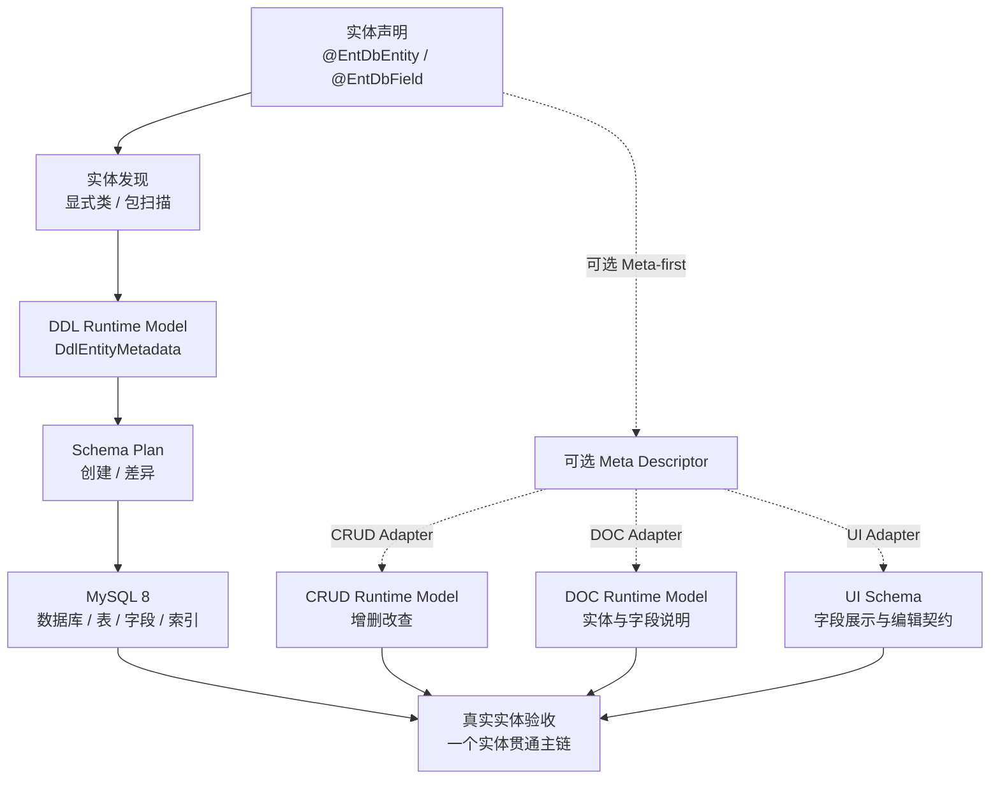
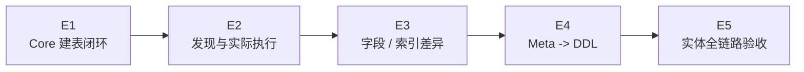
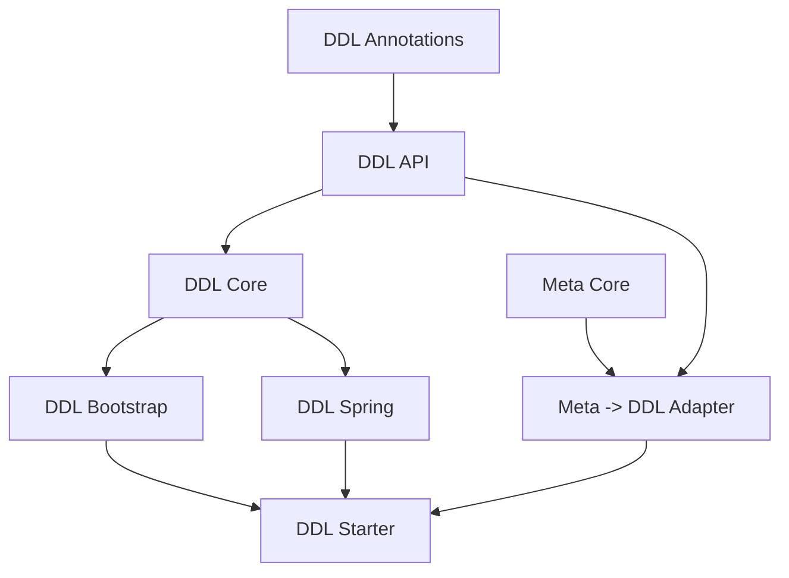

# DDL 实施清单

> 状态：E1 已完成
> 当前大项：E2（待开始）
> 当前小项：等待 E2 任务启动
> 阻塞项：无
> 最近核验：2026-08-25，E1 Core 测试通过

本文是 DDL 的唯一执行看板。它把模块 README 中的能力设想收敛为可验收的阶段，后续每次只推进一个小项。

## 总目标

围绕实体编程框架形成以下纵向闭环：

完成定义不是“能生成一段 SQL”，而是：一个实体能够被发现、归一为 DDL Runtime Model、生成确定的 MySQL SQL，并在 Spring Boot 入口实际执行；随后可以与 CRUD、DOC、UI 的实体模型形成可验证的组合。

## 当前事实

| 项目 | 当前状态 | 说明 |
|---|---|---|
| DDL API / Annotations | 已具备基础类型 | 已有实体、字段、索引和执行请求契约 |
| DDL Core | E1 已完成 | 已建立稳定元数据合同、确定性 CREATE 编排和执行结果分类 |
| MySQL 建表 SQL | E1 已完成 | 已覆盖类型映射、主键、唯一约束、普通索引和表达式索引 |
| 实体解析 | 部分实现 | 已有显式类解析和 Spring 注解包扫描入口 |
| 实际数据库执行 | 未形成默认闭环 | 默认不再装配 Noop SPI；真实数据库 QueryStrategy / SqlExecutor 留待 E2 |
| 字段 / 索引差异 | 未实现 | 尚无稳定 ADD / MODIFY 计划 |
| Meta -> DDL | 未开始 | `ent-loom-meta-adapter-ddl` 当前为空模块 |
| DDL 测试基线 | 已建立 | `ent-loom-ddl-core` 已覆盖 SQL、类型、约束、空输入、异常和模块边界 |

当前事实来源：`ent-loom-modules/ent-loom-ddl/README.md` 及现有实现；E1 完成后再回写组件 Architecture。

## 范围与边界

### 当前纳入

- MySQL 8 数据库和表的创建。
- Java 类型到 MySQL 类型的确定性映射。
- 主键、字段、唯一约束、普通索引和表达式索引的建模。
- 显式实体类和 Spring 包扫描两种发现方式。
- SQL 生成、执行策略和执行结果的稳定合同。
- 新增字段、新增索引和有限字段修改的差异计划。
- Meta Descriptor 到 DDL Runtime Model 的适配。

### 当前不纳入

- 任意 SQL 执行平台。
- 复杂数据库迁移编排和跨版本回滚平台。
- 默认删除字段、删除索引和危险重命名。
- UI 菜单、权限、路由、组件渲染等业务语义。
- Java 8、Boot 2、Boot 4 兼容构件。

## 阶段总览

| 阶段 | 目标 | 主要模块 | 完成后结果 |
|---|---|---|---|
| E1 | 建立 DDL Core 的稳定建表合同 | `api`、`annotations`、`core` | 给定元数据可生成确定的 MySQL CREATE SQL |
| E2 | 接通实体发现和数据库执行 | `bootstrap`、`spring`、`starter` | Spring Boot 可按配置发现实体并执行建表 |
| E3 | 实现可控结构差异更新 | `api`、`core`、`spring` | 新增字段、索引和有限修改可生成 ALTER SQL |
| E4 | 接入通用 Meta 语义 | `ent-loom-meta-adapter-ddl` | Meta-first 实体可以投影到 DDL 模型 |
| E5 | 用真实实体验证整体能力 | 示例 / 集成测试 / 文档 | 一个实体贯通 DDL、CRUD、DOC、UI 验收路径 |

## E1（已完成）：Core 建表闭环

E1 只解决“给定 DDL Runtime Model，能稳定生成建表 SQL”的核心问题，不提前引入 Meta、UI 或复杂迁移策略。

### E1.1 稳定建表模型与 SQL 生成合同

- [x] 明确 `DdlEntityMetadata`、`DdlFieldMetadata`、`DdlIndexMetadata` 的必填字段和非法输入行为。
- [x] 明确单主键、复合主键、唯一字段、普通索引和表达式索引的 SQL 语义。
- [x] 明确 `DdlExecutionMode` 在 E1 中只开放 `NONE`、`CREATE_TABLE`、`CREATE_TABLE_AND_METAS` 的边界。
- [x] 保证同一元数据输入生成稳定、可比较的 SQL 顺序。
- [x] 为类型映射、默认值、注释、转义和标识符引用建立 Core 单测。

验收证据：`ent-loom-ddl-core` 测试通过，SQL snapshot 或等价字符串合同稳定。

### E1.2 建立 Core 执行编排

- [x] `DefaultDdlEngine` 对数据库、表、字段和索引生成结果进行明确分类。
- [x] `DdlExecutionResult` 能区分 generated、executed 和 errors。
- [x] `QueryStrategy`、`SqlExecutor` 保持 SPI 边界，Core 不引入 Spring JDBC。
- [x] `NoopQueryStrategy`、`NoopSqlExecutor` 仅作为显式测试 / dry-run 实现，不伪装成生产执行器。
- [x] 补充执行异常和空输入测试。

验收证据：Core 可在无 Spring 场景下完成生成模式和注入 fake executor 的执行模式测试。

### E1.3 E1 阶段门禁

- [x] `./mvnw -pl ent-loom-modules/ent-loom-ddl/ent-loom-ddl-core -am test` 通过。
- [x] DDL Core 无 Spring、Servlet、Starter 依赖。
- [x] 代码、测试和 README 对 E1 当前边界一致。
- [x] 更新本清单当前事实，并把 E2 设为当前阶段。

验收证据（2026-08-25）：

- 测试命令：`JAVA_HOME=/Users/zubin/Library/Java/JavaVirtualMachines/azul-21.0.10/Contents/Home ./mvnw -pl ent-loom-modules/ent-loom-ddl/ent-loom-ddl-core -am test`。
- 测试结果：Core Reactor 构建成功，`ent-loom-ddl-core` 共 17 项测试通过，0 失败、0 错误；扩展 DDL Reactor 共 22 项测试通过，0 失败、0 错误。
- 测试覆盖：Core 的 `MysqlCreateTableSqlBuilderTest`、`DdlMetadataContractTest`、`DefaultDdlEngineTest`、`DdlCoreBoundaryTest`，以及 Bootstrap/Spring/Starter 的主键推导和默认 SPI 测试。
- 边界验证：Core 运行时仅依赖 `ent-loom-ddl-api`，ArchUnit 验证不依赖 Spring、Servlet、Starter 或 Meta 包；测试依赖不进入运行时构件。
- 未完成工作：E2 实体发现与真实数据库执行器；E3 字段 / 索引差异；E4 Meta -> DDL Adapter；E5 实体全链路验收。

## 后续阶段清单

### E2：实体发现与实际执行

- [ ] `DdlBootstrap` 支持显式类列表和包扫描的统一入口。
- [ ] `SpringAnnotationMetadataLoader` 的实体、字段、索引解析建立测试。
- [ ] `SpringPackageEntityClassResolver` 建立扫描成功、空包和重复类测试。
- [ ] 增加基于 Spring JDBC 的 `QueryStrategy` 和 `SqlExecutor` 实现，放在 `ent-loom-ddl-spring`。
- [ ] Starter 将配置绑定、实体发现、SQL 执行和失败日志接通。
- [ ] 使用 MySQL 8 完成一次真实建库 / 建表验证。

阶段门禁：Spring Boot 配置一个实体包即可在 MySQL 8 中完成建表；关闭 `enabled` 时不执行任何 DDL。

### E3：字段与索引差异

- [ ] 抽象当前数据库表结构读取模型。
- [ ] 实现表注释、字段、主键、唯一约束和索引的差异计算。
- [ ] 实现新增字段和新增索引的 ALTER SQL。
- [ ] 实现有限字段修改，并明确不兼容变化的拒绝原因。
- [ ] 让 `CREATE_*` 与 `MODIFY_*` 执行模式有可测试的合法矩阵。
- [ ] 建立执行前 SQL 预览和失败结果合同。

阶段门禁：从旧模型升级到新模型只执行声明允许的 ALTER，危险变更默认拒绝。

### E4：Meta -> DDL Adapter

- [ ] 明确 Meta Descriptor 到 DDL 字段、实体和关系边界的映射表。
- [ ] 实现 `ent-loom-meta-adapter-ddl` 的最小静态适配器。
- [ ] 保留 DDL 专属属性在 DDL 模型中，不扩张通用 Meta。
- [ ] 覆盖 Meta-only、DDL-only、Meta + DDL override 三条路径。
- [ ] 复用来源和诊断语义，冲突在 Adapter / Registry 边界暴露。

阶段门禁：同一实体使用 Meta-first 方式时，生成结果与等价 DDL-native 方式一致。

### E5：实体全链路验收

- [ ] 选择一个简单实体作为真实验收对象，第一阶段不引入复杂关系。
- [ ] 完成 MySQL 8 建表和 CRUD HTTP 验证。
- [ ] 输出 DOC 实体和字段模型。
- [ ] 输出 UI Schema，至少覆盖文本、数字、日期和图片字段。
- [ ] 补充从实体声明到各 Runtime Model 的 Mermaid 和使用说明。
- [ ] 建立一条可重复执行的集成测试或示例工程命令。

阶段门禁：一个实体可以从声明开始，完成数据库结构、CRUD 操作、文档模型和 UI Schema 的组合验收。

## 依赖与禁止跨越

- E1 不依赖 Meta、Spring 或 Starter。
- E2 才把实体扫描和真实数据库执行接到 Spring 层。
- E3 不反向修改 CRUD 的 Runtime Model。
- E4 不把 DDL 方言属性倒灌到通用 Meta Contract。
- E5 才建立跨 DDL、CRUD、DOC、UI 的真实调用者验收。

## 每阶段固定收尾

1. 代码和测试通过，记录命令、测试类和必要的 MySQL 8 验证证据。
2. 将已完成事实回写到对应 Architecture；没有稳定消费者前不创建架构占位页。
3. 删除本清单中已完成阶段的详细过程，只保留验收结论和未完成事项。
4. 更新[当前实施总览](../当前实施总览.md)和[框架实施清单](../实施清单.md)。
5. 将下一个阶段设为当前阶段，保持 DDL 主线一次只推进一个阶段。
