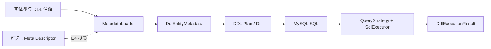

# DDL 路线图

> 状态：E1-E5 已完成，后续阶段未排期
> 当前阶段：无
> 最近核验：2026-08-26

DDL 路线围绕一个目标推进：让实体声明可以稳定生成并执行 MySQL 8 数据库结构，同时为后续 Meta、CRUD、DOC、UI 共享同一个实体能力闭环提供基础。

## 阅读路径

1. 先看[DDL 实施清单](DDL实施清单.md)，确认总目标、阶段顺序和当前小项。
2. 需要了解模块边界、注解和构件职责时，查看模块文件 `ent-loom-modules/ent-loom-ddl/README.md`。
3. 需要复现简单实体的跨模块验收时，查看 [实体全链路验收](../../../guides/ddl/实体全链路验收.md)。

## 总体关系

## 当前文档分层

| 文档 | 职责 |
|---|---|
| 本页 | DDL 路线入口和阅读顺序 |
| [DDL 实施清单](DDL实施清单.md) | 当前阶段、子任务、验收和证据 |
| [测试策略与验收分层](../../../architecture/core/测试策略与验收分层.md) | L1-L5 测试层级、阶段映射和证据格式 |
| `ent-loom-modules/ent-loom-ddl/README.md` | 模块定位、依赖边界和能力范围 |
| [实体全链路验收](../../../guides/ddl/实体全链路验收.md) | `CustomerProfile` 的主链、环境边界和可重复命令 |

## 不在当前主线

- 不先做 Boot 2/Boot 4 兼容构件。
- 不先做通用迁移平台、任意 SQL 编排或复杂回滚引擎。
- 不把 UI 菜单、路由、权限等业务语义放入 DDL Core。
