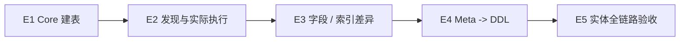

# 框架实施清单

> 状态：DDL E5 已完成，后续主线未排期
> 最近核验：2026-08-26
> 当前大项：无
> 当前小项：无
> 阻塞项：无
> 验收证据：CRUD C1-C7、Meta M1-M4、DDL E1-E5 已完成；E5 的 `CustomerProfile` 静态 Runtime Model、MySQL 8 DDL、H2 + MockMvc CRUD 共 3 项验收测试通过。

本页是轻量执行看板，只维护当前任务状态和执行顺序。详细子任务、完成标志和设计边界以各领域路线图及 Architecture 为准，避免形成第二套详细计划。

## 使用规则

1. `[ ]` 表示对应大项尚未完成，只有代码、测试、文档和验收证据齐全后才能勾选。
2. 当前只推进一个领域主线：DDL E1-E5；CRUD、Meta 和兼容线只维护已完成事实，不并行扩展新能力。
3. 完成一个大项后，先更新 Architecture 和详细路线图，再补充本页的验收证据并勾选。
4. 每次开始工作时，只修改“当前小项、阻塞项、验收证据”三处看板信息。

## 0. 已完成基线

- [x] B1：Native-only、Meta-only、Meta + Module 测试基线已建立。
- [x] B2：CRUD 已收敛到唯一 `CrudRuntimeModel` 和冻结 Registry。
- [x] B3：Registry 启动期构建、校验、冻结和关系图预计算已完成。
- [x] B4：Operation Domain / Operation 合法矩阵与 Stats 独立域已完成。
- [x] B5：当前完整 Reactor 的 JDK 21 基线已明确。

依据：[CRUD 重构路线](crud/CRUD重构路线.md)、[元数据裁决实施计划](meta/元数据裁决实施计划.md)、[Java 与 Spring 兼容性路线图](core/Java与Spring兼容性路线.md)。

## 当前 DDL 执行清单

DDL 的详细子任务、依赖边界和阶段门禁统一维护在 [DDL 实施清单](ddl/DDL实施清单.md)，本页只保留执行顺序。

- [x] E1：DDL Core 建表闭环。验收：稳定元数据合同、确定性建表 SQL、执行结果分类和 Core 边界测试已完成。
- [x] E2：实体发现与 Spring Boot 实际执行。验收：发现合同、公开 API 消费者、Spring JDBC 和 MySQL 8 建库 / 建表证据已完成。
- [x] E3：字段与索引差异更新。验收：表结构快照、字段 / 索引差异、受控 ALTER、危险变化拒绝和 H2 定向执行合同已完成。
- [x] E4：Meta -> DDL Adapter。验收：Meta-only、DDL-only、Meta + DDL override、来源冲突诊断和 DDL 专属属性边界已完成。
- [x] E5：DDL、CRUD、DOC、UI 实体全链路验收。验收：同一无关系 `CustomerProfile` 已通过静态模型、MySQL 8 DDL、H2 + MockMvc CRUD 与使用说明验证。

### E1 已完成门禁

- [x] E1.1：元数据必填项、非法输入、主键 / 索引 / 默认值语义明确。
- [x] E1.2：SQL 生成顺序稳定，Core 执行结果和异常合同明确。
- [x] E1.3：DDL Core 单测通过，Core 无 Spring / Starter 依赖。
- [x] 阶段收尾：已记录测试命令和证据，当前阶段转入 E2。

### E2 启动门禁

- [x] E2.1：发现合同覆盖显式类、包扫描、空输入、重复类和稳定顺序。
- [x] E2.2：Spring 配置与 `enabled=false` 行为可验证，缺少真实 SPI 时有明确诊断。
- [x] E2.3：Spring JDBC 执行器保留生成 / 执行 / 异常结果，并验证资源释放。
- [x] E2.4：公开 API 消费者冒烟测试可编译并完成最小实体调用。
- [x] E2.5：使用专用 profile 完成一次 MySQL 8 建库 / 建表验证。

E2 只接通实体发现和实际 DDL 执行；ALTER 差异留在 E3，Meta Adapter 留在 E4，CRUD / DOC / UI 全链路留在 E5。测试层级和证据格式见 [测试策略与验收分层](../../architecture/core/测试策略与验收分层.md)。

## 已完成 CRUD / Meta 基线

CRUD 主线 `C1-C7` 和 Meta 主线 `M1-M4` 已完成，作为当前 DDL 主线的既有能力基线。

- [x] C1：外部契约回归门禁。验收：HTTP JSON snapshot、错误 code/stage/reason/HTTP status 矩阵、Starter 配置与条件装配合同均已通过。
- [x] C2：稳定 `UpdatePatch<T>` API。验收：稳定类型、默认不可变实现、Binder/Handler 迁移、三态字段和 delegate 桥接测试均已通过。
- [x] C3：Starter 包名统一。验收：旧包删除、新包名守卫和 Starter 条件装配回归均已通过。
- [x] C4：确认 `ent-loom-crud-core` 的模块边界。验收：依赖图、POM 直接依赖合同、Core 无 Spring/Servlet/Starter/叶子实现依赖均已核验。
- [x] C5：收窄 annotations 依赖。验收：移除多余 Meta contract 依赖，annotations 直接依赖合同和 CRUD-only 编译测试均已通过。
- [x] C6：建立 Core / Starter / Meta 架构守卫。验收：三层边界守卫、包名守卫和 Meta Starter 跨模块回归均已通过。
- [x] C7：完成异步上下文治理。验收：同步 ThreadLocal 作用域、任务主体/scope/审计快照、本地持久化往返和线程池复用隔离均已通过。
- [x] M1：公共 Contribution 与属性级 Resolver。验收：公共 Contribution/RuleId/Priority、逐属性 Resolver、同级冲突稳定排序、类型/结构诊断和 fail/warn/ignore 策略测试均已通过。
- [x] M2：Meta Convention。验收：日期时间 Convention、角色/只读/label 属性级裁决、显式 Meta Annotation 覆盖、Starter Bean 收集和来源追踪测试均已通过。
- [x] M3：CRUD 消费闭环。前置：M2，详见 [元数据裁决实施计划](meta/元数据裁决实施计划.md)。
- [x] M4：守卫与回归。前置：M3，详见 [元数据裁决实施计划](meta/元数据裁决实施计划.md)。

## 已完成的 Meta 基线

Native Parser、Meta Parser 和 Adapter 的测试基线、唯一组件 Runtime Model、来源 Descriptor 和静态 Meta Adapter 闭环已完成。

详见：[元数据裁决实施计划](meta/元数据裁决实施计划.md)。

## 已识别问题：暂缓处理

以下问题已通过代码审查确认，当前不进入执行队列；后续恢复时需同步补充实现、测试和契约文档。

| 编号 | 状态 | 事项 | 关联路线 |
|---|---|---|---|
| T1 | 暂缓处理 | 文件与任务授权边界：限制 `fileId` 路径，缺失归属元数据时统一拒绝 | [任务文件后续路线](crud/任务文件后续路线.md) |
| T2 | 暂缓处理 | 幂等执行安全：增加 attempt/token，明确事务一致性和主体/组织作用域 | [CRUD 重构路线](crud/CRUD重构路线.md) |
| T3 | 暂缓处理 | `expectedVersion` 乐观锁：写入时原子递增版本并返回新版本 | [命令](../../architecture/components/crud/命令.md) |
| T4 | 暂缓处理 | 普通 Batch 事务：明确原子/分批语义，补充失败回滚和结果契约 | [默认引擎](../../architecture/components/crud/默认引擎.md) |

## 长期路线：暂不执行

这些事项保留在看板中用于方向管理，但当前不进入每日执行队列。

| 编号 | 状态 | 事项 | 详细路线 |
|---|---|---|---|
| K0 | 暂不执行 | 登记各模块 JDK、字节码、Spring/Servlet 依赖和测试入口 | [Java 与 Spring 兼容性路线图](core/Java与Spring兼容性路线.md) |
| K1 | 暂不执行 | Core 依赖边界守卫与原生 JDBC / Spring JDBC 拆分 | [Java 与 Spring 兼容性路线图](core/Java与Spring兼容性路线.md) |
| K2 | 暂不执行 | Boot 4 / Spring 7 主线验证 | [Java 与 Spring 兼容性路线图](core/Java与Spring兼容性路线.md) |
| K3 | 暂不执行 | Boot 2 / Spring 5.3 兼容构件 | [Java 与 Spring 兼容性路线图](core/Java与Spring兼容性路线.md) |
| K4 | 暂不执行 | Core、Boot 2、Boot 3/4 编译与运行矩阵 | [Java 与 Spring 兼容性路线图](core/Java与Spring兼容性路线.md) |
| D3 | 暂不执行 | Decision 状态值统一：`Proposed`、`Partially Superseded` | [设计决策](../decisions/index.md) |

K0 完成前不创建候选空模块，也不承诺所有 DDL、DOC、UI 能力提供 Boot 2 版本。

## 启动条件：不单独打钩

| 编号 | 启动条件 | 触发后动作 |
|---|---|---|
| D1 | DDL、DOC、UI 形成稳定 Runtime Model、消费者闭环和公共架构入口 | 已触发 DDL：执行 [DDL 实施清单](ddl/DDL实施清单.md)；DOC/UI 继续等待各自真实消费者 |
| D2 | 出现真实调用者、测试和可观察收益 | 再新增跨模块公共 SPI |

这些事项当前不作为 CRUD / Meta 主线的前置任务，避免提前创建占位模块或空泛抽象。

## 大项完成后的固定动作

1. 代码和测试通过，记录验收命令、测试类或提交号。
2. 更新 Architecture 中的当前事实。
3. 从详细路线图移除已完成正文，保留必要决策背景。
4. 更新本页当前大项、当前小项、阻塞项和验收证据。
5. 最后勾选大项，并把下一项设为当前大项。
