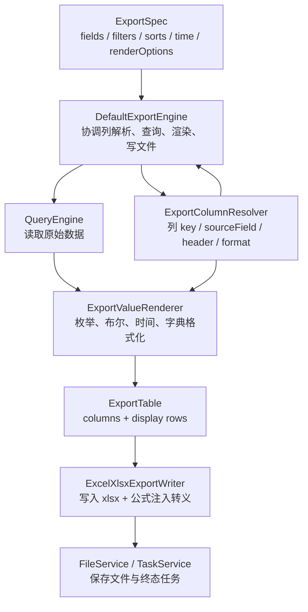
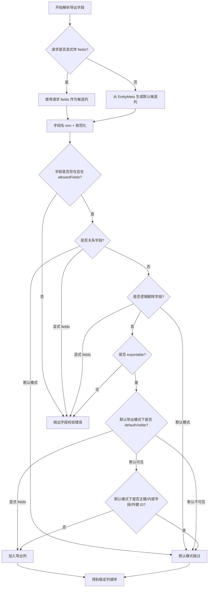
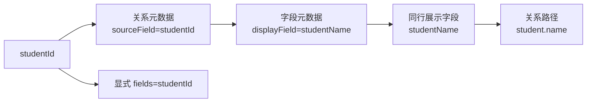
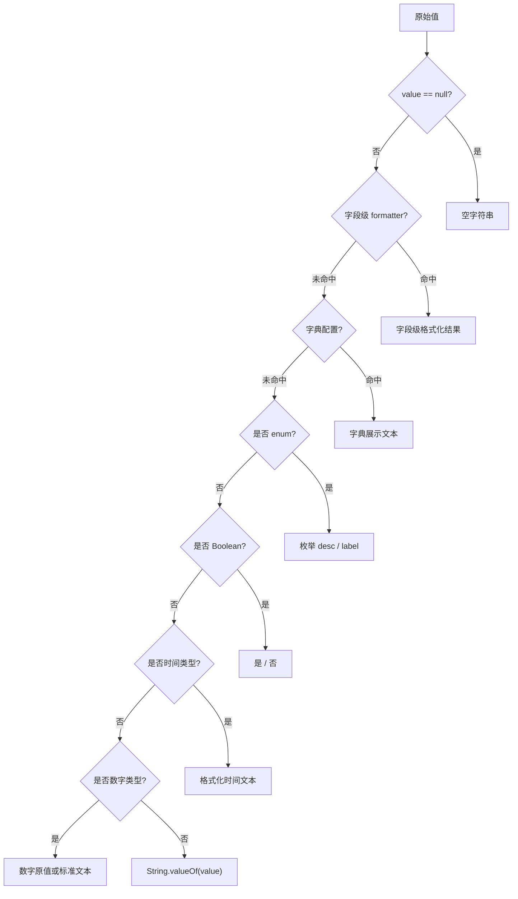
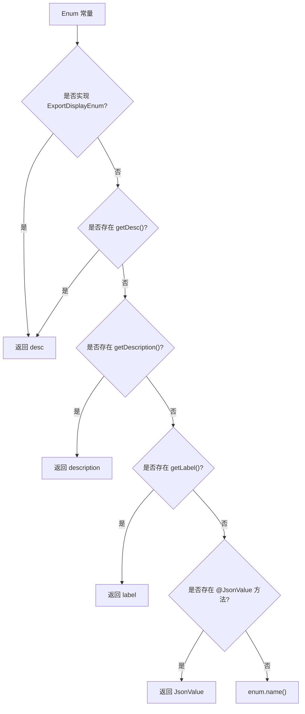
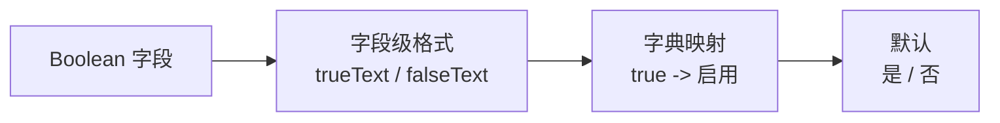
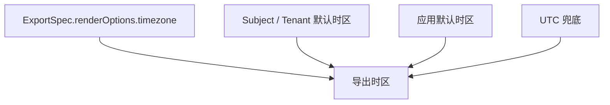
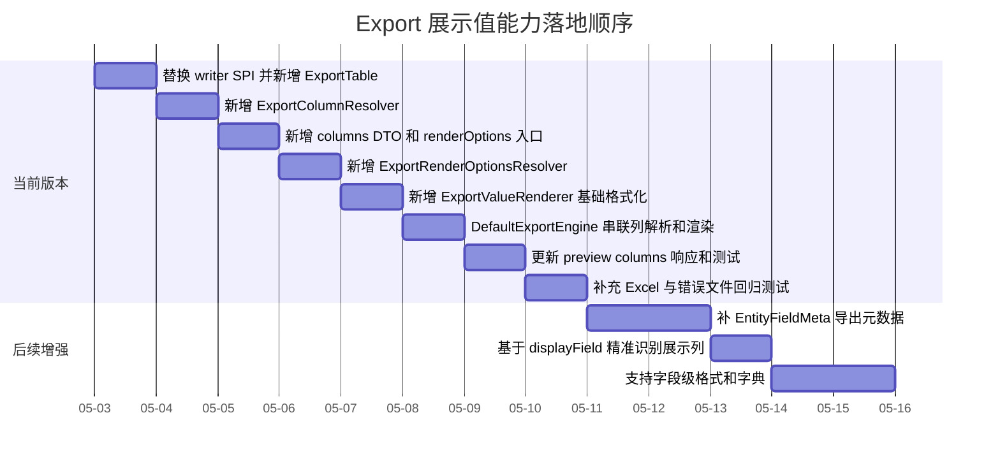

# Export 展示值渲染最佳实践

本文描述通用导出在字段选择、列名展示、枚举/布尔/时间格式化上的默认规范。它补充 [Export 当前实现](../../architecture/components/crud/export.md)，只关注“导出的表格内容应该长什么样”，不重复导出主链、权限、Task/File 和下载安全规则。

本文按三个层次做决策：

- 最佳实践：长期正确的职责边界和能力模型。
- 当前取舍：当前版本必须落地且可以自动化验收的较小范围。
- 后续补充：依赖字段元数据、关系投影或字典服务的能力，不作为 当前版本硬承诺。

本文按“最终版合同优先、不保留旧兼容入口”的口径推进。core writer SPI、默认字段解析、preview/submit 生成链路和 HTTP/API DTO 可以一次性切到新合同，避免继续让 `spec.fields` 或 row key 承担列合同职责。迁移风险通过同步替换调用点、补齐验收测试和清晰失败语义控制，而不是在框架内部长期保留两套导出协议。

## 0. 当前取舍总览

当前版本目标是先把导出结果从“字段 Map 倾倒”收敛为“稳定列合同 + 基础展示值渲染”。凡是依赖业务语义、字典服务、复杂关系投影或新增字段分类元数据的能力，当前版本只保留扩展点和降级边界，不承诺默认做到完全准确。

| 议题 | 最佳实践 | 当前取舍 |
| --- | --- | --- |
| 合同演进 | writer 只消费 `ExportTable`，HTTP preview 按 `columns` 展示 | core writer SPI 和 HTTP DTO 直接切最终版；不保留旧 `List<Map<String,Object>>` writer 入口 |
| 默认字段 | 由字段分类、exportable、defaultVisible 元数据和框架配置控制 | 当前版本先用 `allowedFields` 收窄，再叠加主键、逻辑删除、关系字段、关系边外键和有限内置内部字段拒绝/隐藏规则 |
| 审计时间字段 | 由字段分类元数据判断是否默认展示 | 当前版本不把 `createdAt/updatedAt` 默认当技术字段隐藏；`createdBy/updatedBy` 可按内部字段兜底隐藏 |
| 外键展示 | 通过 `displayField` 或关系投影导出展示列 | 当前版本通过 `RelationGraph` 识别关系边外键，并复用同表合法 `xxxName`；找不到展示字段时不 join、不造空列 |
| 枚举/布尔/时间 | 基于字段类型和字典/格式元数据渲染 | 当前版本基于 `EntityFieldMeta.javaType + raw value` 做基础转换；字典、字段级 true/false 文案后置 |
| 时区入口 | 独立 `renderOptions.timezone` | 当前版本在 HTTP request、`ExportSpec` 和 assembler 中补强类型入口；不从 `payload.timezone` 猜测 |
| 元数据扩展 | `EntityFieldMeta` 原生支持导出语义 | 当前版本不强制一次补齐；补齐前必须明确降级，不扩大权限 |

## 1. 目标

通用导出默认应该输出用户可读数据，而不是把数据库字段原样倾倒到 Excel。

核心目标：

- 默认排除内部技术字段和内部引用字段。
- 外键 ID 默认不直接暴露，优先导出对应展示值。
- 枚举、布尔、时间等常见类型自动转成稳定中文展示。
- Excel 模块只负责写文件，不承载业务语义和字段策略。
- 业务可以通过元数据或 SPI 显式覆盖默认行为。

## 2. 分层边界



职责边界：

| 层 | 应做 | 不应做 |
| --- | --- | --- |
| `DefaultExportEngine` | 解析字段、应用白名单、读取数据、调用展示值渲染 | 直接拼 Excel 样式或硬编码业务枚举 |
| `ExportColumnResolver` | 决定默认导出哪些列、列顺序、列标题 | 绕过字段权限或静默吞掉非法字段 |
| `ExportValueRenderer` | 把原始值转成导出展示值 | 改变 Query API 的原始返回语义 |
| `ExcelXlsxExportWriter` | 写 xlsx、文件名清洗、公式注入转义 | 理解业务字段、枚举含义、字典含义 |

### 2.1 列合同优先于值渲染

最佳实践：导出不能只传 `List<Map<String, Object>> rows` 给 writer。需要先形成稳定列合同，再查询和渲染。否则字段 key、查询字段、展示表头、外键展示字段会混在一起，后续很难支持中文列名和外键展示值。

推荐模型：

```java
public final class ExportColumn {
    private final String key;
    private final String sourceField;
    private final String header;
    private final EntityFieldMeta fieldMeta;
    private final String format;
}

public final class ExportTable {
    private final List<ExportColumn> columns;
    private final List<Map<String, Object>> rows;
}

public interface ExportFileWriter {
    FileWriteRequest write(ExportSpec spec, ExportTable table);
}

public final class ExportRenderOptions {
    private final String timezone;
}
```

HTTP/API 层不直接暴露 core 的 `ExportColumn`，应提供稳定 DTO，例如：

```java
public final class CrudExportColumnData {
    private String key;
    private String header;
}
```

HTTP preview 的最终版响应应是：

```java
public final class CrudExportData {
    private List<CrudExportColumnData> columns;
    private List<Map<String, Object>> previewRows;
}
```

`previewRows` 是 preview 语义下的最终字段名，不代表兼容旧协议。前端和测试必须以 `columns` 作为列顺序和列标题的唯一来源，不能再根据 `previewRows` 的 Map 顺序或 key 自行推断表头。

字段含义：

| 字段 | 含义 |
| --- | --- |
| `key` | 导出行里的稳定列 key，writer 按它取值 |
| `sourceField` | Query 读取的实体字段，当前版本必须是不含 `.` 的根实体字段 |
| `header` | Excel 表头展示名 |
| `fieldMeta` | 字段类型、关系、导出元数据 |
| `format` | 时间、数字、布尔等格式提示 |

当前取舍：

- 当前版本先引入 `ExportColumnResolver` 和 `ExportTable`，让 writer 按 `columns.header` 写表头、按 `columns.key` 写单元格。
- 当前版本的 `sourceField` 只允许根实体字段，不支持 `student.name` 这类关系路径投影。
- 当前版本直接替换 `ExportFileWriter` 方法签名为 `write(ExportSpec, ExportTable)`，不保留 `write(ExportSpec, List<Map<String, Object>>)` 兼容入口。
- 当前版本禁止 writer 从 `spec.fields` 或 row key 推断列顺序和表头；没有 `ExportTable.columns` 时视为框架错误，直接失败。
- 当前版本`DefaultExportEngine.preview` 和 `submit` 必须共用同一套列解析、查询字段和展示值渲染链路，避免 preview 与最终 Excel 内容不一致。
- 当前版本`ExportResult` 和 `CrudExportData` 增加 `columns`，preview 返回 `columns + previewRows`；`previewRows` 的 row key 必须是 `ExportColumn.key`，前端按 `columns` 控制展示顺序和标题。
- 当前版本的 `ExportColumn.key` 默认等于 `sourceField`，保持列合同简单确定；只有后续明确支持展示列别名时，才允许 `key` 与 `sourceField` 不同。
- 当前版本同步替换所有复用 Excel writer 的调用点，包括导入错误文件 writer；禁止留下旧 `List<Map<String, Object>>` 写入入口作为内部捷径。

### 2.2 Excel 单元格类型取舍

最佳实践中，`ExportColumn` 应逐步承载 `cellType`、`numberFormat`、`dateFormat` 等写入提示，让数字、日期在 Excel 中保留排序、筛选和计算能力。

当前取舍：

- 当前版本先按展示文本导出，`ExportValueRenderer` 负责把枚举、布尔、时间转成稳定展示值。
- 当前版本数字值默认保留原始 `Number`，writer 按数字单元格写入；当前版本不做业务数字格式化，数字格式能力列为 后续增强。
- 当前版本不把业务格式化规则下沉到 Excel writer；writer 最多根据 `ExportColumn` 的通用类型提示决定 POI cell type 和 style。

后续补充：

- 支持 `sourceField` 与 `key` 不同，例如 `studentId` 读取后渲染到 `student` 列。
- 支持一个展示列依赖多个原始字段，例如 `province + city + district`。
- 支持关系路径展示列，但必须先补齐 Query/JDBC 的关联投影合同。

## 3. 默认字段策略

导出字段分两类处理：

- 未显式传 `fields`：走默认导出列策略，只导出用户自然需要阅读的字段。
- 显式传 `fields`：仍必须经过字段白名单、权限和 exportable 校验；非法字段直接失败，不能静默剔除。

默认规则：

| 字段类型 | 默认行为 | 说明 |
| --- | --- | --- |
| 主键 ID | 默认不导出 | 显式传 `fields` 且权限允许时可导出 |
| `REF_ID` 字段 | 默认不导出 | 由字段级 `exportDefaultVisible` 和关系展示字段规则控制；没有全局 kind 黑名单配置 |
| `studentId` / `teacherId` 这类关系外键 | 默认不导出 | 由元数据和关系图规则决定；优先导出 `studentName`、`teacherName` 或关系展示列 |
| 逻辑删除字段 | 永不导出 | 即使显式传入也应拒绝 |
| 租户、组织、权限、操作者字段 | 默认不导出 | 最佳实践依赖元数据标识；没有元数据时只能覆盖框架内置内部字段 |
| 创建/更新时间字段 | 默认导出 | 当前版本不把 `createdAt/updatedAt` 直接当技术字段隐藏，除非字段分类元数据或业务 Handler 明确要求 |
| 关系对象字段 | 默认不导出 | 复杂关系导出应走场景 Handler |
| 普通业务字段 | 默认导出 | 受 readable/exportable 白名单约束 |

当前取舍：

- 当前版本默认列来自 `EntityMeta.fieldMetas` 的稳定顺序。
- 当前版本默认排除主键、逻辑删除字段、关系对象字段、命中关系边 `fromField` 的外键字段，以及框架明确知道的内部字段。
- 当前版本不提供全局 `EntFieldKind` 隐藏配置；默认导出策略只消费稳定元数据和关系图，避免配置与字段模型脱节。
- 当前版本关系边外键默认隐藏；如果元数据明确 `exportDefaultVisible=true`，默认导出可以包含该外键，常见来源是字段级注解显式开启。
- 当前版本显式 `fields` 不做静默剔除：字段不存在、不在白名单、关系对象字段、逻辑删除字段都直接失败。
- 当前版本如果缺少 `exportable` 元数据，则按现有 readable/allowedFields 收窄，并叠加导出专属拒绝规则；不能把 `allowedFields` 等同为“允许导出所有字段”。
- 当前版本改变现有默认语义：未显式传 `fields` 时不再默认导出主键 ID。显式传入主键 ID 时，只要字段存在、权限允许且不是禁止字段，可以导出。
- 当前版本对“框架明确知道的内部字段”只做有限内置兜底，例如 `createdBy`、`updatedBy`、`tenantId`、`orgId`、`version` 等；这些字段在 当前版本不仅默认隐藏，显式 `fields` 也直接拒绝，除非业务通过 `ExportHandler` 完整接管场景。
- 当前版本`createdAt`、`updatedAt` 在很多业务中是用户可读时间，不进入内置隐藏名单；如果业务认为它们敏感，必须通过后续字段分类元数据或场景 Handler 控制。
- 当前版本字段名黑名单只能作为临时兜底，不能无限扩展；业务自定义审计字段、组织层级字段、可见性字段必须等字段分类元数据或业务 Handler 接管。

当前版本字段安全边界：

| 字段类别 | 默认导出 | 显式 `fields` | 说明 |
| --- | --- | --- | --- |
| 不存在字段 | 拒绝 | 拒绝 | 不静默忽略 |
| 不在 `allowedFields` | 拒绝 | 拒绝 | `allowedFields` 是最小读取白名单，不是导出授权全集 |
| 关系对象字段 | 跳过 | 拒绝 | 当前版本不导出对象图 |
| 逻辑删除字段 | 拒绝 | 拒绝 | 避免暴露软删除实现 |
| 主键 ID | 跳过 | 允许 | 仍需字段存在且在读取白名单内 |
| `REF_ID` / 关系边外键 ID | 跳过 | 允许 | 当前版本默认不暴露内部引用；默认行为可由全局配置或字段级 `@EntCrudExportField` 调整，显式请求仍需通过字段校验 |
| 内置内部字段 | 跳过 | 拒绝 | `tenantId/orgId/createdBy/updatedBy/version` 等 |
| `createdAt/updatedAt` | 允许 | 允许 | 不按字段名默认视为技术字段 |
| 普通业务字段 | 允许 | 允许 | 受读取白名单和后续 exportable 元数据约束 |

后续补充：

- 在 `EntityFieldMeta` 增加 `exportable` 和 `exportDefaultVisible` 后，默认列策略必须优先使用元数据，不再主要依赖字段名约定。
- 租户、组织、操作者和审计字段的默认隐藏应由字段分类元数据表达；字段名黑名单只能作为 当前版本临时兜底。

字段选择流程：



图中的 `exportable/defaultVisible` 表示后续字段元数据能力。当前版本缺少这类元数据时，普通业务字段在通过 `allowedFields` 和导出专属拒绝规则后可以导出；后续一旦补齐 `exportable=false` 或 `exportDefaultVisible=false`，必须按元数据拒绝或跳过。

## 4. 外键 ID 与展示列

`studentId`、`teacherId` 不能只靠字段名后缀粗暴排除。推荐优先通过元数据识别它是否是关系引用字段。

推荐约定：

| 原始字段 | 推荐默认导出列 | 说明 |
| --- | --- | --- |
| `studentId` | `studentName` 或 `student.name` | 列标题可为 `学生` |
| `teacherId` | `teacherName` 或 `teacher.name` | 列标题可为 `教师` |
| `classId` | `className` 或 `class.name` | 业务可配置展示字段 |

外键展示列解析优先级：



当前取舍：

- `ExportColumnResolver` 当前版本必须显式依赖关系边来源，例如 `RelationGraph` 或等价的 `RelationEdgeProvider`；外键识别不能藏在 Excel writer 或值渲染器里。
- 默认导出时排除命中关系元数据的 `xxxId`，即 `RelationGraph.outgoingOf(rootType).fromField` 指向的根实体字段；如果字段元数据已明确 `exportDefaultVisible=true`，则允许默认导出。
- 如果同一实体存在 `xxxName` 且该字段通过白名单校验，默认加入 `xxxName`；如果 `xxxName` 已经在默认候选列中，只保留一次，并保持 `EntityMeta.fieldMetas` 的稳定顺序。
- 当前版本不默认生成 `student.name` 这类关系路径列，因为默认 JDBC 投影不支持带 `.` 的关联字段。
- 显式传 `fields=studentId` 时，只要字段存在、权限允许且不是禁止字段，可以导出原始 ID。
- 当前版本如果命中外键 ID 但找不到同表展示字段，不临时 join、不调用字典服务、不生成空展示列；默认只排除该 ID。这是有意的最小化取舍：通用导出避免暴露内部引用 ID，但不假装自己拥有关系展示能力。业务必须通过字段级 `@EntCrudExportField(defaultVisible = true)`、显式 `fields` 或 `ExportHandler` 接管场景来导出 ID。
- 当前版本字段名后缀 `Id` 只能作为没有关系元数据时的保守兜底，并且只影响默认导出，不影响显式 `fields`。为降低误伤，只有同表同时存在合法 `xxxName` 展示字段时才触发后缀兜底；否则保留该字段，交给业务元数据或 Handler 决定。
- 如果运行时完全无法提供关系边来源，当前版本必须在实现和测试中明确降级行为：不做关系元数据外键识别，只应用主键、逻辑删除、关系对象和内置内部字段规则；不能假装已经具备关系展示能力。

后续补充：

- `displayField` 元数据落地后，优先使用显式配置的展示字段。
- 关系路径展示列必须等 Query/JDBC 支持关联投影、列别名和权限校验后再开放。
- 业务需要更准确的展示值时，当前版本应通过 `ExportHandler` 接管场景，而不是在通用引擎里临时 join。

## 5. 展示值渲染规范

值渲染发生在列合同和原始数据读取之后。渲染器只能把单元格值转成导出展示值，不能临时决定新增、删除或重排列。

统一渲染入口建议为：

```java
public interface ExportValueFormatter {
    boolean supports(ExportFieldContext context, Object value);

    Object format(ExportFieldContext context, Object value);
}

public final class ExportFieldContext {
    private final ExportColumn column;
    private final EntityFieldMeta fieldMeta;
    private final Class<?> declaredType;
    private final ExportRenderOptions renderOptions;
}
```

推荐再提供一个统一编排入口，避免 `DefaultExportEngine` 直接散落 formatter 顺序和时区解析逻辑：

```java
public interface ExportValueRenderer {
    Map<String, Object> renderRow(List<ExportColumn> columns, Map<String, Object> rawRow, ExportRenderOptions options);
}
```

当前版本中 `DefaultExportEngine` 只负责把列合同、raw rows 和 `ExportRenderOptions` 交给 renderer；formatter 链、枚举反射、布尔映射和时间格式化都收敛在 renderer 内部。

格式化链路：



默认格式化规则：

| Java 类型 | 默认导出值 |
| --- | --- |
| `null` | 空字符串 |
| `Boolean.TRUE` | `是` |
| `Boolean.FALSE` | `否` |
| `Enum` | 优先中文描述，兜底 `name()` |
| `LocalDate` | `yyyy-MM-dd` |
| `LocalDateTime` | `yyyy-MM-dd HH:mm:ss` |
| `Instant` | 按导出时区转成 `yyyy-MM-dd HH:mm:ss` |
| `Date` | 按导出时区转成 `yyyy-MM-dd HH:mm:ss` |
| `LocalTime` | `HH:mm:ss` |
| `BigDecimal` / Number | 默认保留原值，必要时由字段格式覆盖 |
| 其他类型 | `String.valueOf(value)` |

当前版本渲染器不能只看 `raw value instanceof Enum/Boolean/Instant`。Query/JDBC 返回的 `CrudRecord` 里，枚举可能已经是 `String`，布尔可能是 `Boolean`、`Number` 或 `"true"/"false"`，时间可能是 `LocalDateTime`、`Timestamp`、`Date` 或 ISO 文本。因此 formatter 必须同时使用 `EntityFieldMeta.javaType` 和 raw value：

| 字段声明类型 | raw value | 当前版本行为 |
| --- | --- | --- |
| `enum` | enum 常量 | 按枚举展示优先级渲染 |
| `enum` | `String` | 优先按 `Enum.valueOf` 还原后渲染；还原失败时保留原文本 |
| `Boolean/boolean` | `Boolean` | `true/false` -> `是/否` |
| `Boolean/boolean` | `Number` | `0` -> `否`，`1` -> `是`，其他值保留原文本 |
| `Boolean/boolean` | `String` | `true/false/1/0` 做基础映射，其他值保留原文本 |
| 时间类型 | `java.time` / `Date` / `Timestamp` | 按类型和导出时区格式化 |
| 时间类型 | `String` | 当前版本不强行解析非标准业务文本；保留原文本 |

上述规则的目标是让通用导出在常见 JDBC 映射下可用，同时避免对业务编码做过度猜测。

## 6. 枚举规范

业务枚举推荐实现框架统一展示接口：

```java
public interface ExportDisplayEnum {
    String getDesc();
}
```

接口放置规则：

- `ExportDisplayEnum` 不应放在 `core` 包内，否则业务枚举会被迫依赖 core 实现模块。
- 当前版本提供强接口时放在业务可依赖的轻量边界模块，优先 `ent-loom-crud-api`；`core` 只消费该接口，不定义该接口。
- 当前版本不强制业务枚举实现接口；默认 renderer 仍必须支持反射读取 `getDesc()`、`getDescription()`、`getLabel()` 和 `@JsonValue`，保证没有改造业务枚举时也能得到合理展示值。

示例：

```java
/**
 * 德育点评类型枚举
 */
@Getter
@AllArgsConstructor
public enum EnumMoralEvaluationType implements ExportDisplayEnum {

    PRAISE("表扬"),

    IMPROVE("待改进");

    private final String desc;
}
```

枚举展示值读取优先级：



当前版本枚举渲染必须支持两种输入：

- raw value 已经是 enum 常量时，直接按上面的优先级读取展示文本。
- raw value 是 `String` 且 `EntityFieldMeta.javaType` 是 enum 类型时，先用 `Enum.valueOf(javaType, raw)` 还原，再按优先级读取展示文本；还原失败时保留原文本，不能抛出业务不可控异常。

不建议：

- 每个导出场景手写 `switch enum.name()`。
- 在 Excel writer 中反射枚举。
- 把中文描述塞进数据库字段，破坏领域模型。

## 7. 布尔值规范

通用 boolean 默认用 `是/否`，但领域型 boolean 应允许字段级覆盖。

| 字段 | 通用默认 | 推荐业务覆盖 |
| --- | --- | --- |
| `enabled` | 是/否 | 启用/停用 |
| `passed` | 是/否 | 通过/未通过 |
| `deleted` | 不导出 | 不适用 |
| `locked` | 是/否 | 锁定/未锁定 |

覆盖方式优先级：



## 8. 时间格式与时区

时间格式不能放在 JDBC 映射层，也不应改变 Query API 的 JSON 返回。导出层只负责把原始时间值渲染成文件展示文本。

导出展示时区不应强绑定到查询时间范围。`ExportSpec.time` 主要描述过滤条件，展示格式和展示时区属于导出渲染选项，推荐独立表达。

时区优先级：



当前取舍：

- 当前版本新增强类型 `ExportRenderOptions`，并在 `ExportSpec` 暴露 `renderOptions.timezone` 作为唯一导出展示时区入口。
- 当前版本`CrudExportHttpRequest` 同步增加 `renderOptions`，由 assembler 复制到 `ExportSpec`；未知 JSON 字段或 `attributes` 中的 `timezone` 不能被当成导出展示时区。
- 当前版本不使用 `ExportSpec.time.timezone` 或 `payload.timezone` 表达展示时区；`ExportSpec.time` 只保留查询时间范围语义。
- 应用配置也缺失时使用 `UTC` 作为确定性兜底，不把 `ZoneId.systemDefault()` 作为可观察导出语义。
- `LocalDateTime` 不携带时区，只按格式输出；`Instant` 和 `Date` 必须按最终导出时区转换。
- 当前版本增加 `ExportRenderOptionsResolver` 或等价组件，统一完成 request timezone、Subject/Tenant 默认时区、应用默认时区和 UTC 兜底的选择。
- 当前版本对非法 timezone 直接抛出参数校验错误，不静默降级到 UTC，避免用户以为按指定时区导出。

HTTP 请求示例：

```json
{
  "format": "excel-xlsx",
  "fields": ["orderNo", "createdAt"],
  "renderOptions": {
    "timezone": "Asia/Shanghai"
  }
}
```

推荐默认格式：

| 类型 | 格式 |
| --- | --- |
| `LocalDate` | `yyyy-MM-dd` |
| `LocalDateTime` | `yyyy-MM-dd HH:mm:ss` |
| `Instant` | `yyyy-MM-dd HH:mm:ss` |
| `Date` | `yyyy-MM-dd HH:mm:ss` |
| `LocalTime` | `HH:mm:ss` |

## 9. 元数据建议

当前版本可以通过默认规则和 SPI 落地；长期建议把导出能力补进字段元数据。

当前版本不要求一次性补齐所有字段元数据，但必须明确降级边界：没有 `exportLabel` 时表头使用字段名；没有 `exportable` 时按 `allowedFields` 收窄；没有 `displayField` 时只做 `xxxName` 同表约定；没有 `dictionaryCode` 时不做字典翻译。

建议扩展：

```java
public class EntityFieldMeta {
    private final boolean exportable;
    private final boolean exportDefaultVisible;
    private final String exportLabel;
    private final String exportFormat;
    private final String dictionaryCode;
    private final String displayField;
}
```

字段元数据含义：

| 字段 | 含义 |
| --- | --- |
| `exportable` | 是否允许导出 |
| `exportDefaultVisible` | 未显式传 `fields` 时是否默认导出 |
| `exportLabel` | 导出列标题 |
| `exportFormat` | 时间、数字、布尔等格式化提示 |
| `dictionaryCode` | 字典编码 |
| `displayField` | 外键引用对应的展示字段 |

## 10. 推荐落地顺序



实际实施时建议按以下顺序提交：

1. 直接替换 core writer SPI 为 `write(ExportSpec, ExportTable)`，同步修改 Excel writer、导入错误文件 writer 和测试，不保留旧 `List<Map<String, Object>>` writer 合同。
2. 增加 `ExportColumn`、`ExportTable`，先解决列 key、sourceField、header 分离。
3. 增加 `ExportColumnResolver`，覆盖默认字段、显式字段、列标题、主键默认排除、内置内部字段拒绝和 当前版本外键 ID 排除；关系边来源通过 `RelationGraph` 或等价 Provider 注入。
4. 增加 API/starter 层的 `columns` DTO 和 `renderOptions` 请求入口；HTTP preview 使用 `columns + previewRows` 作为最终响应合同。
5. 增加 `ExportRenderOptionsResolver`，明确非法 timezone 失败、Subject/Tenant 默认时区、应用默认时区和 UTC 兜底。
6. 增加 `ExportValueFormatter`、`ExportFieldContext`、`DefaultExportValueRenderer`。
7. 在 `DefaultExportEngine` 查询后，按 `ExportColumn` 把 raw row 转成 display row。
8. 增加默认 formatter：enum、boolean、date/time、null，并覆盖 raw value 是字符串、数字或 JDBC 时间类型的常见情况。
9. 更新 preview 响应，返回 `columns + previewRows`，并确保 preview 和 submit 使用同一个 `ExportTable` 生成流程。
10. 增加测试覆盖 preview、submit 和 import error file 三条路径。
11. 后续增强把 `exportable/exportLabel/exportFormat/displayField` 持久化到 `EntityFieldMeta`。

## 11. 验收清单

| 验收项 | 期望 |
| --- | --- |
| Writer SPI | `ExportFileWriter` 只接收 `ExportTable`，不存在旧 `write(ExportSpec, List<Map<String, Object>>)` 合同 |
| 列合同 | writer 使用 `ExportColumn.header` 写表头，不从 row key 或 `spec.fields` 推断展示列名 |
| HTTP preview | `CrudExportData` 返回 `columns + previewRows`；`previewRows` 的 key 与 `ExportColumn.key` 一致 |
| Preview 一致性 | preview 响应包含稳定 `columns`，且列顺序、表头和值渲染与 submit Excel 一致 |
| 默认导出 | 默认不包含主键 ID、逻辑删除字段、关系对象字段、命中关系元数据的外键 ID、明显内部字段；`REF_ID` 和关系外键默认隐藏策略可被全局配置或字段级注解调整；`createdAt/updatedAt` 默认不因字段名被隐藏 |
| 显式 fields 安全 | 不存在字段、不在白名单字段、关系对象字段、逻辑删除字段和内置内部字段直接失败；不能仅靠 `allowedFields` 放行 |
| 外键 ID | 默认不导出命中关系元数据的 `studentId/teacherId`；同表存在合法 `studentName/teacherName` 时导出展示字段，否则只排除 ID；若元数据明确 `exportDefaultVisible=true`，默认导出可包含该 ID |
| 显式 fields | 非法字段失败，合法 ID 字段可按权限导出 |
| 枚举 | raw enum 常量和 raw 字符串 `PRAISE` 都能基于字段声明类型导出为 `表扬` |
| Boolean | raw `true/false`、`1/0` 和 `"true"/"false"` 能基于字段声明类型导出为 `是/否` |
| 时间 | `Instant/Date/Timestamp` 按统一格式和导出渲染时区导出，唯一入口为 `renderOptions.timezone` |
| renderOptions | HTTP request、`ExportSpec` 和 assembler 都有强类型 `renderOptions`；不从 `payload.timezone` 或未知字段读取展示时区；非法 timezone 直接失败 |
| Excel 安全 | 公式注入文本仍被 writer 转义 |
| 分层约束 | core/starter 不依赖 POI；Excel writer 不理解业务枚举 |
| 导入错误文件 | import error file writer 也通过 `ExportTable` 写 xlsx，不保留旧 writer 入口 |

当前版本不验收：

- `student.name` 这类关系路径展示列。
- 字典服务展示文本。
- 一个导出展示列依赖多个原始字段。
- 业务字段级 `trueText/falseText`、数字格式、复杂日期格式。
