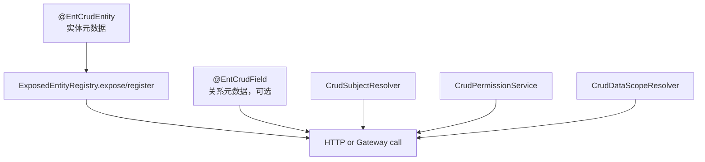
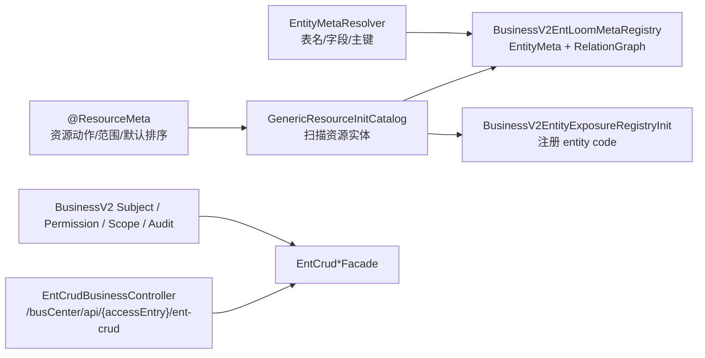

# 业务接入模板

业务接入有两种方式：原生接入和业务桥接接入。原生接入适合新服务直接采用 `@EntCrudEntity`；business v2 当前采用桥接接入，复用已有 `@ResourceMeta`、MyBatis-Plus 元数据和业务权限体系。

## 原生接入最小闭环



最小步骤：

1. 实体加 `@EntCrudEntity(table=..., idField=..., logicDeleteField=...)`。
2. 如需 ROOT_FIRST 展开，在关系字段上加 `@EntCrudField`。
3. 通过 `ResourceCatalogAdapter.runtimeModel()` 输出 `CrudRuntimeModel`，由 Spring 构建 `CrudRuntimeModelBackedEntityMetaRegistry`；Web 层只注册/暴露到 `ExposedEntityRegistry`。
4. 提供 `CrudSubjectResolver`，否则默认 fail closed。
5. 提供 `CrudPermissionService` 和 `CrudDataScopeResolver`，或用配置型规则完成最小授权。

关系字段示例：

```java
@EntCrudField(targetClass = Order.class, targetField = "id")
private Long orderId;

@EntCrudField(
    targetClass = OrderItem.class,
    sourceField = "id",
    targetField = "orderId",
    cardinality = RelationCardinality.ONE_TO_MANY
)
private List<OrderItem> items;
```

## business v2 当前接入链



business v2 的重点：

- `BusinessV2EntLoomMetaRegistry` 避免业务实体强制追加 `@EntCrudEntity`。
- `BusinessV2EntityExposureRegistryInit` 注册 `ResourceInitDefinition.resourceCode` 和实体 simpleName。
- `EntCrudBusinessController` 复用框架 Facade，但把响应包装成业务 `ItemsResponse`。
- `{accessEntry}` 通过 `CrudInvocationContext` 进入 `CrudRequestContextHolder`，再由 `BusinessAccessEntrySpecAttributeContributor` 写入 Spec attributes。
- `BusinessV2CrudPermissionService` 将 CRUD action 映射到业务 `ResourceAction`。
- `BusinessV2CrudDataScopeResolver` 将访问范围映射为实体字段维度，例如 school/class/student/grade。

## 自定义 Query 场景模板

```java
@Component
@EntCrudQueryHandler(
    entityClasses = {Order.class},
    scenes = {"summary"}
)
public class OrderSummaryHandler implements QueryListSceneHandler<OrderSummary> {
    private static final Set<CrudRouteKey> ROUTE_KEYS = Collections.singleton(
        new CrudRouteKey(
            Collections.singletonList(Order.class.getName()),
            QueryOperation.LIST.name(),
            RouteKeyFactory.normalizeScene("summary")
        )
    );

    @Override
    public Set<CrudRouteKey> routeKeys() {
        return ROUTE_KEYS;
    }

    @Override
    public List<OrderSummary> handle(
        QuerySpec<OrderSummary> spec,
        SceneDelegate<QuerySpec<OrderSummary>, List<OrderSummary>> delegate
    ) {
        return delegate.invoke(spec);
    }
}
```

适用场景：

- 查询前补默认过滤条件。
- 查询后聚合/转换结果。
- 复杂业务查询直接绕开默认 SQL。

## 自定义 Command 场景模板

```java
@Component
public class OrderCreateFullHandler implements CommandCreateSceneHandler<Object, Object> {
    private static final Set<CrudRouteKey> ROUTE_KEYS = Collections.singleton(
        new CrudRouteKey(
            Collections.singletonList(Order.class.getName()),
            CommandOperation.CREATE.name(),
            RouteKeyFactory.normalizeScene("full")
        )
    );

    @Override
    public Set<CrudRouteKey> routeKeys() {
        return ROUTE_KEYS;
    }

    @Override
    @Transactional(rollbackFor = Exception.class)
    public Object handle(CommandSpec<Object> spec, SceneDelegate<CommandSpec<Object>, Object> delegate) {
        Object rootResult = delegate.invoke(spec);
        // 同步子表或发业务事件
        return rootResult;
    }
}
```

`ACTION` 场景建议继承 `AbstractSimpleActionHandler`：

```java
@Component
public class OrderSubmitHandler extends AbstractSimpleActionHandler<OrderSubmitRequest, OrderSubmitResponse> {
    public OrderSubmitHandler(OrderSubmitService service) {
        super(Order.class, "submit", OrderSubmitRequest.class, OrderSubmitResponse.class);
        this.service = service;
    }

    private final OrderSubmitService service;

    @Override
    protected OrderSubmitResponse execute(OrderSubmitRequest payload) {
        return service.submit(payload);
    }
}
```

## HTTP 示例

分页：

```json
{
  "entityCodes": ["Order"],
  "options": {
    "page": 1,
    "limit": 20,
    "requestId": "req-1",
    "filterMap": {
      "status": {"op": "EQ", "value": "PAID"}
    },
    "sorts": [
      {"field": "createTime", "direction": "DESC", "target": "FIELD"}
    ],
    "countMode": "EXACT",
    "resultMode": "MAP"
  }
}
```

创建：

```json
{
  "options": {
    "requestId": "req-create-1",
    "idempotencyKey": "idem-create-1"
  },
  "payload": {
    "orderNo": "ORD-1",
    "schoolId": 1001
  }
}
```

Stats：

```json
{
  "options": {
    "page": 1,
    "limit": 20,
    "debug": true
  },
  "stats": {
    "groupBy": [{"field": "classId", "alias": "classId"}],
    "metrics": [{"agg": "COUNT", "field": "id", "alias": "countAll"}],
    "includeSummary": true,
    "includeTotalGroups": true
  }
}
```
