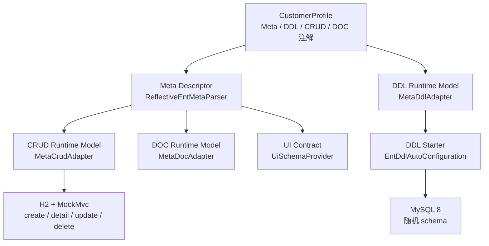

# 实体全链路验收

> 状态：Current
> 最近核验：2026-08-26

本指南说明 E5 使用的最小实体闭环。它是一个可重复执行的验收样例，不是业务项目的 Starter 装配模板；业务权限、复杂关系和真实 HTTP 服务不属于本示例。

验收实体是 `CustomerProfile`，源码位于 `ent-loom-tests/ent-loom-e5-static-test`。它只有主键、文本、数值、日期时间和图片地址字段，且不声明关系。

## 主链



图中的箭头表示验收时已经验证的投影或执行路径，不表示 DDL、CRUD、DOC、UI 必须部署在同一个业务进程中。UI 路径只验证公开 `UiEntityContract`，不启动前端或 UI 服务。

## 实体声明要点

`CustomerProfile` 以 Meta 注解描述通用业务语义，以组件注解补充必要的专属能力：

| 目标 | 关键声明 | 验证结果 |
|---|---|---|
| 通用字段语义 | `@EntEntity`、`@EntField`、`@EntMetaText`、`@EntMetaNumber`、`@EntMetaDateTime`、`@EntMetaMedia` | 生成稳定 Meta Descriptor；字段类型覆盖文本、数值、日期时间、图片 |
| MySQL DDL | `@EntDbEntity`、`@EntDbField`、`@EntDbIndex` | 创建 `customer_profile`、主键自增和 `uk_customer_profile_display_name` 唯一索引 |
| CRUD | `@EntCrudEntity` | 生成实体 Runtime Model，并以 JDBC 在 H2 中执行最小 CRUD |
| DOC | `@EntDocEntity`、`@EntDocField` | 输出实体、字段、列名和字段类型文档模型 |

同一唯一索引同时存在 `@EntIndex(fields = {"displayName"})` 和 `@EntDbIndex(fields = {"display_name"})`。前者保留 Meta 的 Java 字段身份，后者明确 DDL 使用的物理列名；两者的名称和唯一性必须保持等价。

## 验收入口

| 测试类 | 环境 | 覆盖范围 |
|---|---|---|
| `E5EntityRuntimeStaticAcceptanceTest` | 纯内存 | Meta、DDL、CRUD、DOC、UI Runtime Model 的字段身份和类型投影 |
| `E5MysqlDdlAcceptanceTest` | MySQL 8 | DDL Starter 创建随机 schema，并检查字段、主键、自增、唯一索引和公开 `QueryStrategy` 表快照 |
| `E5CrudMvcAcceptanceTest` | H2 + MockMvc | `create`、`detail`、`update`、再次 `detail`、`delete`；不启动真实 HTTP 服务 |

测试模块只声明 `test` scope 依赖，不是生产构件依赖。

## 执行命令

在仓库根目录使用 JDK 21 与 Maven Wrapper 执行常规验收。未启用 MySQL profile 时，MySQL 用例会按设计跳过，其余静态与 MockMvc 用例仍会执行。

```bash
JAVA_HOME=/Users/zubin/Library/Java/JavaVirtualMachines/azul-21.0.10/Contents/Home \
  ./mvnw -pl ent-loom-tests/ent-loom-e5-static-test -am test
```

MySQL 8 验收使用专用 profile。连接参数统一从仓库根目录 `.env.local` 的 `ENTLOOM_TEST_MYSQL_URL`、`ENTLOOM_TEST_MYSQL_USERNAME`、`ENTLOOM_TEST_MYSQL_PASSWORD` 读取；该文件已被 Git 忽略，可从 `.env.local.example` 创建。目标必须是隔离的 MySQL 8 实例，账号须具备建库、建表和删库权限。

Maven `-Dentloom.mysql.integration.*` 参数优先于环境变量和 `.env.local`。已有 `SPRING_DATASOURCE_*` 仅作为本地配置的兼容回退，新配置应使用 `ENTLOOM_TEST_MYSQL_*`。

```bash
JAVA_HOME=/Users/zubin/Library/Java/JavaVirtualMachines/azul-21.0.10/Contents/Home \
  ./mvnw -Pmysql-integration \
  -pl ent-loom-tests/ent-loom-e5-static-test -am test
```

每次 MySQL 用例会生成随机 schema，并在 `finally` 中删除。该流程不引入 Testcontainers，不连接业务数据库，也不启动真实 HTTP 服务。

本地需要检查建表结果时，可在 Maven 或 IntelliJ IDEA 的 VM options 中追加
`-Dentloom.mysql.integration.keep-schema=true`。测试会输出并保留随机 schema；不追加该参数时仍会在结束后自动删除，CI 和普通验收无需改变清理行为。

## 边界

- 仅验证一个无关系实体；不验证外键、联表、级联、权限或租户隔离。
- DDL 验证针对 MySQL 8；CRUD 验证针对 H2 的 MySQL 兼容模式，两者不是同一次事务或同一个数据源。
- MockMvc 只覆盖 HTTP 契约与 JDBC 行为，生产 Web 容器、认证和网络链路由后续业务集成验证。
- 详细阶段结论和命令记录以 [DDL 实施清单](../../evolution/roadmap/ddl/DDL实施清单.md) 为准。
