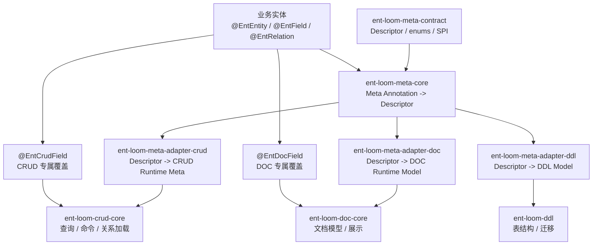
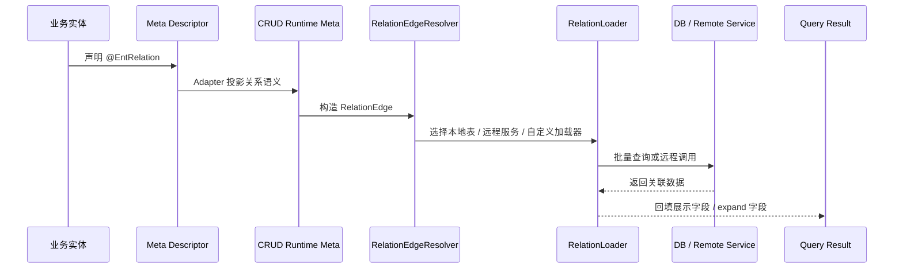
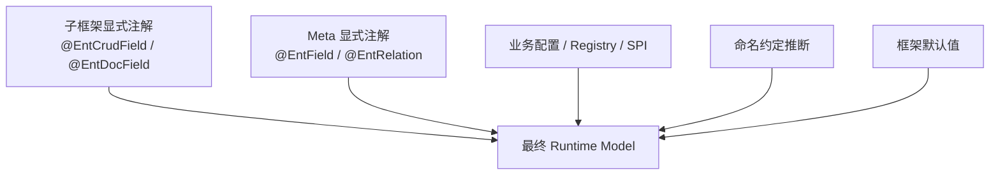
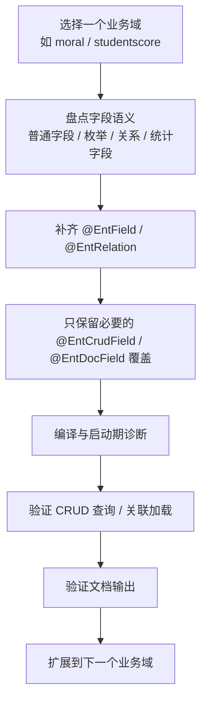
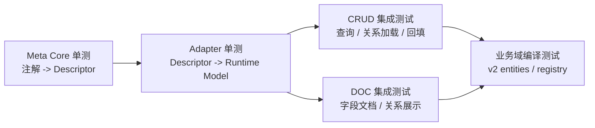

# Ent Loom Meta-first 最佳实践

## 1. 核心结论

建议采用 **Meta-first，子框架覆盖** 的模式。

业务实体优先使用 `ent-loom-meta-annotations` 表达跨模块通用语义；CRUD、DOC、DDL、UI 等子框架保留完整独立能力，但在业务已经提供 Meta 语义时，只补充本框架专属策略或覆盖项。

一句话：

`Meta 描述业务事实，子框架描述执行策略；Descriptor 是中间契约，Runtime Model 是最终执行契约。`

## 2. 核心原则

1. **业务事实只写一遍**

   字段含义、是否必填、字段角色、关联目标、关系基数等跨 CRUD / DOC / DDL / UI 都成立的信息，优先放在 `@EntField`、`@EntRelation`、`@EntIndex` 等 Meta 注解中。

2. **子框架注解不是 Meta 的重复副本**

   `@EntCrudField`、`@EntDocField` 不应为了“注册能力”而在所有字段上重复出现。只有出现模块专属行为、展示覆盖或执行策略时才写。

3. **子框架必须能独立运行**

   CRUD-only、DOC-only 场景仍允许只使用 `@EntCrudField` 或 `@EntDocField` 完整描述能力。Meta-first 是最佳实践，不是对子框架注解能力的削弱。

4. **关系加载属于 CRUD 执行层**

   多表关联查询、远程服务关联、批量回填、懒加载、展开字段等执行行为，应由 CRUD 框架内部的 relation loader / relation resolver / adapter 实现。业务实体只声明关系语义和必要覆盖，不手写加载细节。

5. **注解不是最终契约**

   注解只是输入。框架运行时应先解析为 `EntEntityDescriptor`、`EntFieldDescriptor`、`EntRelationDescriptor` 等统一 Descriptor，再投影到 CRUD / DOC / DDL 自己的 Runtime Model。

6. **显式覆盖优先，默认值不抢语义**

   合并时只让“显式声明”的子框架注解覆盖 Meta 语义，不让注解默认值无意覆盖业务通用定义。

## 3. 推荐架构



模块分工：

| 模块 | 定位 | 是否建议业务直接依赖 |
|---|---|---|
| `ent-loom-meta` | 聚合 pom / 文档入口 | 否 |
| `ent-loom-meta-contract` | Descriptor、共享枚举、SPI | 仅框架或扩展需要 |
| `ent-loom-meta-annotations` | 通用业务语义注解 | 是 |
| `ent-loom-meta-core` | Meta 注解解析与归一 | 通常由框架依赖 |
| `ent-loom-meta-adapters` | Meta 到子框架模型的投影 | 通常由 starter 或子框架依赖 |
| `ent-loom-crud-annotations` | CRUD 完整注解能力与覆盖 | 按需 |
| `ent-loom-doc-annotations` | DOC 完整注解能力与覆盖 | 按需 |

## 4. 注解使用规范

### 4.1 默认推荐写法

一个字段只需要表达通用业务语义时，只写 Meta 注解：

```java
@EntField(
    value = EntFieldKind.REF_ID,
    label = "学生"
)
@EntRelation(
    targetEntity = "student",
    sourceField = "studentId",
    targetField = "id",
    cardinality = RelationCardinality.MANY_TO_ONE
)
private Long studentId;
```

### 4.2 有 CRUD 执行策略时再加 `@EntCrudField`

例如关系需要远程服务加载、指定 join 策略、指定目标 Class：

```java
@EntField(value = EntFieldKind.REF_ID, label = "学生")
@EntRelation(targetEntity = "student", targetField = "id")
@EntCrudField(
    targetClass = Student.class,
    scope = RelationScope.REMOTE_SERVICE,
    joinType = JoinType.LEFT
)
private Long studentId;
```

### 4.3 有 DOC 展示覆盖时再加 `@EntDocField`

例如文档展示名、示例、备注与 Meta 默认语义不同：

```java
@EntField(value = EntFieldKind.REF_ID, label = "学生")
@EntRelation(targetEntity = "student", targetField = "id")
@EntDocField(
    name = "学生",
    targetEntityLabel = "学生基础信息",
    relationRemark = "按 studentId 关联学生主键"
)
private Long studentId;
```

### 4.4 不推荐全量双注解

不建议把所有实体字段机械改成：

```java
@EntDocField(...)
@EntCrudField(...)
private Long studentId;
```

原因：

- 通用语义被重复维护，字段越多越容易漂移。
- DOC 和 CRUD 的默认值可能相互误导。
- 后续 DDL / UI / API 仍要再复制一份。
- 框架无法清晰判断“业务事实”和“模块策略”的边界。

## 5. 关系加载最佳实践

多表关联查询的数据加载建议放在 CRUD 框架实现内部，而不是散落在业务层。

推荐分层：



CRUD 关系加载器建议由框架提供 SPI：

| SPI / 组件 | 职责 |
|---|---|
| `RelationEdgeResolver` | 根据 Descriptor、CRUD 注解、命名约定推断关系边 |
| `RelationLoader` | 负责按关系边批量加载关联数据 |
| `RelationLoaderRegistry` | 根据 `scope`、`targetService`、`targetEntity` 选择加载器 |
| `RelationAssignmentHelper` | 将关联结果回填到查询结果或 DTO |
| `RelationQueryPolicy` | 控制是否自动展开、最大深度、权限过滤、租户隔离 |

业务层只做三类事情：

- 声明关系：`targetEntity`、`sourceField`、`targetField`、`cardinality`。
- 声明策略：必要时用 `@EntCrudField` 指定 `scope`、`joinType`、`targetClass`。
- 注册扩展：特殊远程服务或非标准查询通过 SPI 注册 loader。

## 6. 合并优先级

子框架最终模型建议按以下顺序合并：



优先级：

```text
子框架显式注解
> Meta 显式注解
> 业务配置 / Registry / SPI
> 命名约定推断
> 框架默认值
```

合并规则：

| 情况 | 处理方式 |
|---|---|
| 子框架显式声明字段 | 覆盖 Meta |
| 子框架未声明字段，只存在默认值 | 不覆盖 Meta |
| Meta 与子框架显式声明冲突 | 启动期给出诊断，按子框架显式声明生效 |
| Meta 缺失但可按命名推断 | 使用推断值，并标记为 inferred |
| 推断失败 | 使用默认值或报错，取决于该字段是否为必需语义 |

## 7. 命名规范

统一使用 `target*` 表示关系目标，不再使用 `ref*`、`relationEntityEn`、`relation*Entity*` 这类混合命名。

| 语义 | 推荐命名 | 不推荐 |
|---|---|---|
| 目标服务 | `targetService` | `refService`、`relationService` |
| 目标实体 | `targetEntity` | `relationEntityEn`、`refEntity` |
| 目标实体展示名 | `targetEntityLabel` | `relationEntityName` |
| 当前字段 | `sourceField` | `localField`、`fromField` |
| 目标字段 | `targetField` | `refField`、`toField` |
| 关系基数 | `cardinality` | `relationType` |
| 关系备注 | `relationRemark` | `remark` |

模块命名建议：

| 类型 | 推荐命名 |
|---|---|
| Meta 注解 | `ent-loom-meta-annotations` |
| Meta 契约 | `ent-loom-meta-contract` |
| Meta 解析 | `ent-loom-meta-core` |
| Meta 适配器聚合 | `ent-loom-meta-adapters` |
| CRUD 适配器 | `ent-loom-meta-adapter-crud` |
| DOC 适配器 | `ent-loom-meta-adapter-doc` |
| DDL 适配器 | `ent-loom-meta-adapter-ddl` |

类命名建议：

| 职责 | 推荐命名 |
|---|---|
| Meta 解析器接口 | `EntMetaParser` |
| 反射解析器 | `ReflectiveEntMetaParser` |
| CRUD 投影器 | `MetaCrudAdapter` |
| DOC 投影器 | `MetaDocAdapter` |
| 关系描述 | `EntRelationDescriptor` |
| 关系注解 | `@EntRelation` |
| 关系边 | `RelationEdge` |
| 关系加载器 | `RelationLoader` |

## 8. 业务实体迁移建议

建议按实体域逐步迁移，不要仅为了“看起来统一”批量堆叠注解。



迁移检查表：

| 检查项 | 标准 |
|---|---|
| 字段基础信息 | 能用 `@EntField` 表达的，不重复写到子框架注解 |
| 关系目标 | 统一使用 `@EntRelation(targetEntity, sourceField, targetField)` |
| CRUD 加载 | 只在需要执行策略时写 `@EntCrudField` |
| DOC 展示 | 只在需要展示覆盖时写 `@EntDocField` |
| 旧字段 | 不再使用 `relationEntityEn`、`refEntity` 等历史命名 |
| 枚举 | 使用 `ent-loom-meta-contract` 中的共享枚举 |
| 测试 | 覆盖 Meta 解析、CRUD 投影、DOC 投影、关系加载 |

## 9. 推荐测试分层



最低测试要求：

- `ent-loom-meta-core`：验证 `@EntField`、`@EntRelation`、`@EntIndex` 解析结果。
- `ent-loom-meta-adapter-crud`：验证 Meta 关系能生成 CRUD 关系边。
- `ent-loom-meta-adapter-doc`：验证 Meta 字段能生成文档字段模型。
- `business-center`：验证典型实体域能完成编译，并覆盖至少一个关联查询场景。

## 10. 最终推荐写法

大多数业务字段：

```java
@EntField(value = EntFieldKind.TEXT, label = "姓名", required = OptionalBoolean.TRUE)
private String studentName;
```

普通关系字段：

```java
@EntField(value = EntFieldKind.REF_ID, label = "班级")
@EntRelation(targetEntity = "class", targetField = "id")
private Long classId;
```

带 CRUD 策略的关系字段：

```java
@EntField(value = EntFieldKind.REF_ID, label = "班级")
@EntRelation(targetEntity = "class", targetField = "id")
@EntCrudField(scope = RelationScope.LOCAL_DB)
private Long classId;
```

带 DOC 展示覆盖的关系字段：

```java
@EntField(value = EntFieldKind.REF_ID, label = "班级")
@EntRelation(targetEntity = "class", targetField = "id")
@EntDocField(targetEntityLabel = "班级信息")
private Long classId;
```

不推荐：

```java
@EntDocField(name = "班级", targetEntity = "class")
@EntCrudField(targetEntity = "class")
private Long classId;
```

除非这个字段明确不接入 Meta-first，且当前模块就是 CRUD-only 或 DOC-only。
