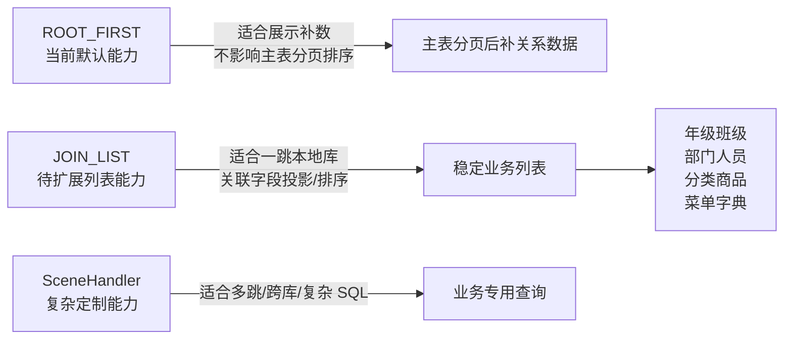
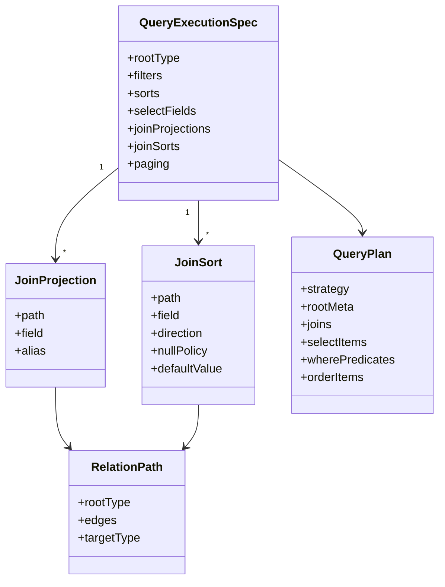
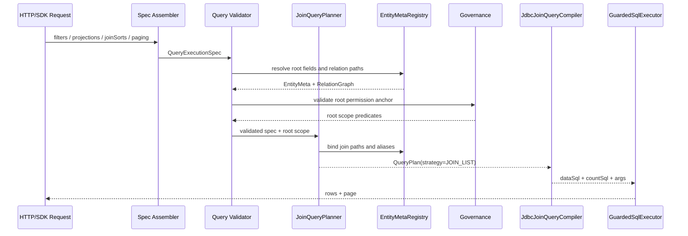
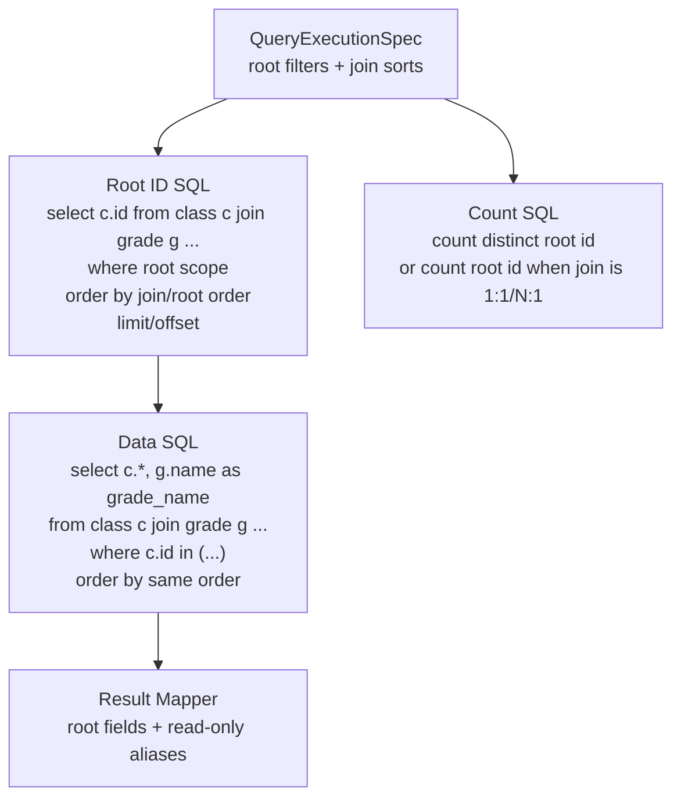
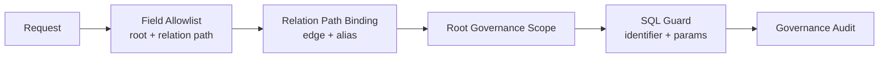

# Relation Query JOIN_LIST 投影与排序方案

本文是 Relation Query 后续路线的子方案，不是当前已实现能力。当前默认 Query 仍以 `ROOT_FIRST` 为主：先查 root 表，再按关系边批量补数；默认编译器不支持关联字段过滤、关联字段排序、JOIN 投影和排序表达式。

## 典型需求

例如班级列表需要带年级名称，并按年级顺序和班级顺序稳定排序：

```sql
SELECT
  c.id,
  g.name AS grade_name,
  c.name AS class_name,
  c.class_no,
  c.type
FROM class c
JOIN grade g ON g.id = c.grade_id
WHERE c.school_id = ?
ORDER BY
  g.stage_sort,
  g.sort,
  COALESCE(c.sort, 999),
  c.class_no,
  c.name,
  c.id;
```

这类需求在组织架构、学校年级班级、区域层级、商品分类、菜单树、字典项等业务中很常见，本质是“主表列表 + 一跳维表投影 + 跨表稳定排序”。

## 当前缺口

| SQL 片段 | 当前默认能力 | 缺口 |
|---|---|---|
| `JOIN grade g ON g.id = c.grade_id` | 关系展开走 `ROOT_FIRST` 补数 | 缺少受控 JOIN 编译 |
| `g.name AS grade_name` | 根实体字段投影为主 | 缺少关联字段投影 alias |
| `ORDER BY g.stage_sort, g.sort` | 只支持 root 字段排序 | 缺少关联排序 |
| `COALESCE(c.sort, 999)` | `QuerySort` 只有 field + direction | 缺少受控排序表达式/null 规则 |
| `WHERE c.school_id = ?` | 支持 root 字段过滤和治理范围 | 需要保持 root 权限锚点不漂移 |

## 能力定位



`JOIN_LIST` 不应该替代所有关系查询。它只解决本地库、有限路径、以 root 为权限锚点的列表读取场景。

## 目标边界

第一阶段建议只支持以下能力：

- root 表必须唯一，数据权限、租户权限、组织范围优先作用在 root 表。
- JOIN 只支持本地库一跳 `N:1` 或 `1:1` 关系，避免 `1:N` 放大 root 行。
- 关联字段可以投影为只读 alias，例如 `grade.name -> gradeName`。
- 关联字段可以参与排序，但必须来自元数据可解析的关系路径。
- 排序表达式只开放内置模板，例如 `NULLS_LAST(defaultValue)`，不接收任意 SQL 字符串。
- 分页语义以 root 行为准，不能因为 JOIN 产生重复 root 行。

暂不放入默认能力：

- 任意多跳 JOIN。
- `1:N` 直接 JOIN 后分页。
- 跨服务、跨库自动 JOIN。
- 用户传入原始 SQL 片段。
- 自动推断权限应落在哪张关联表。

## 建议模型



关键点是把“关联投影”和“关联排序”建模成结构化对象，由元数据解析为关系边和字段列名，而不是把 `g.stage_sort` 或 `COALESCE(...)` 这种 SQL 字符串直接暴露给外部请求。

## 编译流程



## SQL 生成策略

推荐采用“先确定 root 行，再按同一 JOIN 投影取数据”的分页策略，避免 JOIN 影响分页稳定性。



对于严格的一跳 `N:1` / `1:1` JOIN，也可以直接单 SQL 分页：

```sql
select ...
from root r
join target t on ...
where root_scope
order by ...
limit ? offset ?
```

但只要允许 `1:N`、多 join 或存在重复 root 行风险，就应切回 root id 子查询/CTE 两段式策略。

## 排序表达式白名单

排序表达式建议只提供枚举式能力：

| 业务语义 | 结构化表达 | SQL 示例 |
|---|---|---|
| 普通升序 | `field ASC` | `g.stage_sort ASC` |
| 普通降序 | `field DESC` | `g.stage_sort DESC` |
| 空值靠后 | `nullPolicy=NULLS_LAST` | `case when c.sort is null then 1 else 0 end, c.sort asc` |
| 默认值排序 | `defaultValue=999` | `coalesce(c.sort, 999) asc` |
| 稳定兜底 | 自动追加 root id | `c.id asc` |

不建议开放 `sortExpression` 字符串。之前 HTTP 契约已经移除 `sortExpression`，这里也应延续同一安全原则。

## 请求形态草案

草案只表达方向，字段名需要和最终 API 设计保持一致：

```json
{
  "options": {
    "filters": [
      {"field": "schoolId", "op": "EQ", "value": "school-1"}
    ],
    "selectFields": ["id", "name", "classNo", "type"],
    "joinProjections": [
      {"path": "grade", "field": "name", "alias": "gradeName"}
    ],
    "sorts": [
      {"path": "grade", "field": "stageSort", "direction": "ASC"},
      {"path": "grade", "field": "sort", "direction": "ASC"},
      {"field": "sort", "direction": "ASC", "nullPolicy": "DEFAULT_VALUE", "defaultValue": 999},
      {"field": "classNo", "direction": "ASC"},
      {"field": "name", "direction": "ASC"},
      {"field": "id", "direction": "ASC"}
    ],
    "page": 1,
    "limit": 20
  }
}
```

也可以选择不扩展外部 HTTP 协议，先只在 Java 侧增加内部 `QuerySceneHandler`/`QueryPlan` 能力，由业务 handler 构造结构化 join plan。

## 安全与治理要求



必须保持以下约束：

- 所有表名、列名、alias 都来自 `EntityMeta` / `RelationGraph`，不能来自用户字符串拼接。
- `path` 只能解析到唯一关系边；多候选关系必须报错。
- root 数据范围必须进入所有 data/count/id SQL。
- count SQL 和 data SQL 的过滤条件必须一致。
- 自动追加稳定排序字段，例如 root id，防止分页抖动。
- SQL 安全守卫需要理解 JOIN alias，不只是单表 `t.column`。

## 文档关系

- 当前实现事实以 [Query 当前实现](../../architecture/components/crud/query.md) 和 [关系查询架构](../../../ent-loom-components/ent-loom-crud/docs/implementation/relation-query-logic.md) 为准。
- 默认跨表查询的治理锚点大方向见 [Relation Query 后续路线](relation-query.md)。
- 本文聚焦其中更常见的列表型场景：一跳 JOIN 投影、关联排序、空值排序和稳定分页。

## 落地顺序建议

1. 先在内部模型增加 `JoinProjection`、`JoinSort`、`NullSortPolicy`，不开放任意 SQL。
2. 扩展关系路径解析，要求 path 唯一绑定到 `RelationEdge`。
3. 新增 `JOIN_LIST` 编译器，第一版只支持一跳 `N:1` / `1:1`。
4. count/data/id SQL 共用同一组已绑定谓词和 join 描述。
5. 增加编译器测试覆盖关联投影、关联排序、nulls-last、默认值排序、稳定兜底排序。
6. 再决定是否开放 HTTP 请求字段；若业务差异较大，优先通过定制 `QuerySceneHandler` 暴露。
