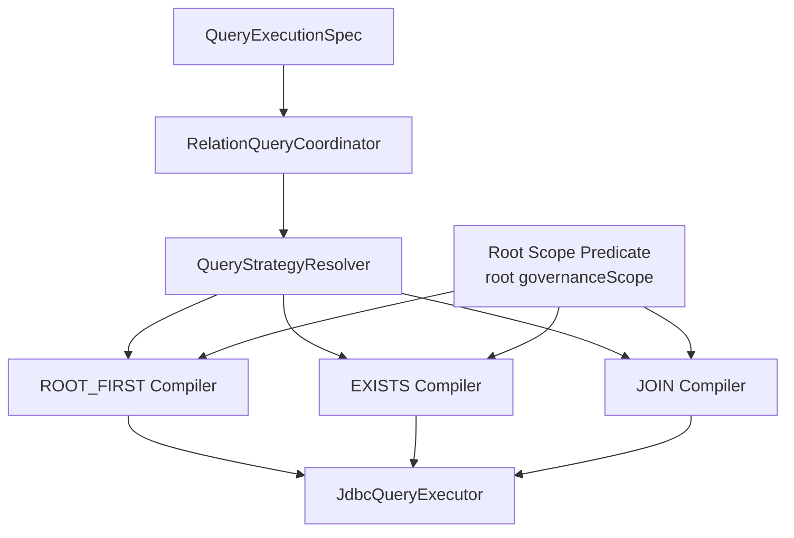

# Relation Query 后续路线

本文是下一阶段方案，不是当前已实现能力。当前实现只支持 `ROOT_FIRST` 默认读，不支持默认 `EXISTS/JOIN`、关联过滤、关联排序。

## 目标

在不破坏当前治理模型的前提下，为默认跨表查询增加“主表权限锚点”能力：

- 治理范围仍优先落在 root entity。
- 关联过滤可以通过 `EXISTS` 或 `JOIN` 编译到 SQL。
- 默认仍保证字段白名单、参数限制、逻辑删除和审计语义。
- 复杂跨服务、多跳、跨库关系仍不纳入默认引擎。

## 推荐分层

## 策略边界

| 策略 | 适合场景 | 风险 |
|---|---|---|
| `ROOT_FIRST` | 先按主表分页，再补子表展示 | 不能关联过滤/排序 |
| `EXISTS` | 用子表条件筛主表，不展开子表行 | SQL 编译复杂度适中 |
| `JOIN` | 需要按关联字段排序或直接投影 | 分页去重、计数和数据膨胀风险高 |

一跳本地库 `JOIN` 列表的细化方案见 [Relation Query JOIN_LIST 投影与排序方案](relation-query-join-list.md)。

## 实施建议

1. 保留 `QueryPlan`，新增关系过滤/排序的结构化描述，不直接把字符串 SQL 塞进 Plan。
2. 将 `JdbcQueryCompiler` 拆成根谓词、关联谓词、排序、分页四类组件。
3. `SqlIdentifierAllowlistValidator` 需要从“允许单跳字段路径”升级为“字段路径解析 + 关系边绑定”。
4. `DataScope` 仍只应用 root 表，除非业务显式贡献可验证的关联维度约束。
5. 对 `JOIN` 分页必须有明确去重策略，例如先分页 root id，再回表补行。

## 不建议放入默认引擎的能力

- 远程服务自动补数。
- 多跳任意路径 join。
- 跨表写事务编排。
- 自动推断业务语义型权限锚点。

这些能力应继续通过业务场景 Handler 或单独 relation-query 内核扩展完成。
