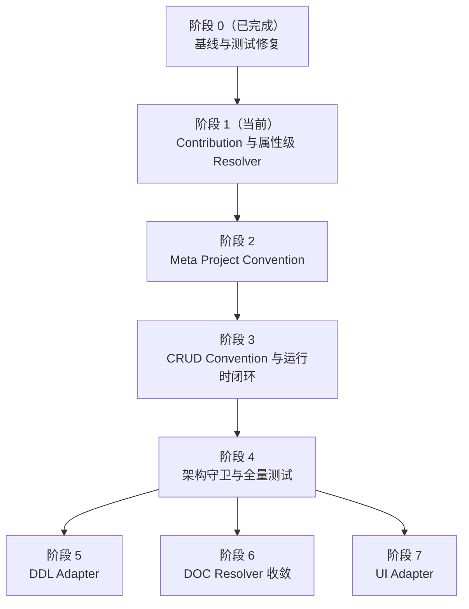

# 元数据裁决分期实施清单

> 性质：阶段实施清单
> 状态：阶段 0 已完成，当前进入阶段 1
> 规范依据：[Metadata Resolution Contract](../../architecture/core/meta/metadata-resolution-contract.md)
> 目标：逐步落地“属性级裁决、可追踪来源、模块独立运行、运行时闭环”。
> 原则：每期只引入一个主要架构变化；每期结束必须可编译、可测试、可回滚。

## 实施顺序

## 清单

### 阶段 0：基线整理（已完成）

- [x] 完成 `modules / meta / integrations` 目录重构
- [x] 将 CRUD Native Parser 归入 `ent-loom-crud-core`
- [x] 确认 `DefaultStatsQueryEngineTest` 修复并持续通过
- [x] 建立 Native-only、Meta-only、Meta + Module 三类测试基线

**完成标志**：`mvn test` 全绿，且目录重构后的依赖边界稳定。

2026-08-20 使用 JDK 21 执行全仓 `mvn clean test` 已通过；Native-only、Meta-only、Meta + Module 分别由 CRUD native parser、Meta adapter acceptance 和 merger 测试覆盖。

### 阶段 1：公共裁决契约（当前，P0）

- [ ] 在 `ent-loom-meta-contract` 增加 `Contribution`、`RuleId`、`Priority`
- [ ] 为结果保留 `value / source / ruleId`
- [ ] 实现统一属性级 Resolver
- [ ] 增加同级冲突、类型不匹配、结构冲突诊断
- [ ] 明确 `fail-fast / warn / ignore` 策略

**完成标志**：不同属性可独立取值；同级冲突不依赖加载顺序。

### 阶段 2：Meta Convention（P0）

- [ ] 增加 Meta Convention SPI 和 Starter 收集机制
- [ ] 实现 `createTime / createdAt + 时间类型 -> DATETIME.CREATED_TIME`
- [ ] Convention 贡献 `role / readOnly / label`
- [ ] 校验名称与 Java 类型
- [ ] 显式 Meta Annotation 可覆盖 Convention

**完成标志**：不写注解也能生成带来源的 Meta Descriptor。

### 阶段 3：CRUD 闭环（P0）

- [ ] 增加 CRUD Built-in / Project Convention SPI
- [ ] 接入创建填充、禁止更新、默认排序、导出格式
- [x] 统一 Native-only 与 Meta-enabled 两条建模路径到 `CrudRuntimeModel`
- [ ] Adapter 只负责 Meta Descriptor 投影
- [x] 形成唯一 CRUD Runtime Model

**完成标志**：Meta 属性实际影响 CRUD 查询、写入和导出行为。

### 阶段 4：守卫与回归（P1）

- [x] 建立现有 Meta / CRUD Core 的 ArchUnit 边界守卫基线
- [ ] 补 Maven 依赖边界守卫并完整固化 `Module Core -X-> meta-core`
- [ ] 增加规则顺序稳定性测试
- [ ] 增加来源追踪和消费者闭环测试

**完成标志**：架构边界违规时构建失败，`mvn test` 全绿。

### 阶段 5：DDL 接入（P1）

- [ ] 实现 `meta-adapter-ddl`
- [ ] Meta 字段投影为 DDL Runtime Model
- [ ] 支持时间类型、列映射和可选默认表达式
- [ ] 明确不支持属性的处理策略

**完成标志**：Meta 语义可影响建表 SQL，且来源可诊断。

### 阶段 6：DOC 收敛（P1）

- [ ] Doc Merger 改用公共 Resolver
- [ ] 接入 `label / description / readOnly / relation`
- [ ] 移除 Doc 自己维护的优先级逻辑

**完成标志**：文档输出与 CRUD 使用同一套属性裁决规则。

### 阶段 7：UI 接入（P2）

- [ ] 明确 UI API、Annotation、Runtime Model 边界
- [ ] 实现 `meta-adapter-ui`
- [ ] 接入 `readOnly / label / component=DATE_TIME`
- [ ] 明确 UI 不支持属性的处理策略

**完成标志**：Meta 字段语义可投影为 UI 表单契约。

## 每期固定验收

- [ ] `mvn -f ent-loom/pom.xml -DskipTests compile`
- [ ] 相关模块单元测试通过
- [ ] Native-only 路径仍可运行
- [ ] Meta-enabled 路径结果可追踪
- [ ] 无新增重复 Runtime Model 或 Parser
- [ ] 更新对应架构文档和变更记录
