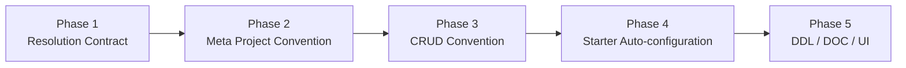

# 元数据约定与裁决实施路线

> 性质：实施路线
> 状态：路线图
> 规范依据：[Metadata Resolution Contract](../../architecture/core/meta/metadata-resolution-contract.md)

## 1. 当前基础

- Meta 已支持 Java 类型与字段名推断，并生成带来源的 Descriptor。
- `ent-loom-crud`、`ent-loom-doc` 已能合并 Meta 与 Module Native Annotation。
- `CrudNativeRuntimeModelParser` 可独立生成 `CrudRuntimeModel`。
- `ent-loom-meta-adapter-ddl` 仍为空壳，`ent-loom-ui` 尚无 Meta Adapter。
- Project Convention、统一 Property Contribution 和完整 Runtime 消费链尚未建立。

## 2. 实施阶段



### 阶段一：Resolution Contract

- 在 `ent-loom-meta-contract` 定义值来源、规则标识、属性贡献和冲突诊断契约。
- 固定属性级合并算法，不允许整模型覆盖。
- 为 Explicit、Project Convention、Built-in Convention、Inference 和 Default 建立可追踪 Source。

### 阶段二：Meta Project Convention

- 在 `ent-loom-meta-core` 增加字段约定接口和执行器。
- `ReflectiveEntMetaParser` 接入按顺序执行的项目规则。
- 以 `createTime/createdAt` 时间字段完成第一个闭环。
- Meta 显式注解可逐属性覆盖项目规则。

### 阶段三：CRUD Convention

- 在 `ent-loom-crud-core` 增加 CRUD 字段约定和中间 Builder。
- `CrudNativeRuntimeModelParser` 在不依赖 `meta-core` 时也能执行项目规则。
- 收敛现有列名、主键候选和默认时间排序等分散约定。
- 让只引入 CRUD 的项目获得相同的项目级定制能力。

### 阶段四：Starter Auto-configuration

- `ent-loom-meta-spring-boot-starter` 收集 Meta Convention Bean。
- `ent-loom-crud-spring-boot-starter` 收集 CRUD Convention Bean。
- 支持排序、启停、诊断策略和启动期结果摘要。
- 禁止用 Bean 加载顺序解决同级冲突。

### 阶段五：Module 扩展

- `ent-loom-ddl`：完成 Meta Adapter，再接入 DDL Project/Built-in Convention。
- `ent-loom-doc`：复用 Resolution Contract，并保留 `DocOverrideProvider` 的动态覆盖边界。
- `ent-loom-ui`：先稳定 UI Runtime Model，再增加 UI Annotation、Convention 和 Meta Adapter。

## 3. 最小验收场景

以无字段注解的实体属性为基准：

```java
private LocalDateTime createTime;
```

必须验证：

1. 无项目规则时只得到基础时间类型推断。
2. Meta 项目规则能产生创建时间角色、只读和标签。
3. CRUD-only 项目不依赖 Meta Core，也能产生 CRUD 专属效果。
4. 显式注解只覆盖指定属性，其他属性继续继承项目规则。
5. 同级冲突包含实体、字段、属性、规则及双方来源。
6. 名称匹配但类型错误时给出诊断。
7. 关闭规则后恢复到下一优先级结果。
8. 规则最终改变 Command、Query 或 Export 行为，而非只停留在元数据中。

## 4. 暂不纳入

- 运行期动态刷新规则。
- 远程配置中心或数据库规则存储。
- 复杂规则 DSL 和可视化编辑器。
- 在 DDL/UI 基础模型未闭环前强行统一全部模块。
- 未经项目确认自动启用租户隔离、逻辑删除等高影响行为。

## 5. 完成定义

当 Meta-first 和 CRUD-only 两条路径都能完成“项目规则注册 → 属性裁决 → 来源诊断 → 运行时效果”，且显式注解能够稳定覆盖项目规则时，核心闭环完成。
