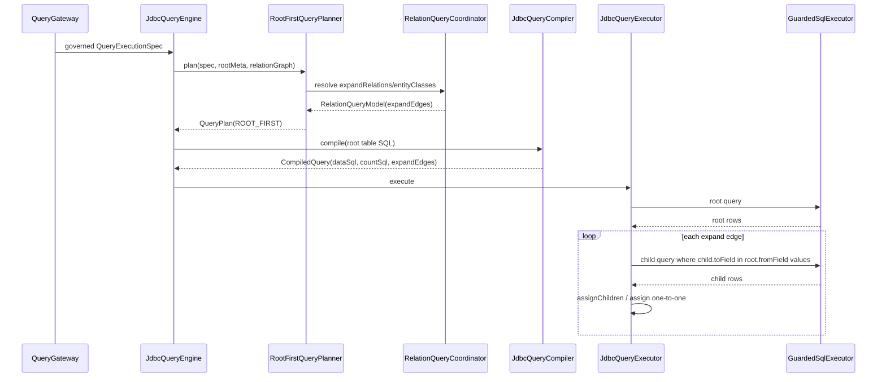

# 关系查询架构

当前关系查询是 `ROOT_FIRST` 的 MVP-1：先查根实体，再按关系边批量补数。它不是默认 JOIN 查询，也不支持关联字段过滤/排序。

一跳 JOIN 投影、关联排序、`COALESCE`/null 排序和稳定分页的待扩展方案见 [Relation Query JOIN_LIST 投影与排序方案](../../../../docs/roadmap/crud/relation-query-join-list.md)。

## 当前执行模型



## 关系元数据来源

框架原生：

- `@EntCrudEntity` 声明实体名、表名、主键、逻辑删除字段、所属服务。
- `@EntCrudField` 声明 CRUD 查询关系：`targetService`、`targetEntity`、`sourceField`、`targetField`、`cardinality`、`targetClass`、`scope`、`joinType`。
- `CrudNativeRuntimeModelParser` 可把 CRUD native 注解解析为 `CrudRuntimeModel`，最终仍由 `CrudRuntimeModelBackedEntityMetaRegistry` 冻结为运行期只读快照。
- `RelationCardinality` 使用 `ent-loom-meta-contract` 中的通用关系基数枚举，和 `EntRelation` 保持同一套语义。

常用声明：

```java
@EntCrudField(targetClass = Order.class, targetField = "id")
private Long orderId;

@EntCrudField(
    targetClass = OrderItem.class,
    sourceField = "id",
    targetField = "orderId",
    cardinality = RelationCardinality.ONE_TO_MANY
)
private List<OrderItem> items;
```

约定：

- `MANY_TO_ONE` 默认将被注解字段视为当前实体外键字段，生成 `declaringEntity -> targetEntity` 的语义边。
- `ONE_TO_MANY` 将被注解字段视为当前实体关系字段；未显式配置 `sourceField` 时使用声明实体 id 字段，`relationField` 保留集合属性名。

business v2 桥接：

- 业务侧通过 `ResourceCatalogAdapter` 输出 `CrudRuntimeModel`。
- adapter 同步注册资源 code 和 aliases，供 HTTP `entity` 路径解析。
- registry 在启动期校验关系目标实体和 from/to 字段，并预计算每个 root 的 `RelationGraph`。

```mermaid
flowchart LR
    native["@EntCrudEntity / @EntCrudField"]
    parser["CrudNativeRuntimeModelParser"]
    adapter["ResourceCatalogAdapter"]
    model["CrudRuntimeModel"]
    registry["CrudRuntimeModelBackedEntityMetaRegistry"]
    graph["Frozen RelationGraph"]

    native --> parser --> model
    adapter --> model --> registry --> graph
```

## 请求解析规则

关系请求可以来自两种输入：

1. `options.expandRelations`：显式展开字段或目标实体名。
2. `entityCodes/entityClasses`：`root, child, grandChild...` 的实体范围。

`PathResolver` 的当前行为：

- 如果显式传 `expandRelations`，只按根实体 outgoing edges 解析。
- 如果没有显式 `expandRelations` 且 `entityClasses.size() > 1`，按实体序列推断路径。
- 解析时可匹配 `relationField`、目标实体全名、目标实体 simpleName、去掉 `Entity` 后的 simpleName。
- 出现 0 条边会报 `ENTITY_SCOPE_ILLEGAL` 或 `ValidationException`。
- 出现多条候选边会报 `ENTITY_SCOPE_ILLEGAL`，要求改顺序或改定制 Handler。

## 当前限制

| 能力 | 当前状态 |
|---|---|
| 本地库一跳 `ROOT_FIRST` 展开 | 已实现 |
| 基于实体序列的有限路径展开 | 已实现，但仍以批量补数为主 |
| `RelationScope.REMOTE_SERVICE` | 默认关系查询拒绝 |
| 关联过滤 | 默认编译器拒绝 |
| 关联排序 | 默认编译器拒绝 |
| `EXISTS` / `JOIN` | 仅保留在下一阶段方案文档，不在当前公开 `QueryStrategy` 中暴露 |
| 默认跨表写 | 未实现，走定制 Command SceneHandler |

## 使用建议

- 普通列表详情需要子集合时，用 `entityCodes` 或 `expandRelations` 触发 ROOT_FIRST 展开。
- 需要关联过滤、关联排序、跨服务补数或复杂聚合时，优先写 `Query*SceneHandler` 或 `StatsSceneHandler`。
- 需要“主表列表 + 一跳维表投影 + 跨表稳定排序”时，当前仍走定制 `Query*SceneHandler`；通用化方案见 [Relation Query JOIN_LIST 投影与排序方案](../../../../docs/roadmap/crud/relation-query-join-list.md)。
- 需要“一次写主子表”时，用 `CommandCreate/Update/DeleteSceneHandler` 包住默认 delegate，再做子表同步。
