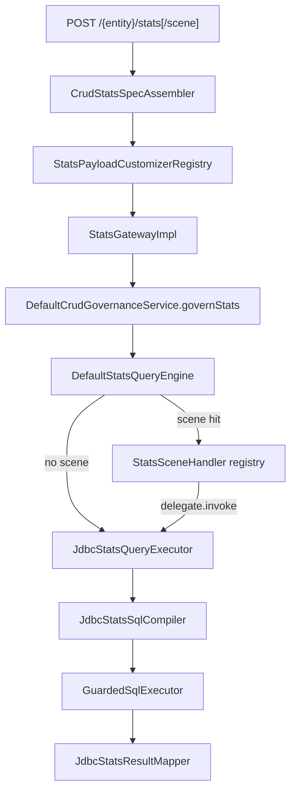
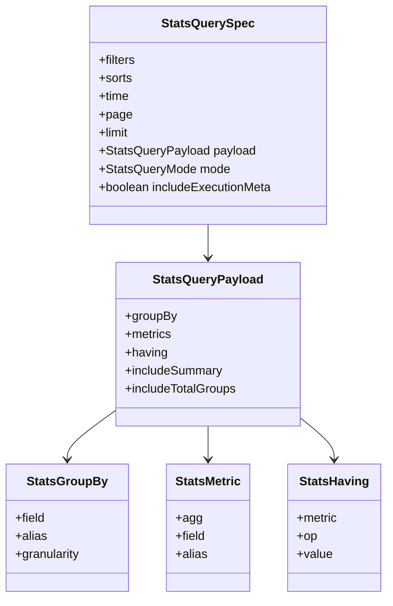
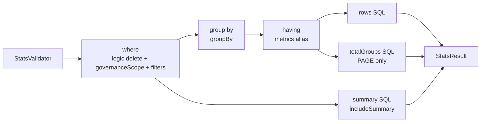

# 单表统计能力架构

Stats 是独立的一等操作：HTTP 入口组装 `StatsQuerySpec`，网关通过 `ExecutionPipeline -> governStats` 完成治理，再交给 `StatsQueryEngine` 和 `StatsQueryExecutor` 执行。当前实现面向单表聚合。

## 执行链

## DSL 模型

模式：

- `SCALAR`：无分页，返回 `metrics`。
- `LIST`：按 `groupBy` 返回 rows，默认 limit=200。
- `PAGE`：按 `groupBy` 返回 rows 和分页信息；无 `groupBy` 时不允许分页。

## SQL 阶段

当前 SQL 编译规则：

- 指标函数由 `StatsAggFunction` 解析，支持 `COUNT` 以及字段聚合函数。
- `COUNT` 可省略字段或使用 `*`。
- `groupBy.granularity` 当前仅支持 `DAY`，`MONTH/YEAR/HOUR` 会被拒绝。
- `having.metric` 必须引用已声明的 `metrics.alias`。
- Stats 排序的 `target` 不能为 `AUTO`，组装器会先解析成 `METRIC/DIMENSION/FIELD`。
- Stats 不支持关联过滤。
- SQL 安全守卫通过 `FilterableSpec` 校验 Stats 的 filters/sorts/time，不再依赖 `QuerySpec` 类型判断。

## 场景扩展

`StatsSceneHandler` 与 Query/Command SceneHandler 一样按 `CrudRouteKey` 注册。典型用法是：

- 改写 `StatsQuerySpec`，再调用 `delegate.invoke(rewrittenSpec)`。
- 执行默认统计后补充业务字段、排名、零值行。
- 根据 `governanceScope` 进一步限制某些业务场景。

business v2 的 `AbstractBusMoralRecordLineStatsHandler` 就是这种模式：它重写德育排行统计的范围、分组、补学生信息和排名逻辑，但仍可复用默认 JDBC Stats 执行器。
