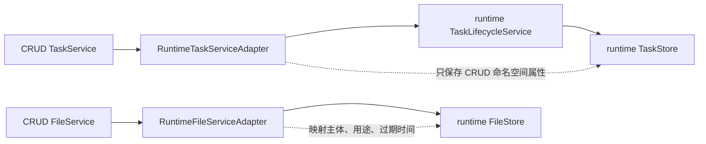

由于 ent-loom-meta 中能力范围广,没有固定标准,所以把 ent-loom-integrations 解耦出来，避免影响 ent-loom-modules 独立核心功能的组织。

`ent-loom-integrations` 用于承接 `ent-loom-meta-core` 解析后的 Descriptor，并适配到具体能力模块。

当前结构:

```text
ent-loom-integrations
├── ent-loom-meta-adapter-crud
├── ent-loom-meta-adapter-ddl
├── ent-loom-meta-adapter-doc
├── ent-loom-meta-spring-boot-starter
└── ent-loom-runtime-adapter
```

定位:

1. `ent-loom-meta-adapter-crud`: Meta Descriptor 到 CRUD 运行时模型的适配；P0 已覆盖 Meta-only、CRUD-only、Meta + CRUD override、关系方向和诊断。
2. `ent-loom-meta-adapter-ddl`: Meta Descriptor 到 DDL 执行层的适配；E4 已提供 `MetaDdlAdapter`，覆盖 Meta-only、DDL-only 和 Meta + DDL override，DDL 专属属性不进入通用 Meta Contract。
3. `ent-loom-meta-adapter-doc`: Meta Descriptor 到 DOC 输出模型的适配；P0 已覆盖 Meta-only、DOC-only、Meta + DOC override、稳定 DOC Runtime Model、关系/索引文档和诊断。
4. `ent-loom-meta-spring-boot-starter`: P1 装配层，只负责条件注册 `MetaCrudAdapter` / `MetaDocAdapter`，不承载合并规则。
5. `ent-loom-runtime-adapter`: 可选集成层，以 `ent-runtime` 的 `TaskLifecycleService` 和 `FileStore` 实现 CRUD Task/File SPI；当前验证主体、任务生命周期、流式文件、过期和下载守卫的最小闭环，不进入默认 Reactor。

依赖约定:

1. adapter 统一依赖 `ent-loom-meta-core`。
2. adapter 只依赖目标能力模块的 core，不反向污染目标模块。
3. `ent-loom-modules` 中的 CRUD/DOC/DDL 保持独立，不直接依赖 `ent-loom-meta-annotations`。
4. starter 可依赖 adapter、目标 core 和 Spring Boot auto-config；core 模块不能反向依赖 starter。
5. `ent-loom-runtime-adapter` 可以依赖 `ent-loom-crud-core` 和独立发布的 `ent-runtime/runtime-contract`、`runtime-core`；`ent-loom` Core 与 `ent-runtime` 均不得反向依赖它们。

Task/File Adapter 最小公开契约:



- Task Adapter 只允许从 `PENDING/CREATED` 开始，状态通过 runtime 生命周期服务流转；不直接调用 `TaskStore.save`。
- Task Adapter 将 runtime 的任务异常映射为 CRUD 错误码；任务结果文件必须与任务快照主体一致，导出任务成功时必须有结果文件，终态不能再次覆盖。
- File Adapter 对外保留 `save`、`getRequired`、`read`、`openStream`；文件主体、用途和过期时间由 runtime 文件契约承接，三种读取入口统一尊重 runtime 的过期校验。
- File Adapter 将 runtime 的未找到、过期、流大小不一致和存储失败分别映射为 `FILE_NOT_FOUND`、`FILE_EXPIRED`、`VALIDATION_ERROR` 和 `FILE_SERVICE_UNAVAILABLE`。
- 适配器可以注入自定义 `TaskLifecycleService`；未注入时保留基于 `DefaultTaskLifecycleService` 的兼容构造器。
- 该契约不承诺分布式 Worker、任务持久化、事务一致性或跨服务幂等。

P0 验收入口:

- `ent-loom-meta-adapter-crud/src/test/java/com/entloom/meta/adapter/crud/MetaCrudAdapterP0AcceptanceTest.java`
- `ent-loom-meta-adapter-doc/src/test/java/com/entloom/meta/adapter/doc/MetaDocAdapterP0AcceptanceTest.java`

P1-1 验收入口:

- `ent-loom-meta-spring-boot-starter/src/test/java/com/entloom/meta/starter/EntLoomMetaAutoConfigurationTest.java`
- `ent-loom-meta-spring-boot-starter/src/test/java/com/entloom/meta/starter/EntLoomMetaStarterBoundaryGuardTest.java`

Task/File Adapter 合同测试：

- `ent-loom-runtime-adapter/src/test/java/com/entloom/crud/runtime/adapter/RuntimeAdapterExportFlowTest.java`
- `ent-loom-runtime-adapter/src/test/java/com/entloom/crud/runtime/adapter/CrudRuntimeFileMapperTest.java`
